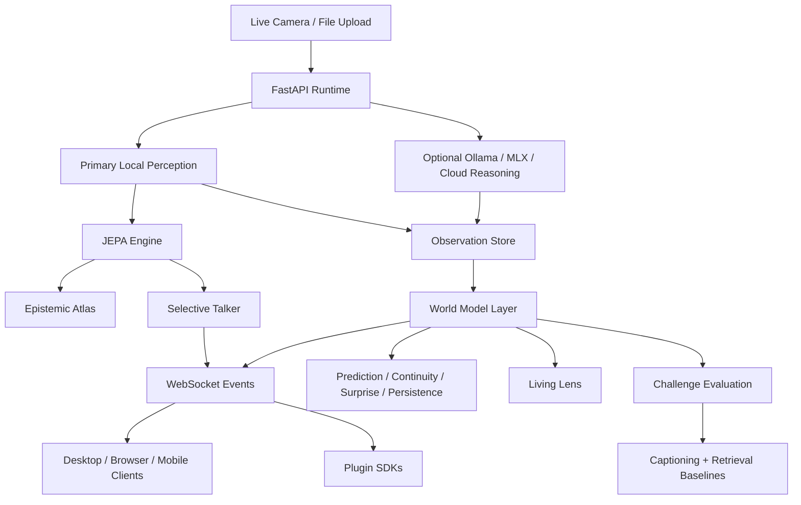

# CLAUDE.md

This repository is now an executable cross-platform project. Use this file as the first-stop implementation guide for future agents.

## Overview

Toori is a JEPA proof surface with three client surfaces:

- Electron desktop shell for the M1 iMac
- SwiftUI iOS client source tree
- Jetpack Compose Android client source tree

The working runtime lives in Python and exposes a loopback-first API on `127.0.0.1:7777`. It stores real observations from camera input, computes local embeddings, maintains world-model state, searches prior observations, and optionally calls reasoning backends.

## Mission And Vision

### Mission

Make JEPA-style world-model behavior inspectable in a real product.

Future work in this repository should keep the proof legible to a human operator. The key question is never only “did the system answer?”, but also:

- what did it expect?
- what stayed stable?
- what changed?
- what persisted through occlusion or movement?
- how did that compare with weaker baselines?

### Vision

Turn Toori into a reusable world-state runtime that can power many applications.

The browser and desktop UI are only the first proof surfaces. The runtime, event model, and SDKs should evolve so Toori can become:

- a desktop scientific demonstration of JEPA-style reasoning
- a plugin/runtime for other products
- a cross-platform perception-and-memory layer with consistent world-model semantics

When deciding between “better captioning” and “better world-state evidence,” bias toward world-state evidence.

## System Diagram

## Primary Entry Points

- [cloud/api/main.py](/Users/macuser/toori/cloud/api/main.py): main runtime app
- [cloud/jepa_service/engine.py](/Users/macuser/toori/cloud/jepa_service/engine.py): JEPA engine and spatial energy maps
- [cloud/runtime/talker.py](/Users/macuser/toori/cloud/runtime/talker.py): selective talker event generator
- [cloud/runtime/atlas.py](/Users/macuser/toori/cloud/runtime/atlas.py): epistemic atlas for entity tracking
- [cloud/runtime/app.py](/Users/macuser/toori/cloud/runtime/app.py): app factory and routes
- [cloud/runtime/service.py](/Users/macuser/toori/cloud/runtime/service.py): core analyze/query/settings logic
- [desktop/electron/main.js](/Users/macuser/toori/desktop/electron/main.js): Electron shell entrypoint
- [desktop/electron/src/App.tsx](/Users/macuser/toori/desktop/electron/src/App.tsx): desktop product UI
- [mobile/ios/TooriApp/TooriLensApp.swift](/Users/macuser/toori/mobile/ios/TooriApp/TooriLensApp.swift): iOS app root
- [mobile/android/app/src/main/java/com/toori/app/MainActivity.kt](/Users/macuser/toori/mobile/android/app/src/main/java/com/toori/app/MainActivity.kt): Android app root

## Development Commands

- Runtime dev server:
  `TOORI_DATA_DIR=.toori python3 -m uvicorn cloud.api.main:app --host 127.0.0.1 --port 7777`
- Verified Python tests:
  `pytest -q cloud/api/tests cloud/jepa_service/tests cloud/search_service/tests cloud/monitoring/tests tests/test_readme.py`
- Desktop install and build:
  `cd desktop/electron && npm install && npm run build`
- Desktop launch:
  `cd desktop/electron && npm start`

## Architecture

### Runtime

- `RuntimeContainer` coordinates settings, provider health, observation storage, local similarity search, and event publication.
- `JEPAEngine` computes purely numerical latent predictions (`||s - ŝ||²`) and spatial energy maps natively.
- `SelectiveTalker` uses adaptive energy thresholds to gate logic without wasting LLM cycles.
- `EpistemicAtlas` maintains in-memory entity relationship graphs tracking co-occurrence and persistence.
- `ObservationStore` persists observations and settings in SQLite under `.toori/`.
- `ProviderRegistry` selects perception and reasoning providers and enforces circuit-breaker fallback.
- The proof-surface layer adds scene state, entity tracks, prediction windows, and challenge runs on top of observations.

### Provider Policy

- Primary local perception targets:
  - desktop: ONNX when configured
  - iOS: CoreML-compatible path in native client
  - Android: TFLite-compatible path in native client
- Guaranteed local fallback in the Python runtime:
  - `basic` classical image descriptor over real pixels
- Optional desktop reasoning:
  - `ollama`
  - MLX via configured shell command
- Default reasoning fallback:
  - OpenAI-compatible cloud provider

### Proof Surface Policy

- `Live Lens` is the operator/debug surface.
- `Living Lens` is the scientific proof surface and should be treated as the primary demo path.
- The proof surface must be understandable without reading research papers. Favor plain language, structured evidence, and guided interaction over jargon-heavy dashboards.
- The proof surface must expose:
  - prediction consistency
  - temporal continuity
  - surprise
  - persistence
  - baseline comparison
- The differentiator of Toori is not one more multimodal UI. The differentiator is that the runtime turns live scenes into a measurable world state and lets the user compare that behavior against caption-only and retrieval-only baselines.
- In operator wording, `passive mode` means `continuous monitoring mode`: the camera stays live, the scene model keeps updating, and the user does not have to press capture each time.
- Browser mode is the default proof-development surface until the Electron app is packaged as a signed macOS bundle.

### Clients

- Desktop UI is the most complete operator surface today.
- Mobile sources are aligned to the same runtime contract and settings surface, but still need platform dependency installation and project wiring to build in native IDEs.

## Important Invariants

- Never reintroduce placeholder zero-vector behavior in user-facing flows.
- Search results must always refer to actual stored observations.
- Reasoning providers (Ollama/MLX) are selectively triggered or operate in query-only mode. Live tick paths must not invoke reasoners autonomously.
- The JEPA engine must remain pure numy-compatible (`float32`) without CUDA or PyTorch to ensure identical paths for M1/MPS users.
- `ollama` and MLX must remain optional and health-checked.
- ONNX/CoreML/TFLite-compatible perception remains primary even when desktop local reasoning is enabled.
- If a provider is unhealthy, the runtime must degrade gracefully instead of blocking capture/search.
- macOS Camera privacy depends on a real app bundle identity; stock Electron CLI launches should not be treated as proof of permission support.

## Recommended Work Areas

- Improve the Python runtime before adding more UI complexity.
- Keep client models aligned with [cloud/runtime/models.py](/Users/macuser/toori/cloud/runtime/models.py).
- Extend SDKs in [sdk](/Users/macuser/toori/sdk) when public API changes.
- Update [docs/system-design.md](/Users/macuser/toori/docs/system-design.md), [docs/user-manual.md](/Users/macuser/toori/docs/user-manual.md), and [docs/plugin-guide.md](/Users/macuser/toori/docs/plugin-guide.md) whenever interfaces or workflows move.
- When proof surfaces change, update the README and user manual so the browser-first workflow and packaged-macOS caveat stay explicit.
