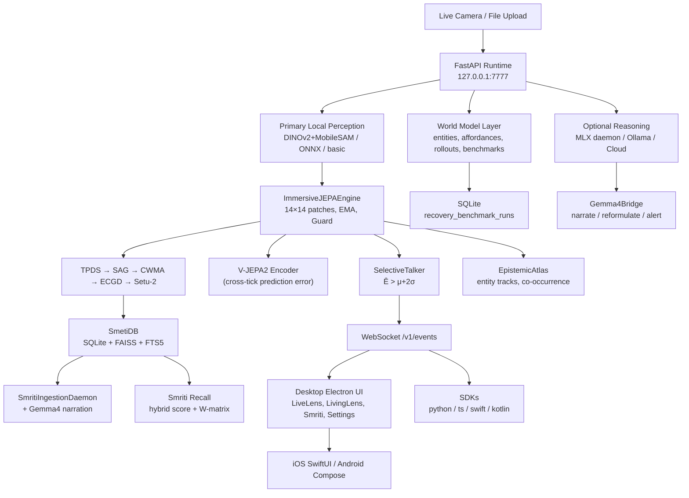

# CLAUDE.md — Toori Implementation Guide

This is the authoritative reference for every agent working in this repository.
Read this entirely before making any change.

---

## Mission & Vision

**Mission:** Make JEPA-style world-model behavior inspectable in a real product.
The key question is never just "did the system answer?" but also:
- What did it expect?
- What stayed stable?
- What changed?
- What persisted through occlusion or movement?
- How does that compare with caption-only and retrieval-only baselines?

**Vision:** A reusable world-state runtime powering many applications — desktop scientific demo, plugin runtime for other products, cross-platform perception-and-memory layer.

**Differentiator:** Toori turns live scenes into a *measurable world state* and compares JEPA behavior against weaker baselines. It is not just another multimodal UI.

---

## Repository Layout

```
toori/
├── cloud/                     Python runtime (FastAPI, JEPA, Smriti)
│   ├── api/                   FastAPI entrypoint + auth + tests
│   │   ├── main.py            → imports create_app() from cloud.runtime.app
│   │   ├── auth.py            API key middleware
│   │   └── tests/             16 test files (272 tests total)
│   ├── jepa_service/          JEPA engines, perceptual pipeline sub-services
│   │   ├── engine.py          JEPAEngine (compat) + ImmersiveJEPAEngine (primary)
│   │   ├── anchor_graph.py    SemanticAnchorGraph (SAG)
│   │   ├── confidence_gate.py EpistemicConfidenceGate (ECGD)
│   │   ├── depth_separator.py TemporalParallaxDepthSeparator (TPDS)
│   │   └── world_model_alignment.py CrossModalWorldModelAligner (CWMA)
│   ├── monitoring/            Prometheus metric tests
│   ├── perception/            DINOv2 + MobileSAM + ONNX + V-JEPA2 encoder
│   ├── runtime/               Core business logic (22 modules)
│   │   ├── app.py             create_app(), all FastAPI routes
│   │   ├── atlas.py           EpistemicAtlas (entity relationship graphs)
│   │   ├── config.py          resolve_data_dir(), resolve_smriti_storage(), default_settings()
│   │   ├── error_types.py     SmritiError hierarchy
│   │   ├── events.py          WebSocket event bus
│   │   ├── gemma4_bridge.py   Gemma4Bridge (anchor narration, query reformulation, alerts)
│   │   ├── jepa_worker.py     JEPAWorkerPool (isolated JEPA off FastAPI event loop)
│   │   ├── models.py          ALL Pydantic data models (single source of truth)
│   │   ├── observability.py   CorrelationContext, PipelineTrace, TokenBucketRateLimiter,
│   │   │                      MemoryCeilingManager, SchemaVersionManager, structlog wrapper
│   │   ├── proof_report.py    PDF proof generation (WeasyPrint streaming)
│   │   ├── providers.py       ProviderRegistry + all provider implementations
│   │   │                      incl. MlxReasoningProvider (daemon architecture)
│   │   ├── resilience.py      SmritiCircuitBreaker, FallbackChain, BackPressureQueue
│   │   ├── service.py         RuntimeContainer — all analyze/query/settings/Smriti logic
│   │   ├── setu2.py           Setu2Bridge (grounded region description)
│   │   ├── smriti_gemma4_enricher.py  SmetiGemma4Enricher (Gemma4 inside ingestion/tick)
│   │   ├── smriti_ingestion.py        SmritiIngestionDaemon + watch folder queue
│   │   ├── smriti_migration.py        Copy-first Smriti data migration
│   │   ├── smriti_storage.py          SmetiDB — SQLite + FAISS, recall, clusters, journals
│   │   ├── storage.py                 ObservationStore + recovery benchmark persistence
│   │   ├── talker.py                  SelectiveTalker (energy-gated events)
│   │   └── world_model.py             Sprint 6 planning layer (entities, affordances, rollouts)
│   └── search_service/        Compatibility search service
├── desktop/electron/          Electron + React/Vite operator UI
│   ├── main.js                Electron shell entrypoint
│   └── src/
│       ├── App.tsx            Root router (tab switcher)
│       ├── types.ts           ALL TypeScript types (keep in sync with models.py)
│       ├── styles.css         Global design tokens and component styles
│       ├── constants.ts       API base URL, polling intervals
│       ├── tabs/              LiveLensTab, LivingLensTab, SmritiTab, SettingsTab,
│       │                      MemorySearchTab, SessionReplayTab, IntegrationsTab
│       ├── components/        BaselineBattle, ConsumerMode, ForecastPanel,
│       │                      Gemma4Panel, OcclusionPanel, SigRegGauge, SpatialCanvas3D
│       │   └── smriti/        DeepdiveView, MandalaView, PerformanceHUD,
│       │                      PersonJournal, RecallSurface, SmritiStorageSettings,
│       │                      mandala-force-worker.ts
│       ├── hooks/             useCameraStream, useLivingLens, useRuntimeBridge,
│       │                      useSmritiState, useWorldState
│       ├── state/             DesktopAppContext
│       ├── panels/            ScientificReadout
│       ├── layouts/           Shell layouts
│       ├── lib/               Shared utilities
│       └── widgets/           Small reusable widgets
├── mobile/
│   ├── ios/TooriApp/          SwiftUI client (TooriLensApp.swift entry)
│   ├── macos/SmritiApp/       Standalone macOS 14+ menu bar app (SwiftUI + AppKit bridge)
│   └── android/app/…          Jetpack Compose client (MainActivity.kt entry)
├── sdk/                       python/, typescript/, swift/, kotlin/ SDKs
├── scripts/
│   ├── mlx_reasoner.py        Gemma-4 MLX daemon script (stdin/stdout JSON-lines)
│   ├── setup_backend.py       Backend dependency installer
│   ├── setup_frontend.py      Frontend dependency installer
│   ├── download_desktop_models.py  ONNX model downloader
│   ├── train_tvlc.py          TVLC trainer entrypoint (COCO + Gemma teacher + torch finetune)
│   └── e2e_test.py            End-to-end smoke test
├── docs/                      system-design.md, user-manual.md, plugin-guide.md
├── tests/test_readme.py       README contract guard
├── requirements.txt           Core Python deps (fastapi, uvicorn, pydantic, numpy,
│                              av>=12, watchdog>=4)
├── cloud/perception/          Torch-isolated (numpy/onnx/coreml) perception models
│   ├── audio_encoder.py       AudioEncoder (numpy Mel-spec, 384-dim, PyAV decode)
│   ├── clap_projector.py      CLAPProjector (CLAP 512→DINOv2 384 cross-modal projection, numpy)
│   ├── tvlc_connector.py      TVLCConnector (Perceiver Resampler, DINOv2 196×384 → Gemma 4 32×2048)
│   ├── tvlc_training.py       TVLC training loop + Gemma caption teacher + weight export
│   ├── vjepa2_encoder.py      Safe, lazy-loading interface for vjepa2
│   ├── vits14_onnx_encoder.py Honest V-JEPA2 fallback (ViT-S/14 ONNX real patches)
│   └── ...                    (dinov2, sam)
├── conftest.py                Shared pytest fixtures
├── AGENTS.md                  Codex agent guidance
└── CLAUDE.md                  ← this file
```

---

## Development Commands

```bash
# Start runtime (loopback, port 7777)
TOORI_DATA_DIR=.toori bash scripts/run_runtime.sh

# Full verified test suite (272 pass, 11 skip as of Sprint 6 + MLX daemon)
pytest -q cloud/api/tests cloud/jepa_service/tests cloud/search_service/tests cloud/monitoring/tests tests/test_readme.py

# Focused Smriti regression gate
pytest -q cloud/api/tests cloud/jepa_service/tests

# Desktop
cd desktop/electron && npm install
cd desktop/electron && npm run typecheck
cd desktop/electron && npm run build
cd desktop/electron && npm start

# iOS (Xcode)
xcodebuild -project mobile/ios/TooriLens.xcodeproj -scheme TooriLens \
  -configuration Debug -sdk iphonesimulator \
  -derivedDataPath .xcode-derived CODE_SIGNING_ALLOWED=NO build

# macOS menu bar app (Xcode)
xcodebuild -project mobile/macos/SmritiApp/SmritiApp.xcodeproj -scheme SmritiApp \
  -destination 'platform=macOS' \
  -derivedDataPath .xcode-derived/smriti-app build
open .xcode-derived/smriti-app/Build/Products/Debug/SmritiApp.app

# Android — open mobile/android in Android Studio
```

Python 3.11 is required for the runtime. Use `bash scripts/run_runtime.sh` unless you have a specific reason to launch `python3.11 -m uvicorn` manually.
On a fresh Xcode installation, run `xcodebuild -runFirstLaunch` once before building the macOS app if Xcode fails to load simulator or IDE plugins.

---

## Current Project State (2026-04-08)

This section records the stabilization work completed through 2026-04-08. Treat it as the current handoff state for runtime, desktop, and JEPA behavior.

### Why this work was done

The project was showing three coupled failures in operator-visible flows:
- Native V-JEPA2 worker crashes caused repeated `JEPA worker unavailable` warnings and backend instability.
- Desktop refreshes were tying hot render state to cold diagnostics, which created freeze-like behavior and visible UI stalls under event traffic.
- Living Lens and Live Lens were showing misleading or unstable UI output: degraded JEPA while proposal boxes still rendered, missing rainbow heatmap behavior, and placeholder entity labels such as `entity -1` or generic narration taking over the proof surface.

### Before / After

| Area | Before | After |
|------|--------|-------|
| Runtime launch safety | Running the backend with `python3` on this machine could enter unsupported Python 3.14 and crash in native extensions. | Runtime now fails fast on unsupported Python and is expected to launch via `bash scripts/run_runtime.sh` or explicit Python 3.11. |
| Native JEPA readiness | Worker pool could be treated as available before native V-JEPA2 was actually safe to run. | Native JEPA now performs an isolated preflight before the pool is trusted. |
| Native JEPA failure handling | Native worker crash could trigger respawn loops or ambiguous degraded behavior. | Failed native JEPA is quarantined, status is persisted in `WorldModelStatus`, and fallback is surfaced honestly as degraded rather than masquerading as healthy JEPA. |
| CPU JEPA profile | CPU worker path could inherit the heavier 8-frame production profile and crash during model load. | CPU worker path now defaults to 4 frames when no explicit override is present. |
| Desktop refresh model | `useWorldState` hot path pulled world state, provider health, settings, and observations together, causing refresh storms and UI freezes. | Desktop now splits hot refresh from cold refresh. Tick-driven updates stay lightweight; health/settings/history move to slower polling or explicit actions. |
| Living Lens reconcile cadence | Every successful tick could trigger broad refresh behavior. | Living Lens now updates local state first and throttles broader reconciliation. |
| Heatmap rendering | Energy overlay had regressed to an amber threshold grid and often appeared absent. | Heatmap now uses a retained spectrum renderer with visible rainbow-style energy gradients and short persistence between ticks. |
| Entity stability | UI could flicker between anchors, tracks, and proposal boxes; placeholder labels leaked into the main proof surface. | Overlay source arbitration is sticky, placeholder labels are centrally filtered, and node IDs are stabilized so proof surfaces stop renaming entities every cycle. |
| Observations API for UI | Desktop hot path fetched full observations including embeddings. | `/v1/observations` supports `summary_only=true`, and desktop hot paths can stay lightweight. |
| Runtime snapshot | Desktop had to compose several expensive endpoints for live state. | `/v1/runtime/snapshot` provides a single lightweight hot-path payload for current runtime state. |

### Problems encountered

1. Native V-JEPA2 on this machine was not consistently stable under the existing worker lifecycle.
2. The worker process could die during load and leave the product oscillating between configured/degraded/fallback states.
3. The frontend was coupling real-time rendering to diagnostics and history fetches, so WebSocket traffic translated into visible stalls.
4. Heatmap rendering logic no longer matched the earlier proof-style rainbow visualization and dropped too much low-to-mid energy data.
5. Fallback labels and rapidly changing overlay sources polluted the main scientific UI with unstable semantics.

### Solutions implemented

**Backend / runtime**
- Added JEPA worker environment defaults and an isolated native preflight path in `cloud/runtime/jepa_worker.py`.
- Added CPU-aware frame resolution in `cloud/perception/vjepa2_encoder.py` so CPU-native JEPA defaults to 4 frames when no override exists.
- Extended `WorldModelStatus` with `active_backend`, `native_ready`, `preflight_status`, `last_failure_at`, and `crash_fingerprint`.
- Added runtime-side native failure recording and quarantine state in `cloud/runtime/service.py`.
- Added `GET /v1/runtime/snapshot` for desktop hot-path state.
- Added `summary_only=true` support to `GET /v1/observations`.
- Kept fallback available, but changed it to remain explicitly degraded when serving ticks.

**Desktop / product UI**
- Split `useWorldState` into hot refresh and cold refresh behavior.
- Removed provider-health fetches from every tick-driven refresh path.
- Throttled Living Lens reconciliation in `useLivingLens.ts`.
- Restored a spectrum energy overlay in `SpatialHeatmap.tsx` with short retention so the overlay does not blink out between adjacent ticks.
- Added sticky source arbitration in `DesktopAppContext.tsx` so anchors win briefly, then tracks, then proposal boxes.
- Added shared placeholder label suppression in `desktop/electron/src/lib/formatting.ts`.
- Reduced unnecessary render pressure in `ConsumerMode.tsx`.
- Updated status surfaces in workspace, Live Lens, Living Lens, and Settings so backend truth is shown accurately.

### Where the project stands now

- Runtime launch is intentionally constrained to Python 3.11.
- Native V-JEPA2 is now treated as a first-class capability with explicit readiness, preflight, and quarantine state instead of an implicit “configured therefore working” assumption.
- Honest fallback remains available to preserve product continuity, but it must surface as degraded and never be presented as native JEPA success.
- Desktop live surfaces now have a clearer separation between real-time state and slow diagnostics, which is the main stabilization step for the freezing problem.
- The proof UI is closer to the intended scientific experience again: visible spectrum heatmap, more stable entity presentation, and fewer placeholder labels.

### Residual risk / operator note

If native V-JEPA2 is still unstable on a specific machine, the system should now quarantine that native path and continue in an honest degraded state rather than freezing, flapping, or pretending native JEPA is healthy. This is the correct behavior until the native model/runtime stack is proven stable on that machine.

### Verification completed

- `python3.11 -m py_compile` passed for the touched backend files.
- `cd desktop/electron && npm run typecheck` passed.
- Python 3.11 smoke validation covered runtime snapshot, summary-only observations, CPU frame fallback behavior, and native preflight quarantine behavior.
- Full `pytest` under Python 3.11 was not completed in this environment because `pytest` was not installed in that interpreter at the time of validation.

### 2026-04-08 P0 recovery follow-up

This second pass extended the earlier stabilization work into the remaining operator-visible failures.

#### Why a second pass was required

- Operators still reported startup Python crash dialogs on macOS, even after fallback/quarantine semantics were improved.
- Proof export was still broken by a real contract bug: `Gemma4Bridge` was being given `MlxReasoningProvider` directly instead of an async callable adapter.
- The scientific readout was conflating `surprise` with heatmap energy, which made the challenge panel look untrustworthy.
- “What Toori Knows” was still using the old rotating sphere and could collapse to one generic node even when multiple entities existed.
- The label path still allowed absurd pairwise phrases such as `hot dog near velvet` to become primary user-facing summaries.

#### Additional before / after changes

| Area | Before | After |
|------|--------|-------|
| Native preflight isolation | Preflight used multiprocessing, and native crashes could still surface as Python crash dialogs on macOS. | Preflight now runs in a dedicated Python 3.11 subprocess in `cloud/runtime/jepa_worker.py`, with structured exit-code/signal capture. |
| Native retry control | Native crashes were quarantined, but there was no operator action to explicitly retry. | `POST /v1/world-model/retry-native` now resets quarantine/preflight state and is exposed in Settings as `Retry Native JEPA`. |
| World model status truth | Status did not expose process-level native crash details. | `WorldModelStatus` now includes `native_process_state`, `last_native_exit_code`, `last_native_signal`, and `retryable_native_failure`. |
| Runtime snapshot richness | Hot snapshot returned current state, tick, and observations, but not a merged graph payload. | `RuntimeSnapshotResponse` now includes `scene_graph` for the Living Lens knowledge surface. |
| Proof export | PDF generation could fail with `'MlxReasoningProvider' object is not callable`, and the heading read `Gemma 4 Analysis Report`. | Runtime now uses a shared MLX callable adapter, proof export falls back cleanly, and the PDF heading is `Analysis Report`. |
| Science metrics | `service.py` was overwriting `surprise_score` with `mean_energy`, corrupting challenge semantics. | `world_model.py` remains the canonical owner of `surprise_score`; heatmap activity now lives separately in `energy_activation_score`. |
| Open-vocab labels | Primary labels could still degrade into relation phrases such as `X near Y`. | Primary labels are now atomic object labels only; pairwise relation phrases are rejected by the label-quality gate. |
| TVLC / crop evidence | Open-vocab relabeling used geometry only. | Live relabeling now passes TVLC context and a localized crop image into the MLX prompt when available. |
| Consumer graph | Living Lens used the old rotating sphere and a 3-column layout that wasted the right side. | `ConsumerMode.tsx` now renders a deterministic Cytoscape scene graph with a node list and details panel, and Living Lens consumer mode uses a true 2-pane layout. |
| Energy legend | Heatmap colors were visible but not explained. | Live Lens and Living Lens now surface a visible spectrum legend explaining violet/blue→red semantics. |
| Challenge chart | Chart title always implied scored challenge output and omitted energy. | `ScientificReadout.tsx` now distinguishes preview vs scored challenge state, and `ChallengeMetricChart.tsx` plots continuity, surprise, persistence, and energy over the latest chronological window. |

#### Key files changed in the 2026-04-08 pass

**Backend**
- `cloud/runtime/jepa_worker.py`
- `cloud/runtime/service.py`
- `cloud/runtime/app.py`
- `cloud/runtime/models.py`
- `cloud/runtime/proof_report.py`
- `cloud/runtime/mlx_adapter.py`
- `cloud/runtime/smriti_gemma4_enricher.py`
- `cloud/runtime/world_model.py`

**Desktop**
- `desktop/electron/src/hooks/useWorldState.ts`
- `desktop/electron/src/state/DesktopAppContext.tsx`
- `desktop/electron/src/components/ConsumerMode.tsx`
- `desktop/electron/src/components/EnergySpectrumLegend.tsx`
- `desktop/electron/src/tabs/LivingLensTab.tsx`
- `desktop/electron/src/tabs/LiveLensTab.tsx`
- `desktop/electron/src/tabs/SettingsTab.tsx`
- `desktop/electron/src/panels/ScientificReadout.tsx`
- `desktop/electron/src/widgets/ChallengeMetricChart.tsx`
- `desktop/electron/src/styles.css`
- `desktop/electron/src/types.ts`

#### Current operational interpretation

- `active_backend="vjepa2"` means native V-JEPA2 is actually serving ticks.
- `active_backend="dinov2-vits14-onnx"` with `degraded=True` means the runtime is in honest degraded continuity mode because native JEPA is quarantined or unavailable.
- `native_process_state` is the main operator-facing truth for native JEPA lifecycle:
  - `idle` → no preflight attempt yet or state reset
  - `starting` → subprocess preflight in progress
  - `ready` → native JEPA verified and available
  - `crashed` / `quarantined` → native path failed and must not be treated as healthy

#### Remaining validation gap

- The code path is in place to reduce or eliminate user-visible startup crash dialogs by isolating native preflight into a subprocess, but this exact macOS GUI behavior still needs manual validation on the affected machine after the runtime is relaunched and exercised.
- Targeted Python 3.11 `pytest` regressions were added, but they could not be executed here because `pytest` is not installed in the local Python 3.11 interpreter.

### 2026-04-08 Rev 2 completion

This follow-up closed the remaining gaps that were still visible in manual testing after the earlier 2026-04-08 passes.

#### What changed in Rev 2

| Area | Before | After |
|------|--------|-------|
| Live JEPA worker containment | The runtime still used `multiprocessing.Process` workers for live ticks, auto-respawned them on crash, and could re-enter a crash loop even after native failure. | `cloud/runtime/jepa_worker.py` now runs live JEPA in explicit console `python3.11` subprocess workers using a framed stdin/stdout JSON protocol. A hard worker death now fails pending work, records exit metadata, and does **not** auto-respawn. |
| Safe fallback activation | After a fatal native worker failure, the runtime could recycle the worker and resubmit through a new pool in degraded mode. | `cloud/runtime/service.py::_run_jepa_tick()` now treats the first native crash as terminal for the session, opens the circuit, arms safe fallback once, and immediately switches to inline degraded continuity instead of rebuilding the same worker pool. |
| Native/session status truth | Sidebar/provider state still tended to read as generic “fallback,” and runtime status did not fully reflect steady-state native crash behavior. | Native state now resolves to one of three operator truths: `vjepa2 active`, `vjepa2 quarantined with degraded continuity`, or `no JEPA tick available`. `native_process_state`, `last_native_exit_code`, and `last_native_signal` remain the source of truth for crash RCA. |
| WebSocket/runtime availability coupling | A single socket close/error could wipe the desktop’s runtime-derived state and make the product look like the backend was flapping. | `desktop/electron/src/hooks/useWorldState.ts` now keeps the last good snapshot, marks the stream as reconnecting, and only declares runtime unavailable after bounded hot-snapshot transport failures. |
| Graph layout and depth truthfulness | `ConsumerMode.tsx` still used fixed pixel math, graph nodes could drift right/out of frame, and unknown depth could masquerade as a real lane. | The graph is now container-relative and resize-aware, unresolved depth is rendered explicitly, and the right-side panel no longer clips or wastes the available width. |
| Strict evidence gate | Proposal/basic labels and descriptor strings could still leak into summaries, graph nodes, or tags. | `providers.py`, `world_model.py`, `service.py`, and `smriti_gemma4_enricher.py` now reject descriptor-style labels, relation phrases, placeholder ids, and low-evidence nouns before they become persisted semantics. Weak evidence falls back to deterministic aliases instead of speculative captions. |
| TVLC semantic authority | Merely having TVLC present could look equivalent to having trained semantic grounding. | TVLC now only counts as authoritative when `connector_type == "tvlc_trained"`. Random-init or missing-TVLC states are surfaced as non-authoritative, and open-vocab readiness requires trained TVLC plus healthy MLX. |
| Scene graph contract | The frontend graph had only coarse node fields and could not distinguish label provenance or unresolved depth confidence. | `SceneGraphNode` now carries `depth_confidence`, `label_source`, and optional `label_evidence`, and `RuntimeSnapshotResponse.scene_graph` is the canonical source for the Living Lens knowledge graph. |

#### Key files touched in Rev 2

**Backend**
- `cloud/runtime/jepa_worker.py`
- `cloud/runtime/service.py`
- `cloud/runtime/models.py`
- `cloud/runtime/providers.py`
- `cloud/runtime/world_model.py`
- `cloud/runtime/smriti_gemma4_enricher.py`
- `cloud/api/tests/test_semantic_label_gating.py`

**Desktop**
- `desktop/electron/src/hooks/useWorldState.ts`
- `desktop/electron/src/components/ConsumerMode.tsx`
- `desktop/electron/src/state/DesktopAppContext.tsx`
- `desktop/electron/src/lib/formatting.ts`
- `desktop/electron/src/styles.css`
- `desktop/electron/src/tabs/LiveLensTab.tsx`
- `desktop/electron/src/tabs/LivingLensTab.tsx`
- `desktop/electron/src/tabs/SettingsTab.tsx`
- `desktop/electron/src/layouts/NavSidebar.tsx`
- `desktop/electron/src/tabs/IntegrationsTab.tsx`
- `desktop/electron/src/types.ts`

#### Verification completed for Rev 2

- `python3.11 -m py_compile cloud/runtime/jepa_worker.py cloud/runtime/service.py cloud/runtime/models.py cloud/runtime/providers.py cloud/runtime/world_model.py cloud/runtime/smriti_gemma4_enricher.py cloud/api/tests/test_semantic_label_gating.py`
- `cd desktop/electron && npm run typecheck`
- `cd desktop/electron && npm run build`

#### Remaining open item after Rev 2

- The biggest remaining non-code uncertainty is manual validation on the affected macOS machine that the operator no longer sees repeated Python crash dialogs after native JEPA is quarantined. The architecture is now correct for that outcome, but it still needs one live launch-and-run confirmation on the target machine.

### 2026-04-09 TVLC trainer implementation

The missing TVLC training path is now implemented. This closes the gap between “TVLC present” and “TVLC actually trained with semantic supervision.”

#### What changed

| Area | Before | After |
|------|--------|-------|
| TVLC training entrypoint | The repo had older internal TVLC training logic, but the public `scripts/train_tvlc.py` path was not the dedicated Gemma-guided operator workflow we wanted. | `scripts/train_tvlc.py` still preserves `--random-init`, but now routes real training runs into `scripts/train_tvlc_mlx.py`. |
| End-to-end trainer | Internal training logic existed, but the public path did not expose the new prototype-backed Gemma-teacher flow as the main connector-training command. | `scripts/train_tvlc_mlx.py` now loads COCO captions, extracts DINOv2 patch tokens, canonicalizes captions with an optional Gemma 4 teacher daemon, trains the connector in PyTorch, and exports runtime-compatible `.npz` weights with semantic prototypes. |
| Gemma 4 in TVLC supervision | Gemma 4 existed only on the runtime side for narration/reformulation. | The trainer can now reuse `scripts/mlx_reasoner.py` as a semantic teacher that rewrites captions into atomic labels, attributes, scene tags, and summaries before building training targets. |
| Training traceability | There was no public guarantee that connector exports carried runtime-useful semantic metadata. | Trained exports now include `trainer_version`, `training_metadata`, and semantic prototype data inside the `.npz` payload. |
| Direct Gemma semantic embeddings | The trainer still relied on deterministic hashed semantic targets because the repo did not expose a stable Gemma embedding extractor. | `cloud/perception/gemma_semantic_extractor.py` now reads local Gemma safetensors + tokenizer assets, dequantizes token embeddings directly, and produces stable pooled 2048-d semantic embeddings without depending on `mlx_vlm` generation. |
| Runtime label verification | TVLC hints were mostly string-based and heuristic-gated. | `smriti_gemma4_enricher.py` now uses the semantic extractor to compare Gemma label candidates against TVLC prototype hints and reject mismatched outputs before they become user-facing labels. |

#### Working principle

1. `Dinov2Encoder` extracts `196 x 384` patch tokens from each COCO image.
2. The paired caption is canonicalized into:
   - `primary_label`
   - `attributes`
   - `scene_tags`
   - `summary`
3. Canonicalization is Gemma-guided when possible:
   - the trainer launches `scripts/mlx_reasoner.py` as a teacher daemon
   - Gemma rewrites captions into compact grounded JSON
   - if the Gemma daemon is unavailable, the trainer falls back to deterministic caption heuristics instead of aborting
4. `cloud/perception/gemma_semantic_extractor.py` loads the local Gemma tokenizer and `model.safetensors`, dequantizes token rows from:
   - `language_model.model.embed_tokens.*`
   - `language_model.model.embed_tokens_per_layer.*`
5. The extractor pools those token embeddings into a stable `2048`-dim semantic embedding without using `mlx_vlm` generation.
6. TVLC training uses those extractor-backed phrase embeddings as the target space whenever available.
7. A Perceiver-style connector is finetuned so pooled visual slots align with that semantic space.
8. After training, the script exports the exact weight tensors expected by `cloud/perception/tvlc_connector.py`, plus semantic prototypes that runtime TVLC context can surface.

#### Why this matters

- The runtime already requires trained TVLC plus healthy MLX before open-vocabulary labels are treated as authoritative.
- Before this change, `models/vision/tvlc_connector.npz` could only realistically be `random_init=True`, which meant TVLC could never become semantically authoritative.
- This trainer creates the missing path for TVLC to become a real semantic bridge rather than a placeholder artifact.

#### Key files touched

- `scripts/train_tvlc.py`
- `scripts/train_tvlc_mlx.py`
- `cloud/perception/tvlc_connector.py`
- `cloud/perception/gemma_semantic_extractor.py`
- `cloud/runtime/smriti_gemma4_enricher.py`
- `cloud/runtime/service.py`

#### Operator command

- `python3.11 scripts/train_tvlc.py --coco-dir /path/to/coco2017 --epochs 3`

#### Current limitation

- This is now a stable semantic embedding path based on Gemma token embeddings and per-layer token slices, not a full autoregressive last-layer rollout from `mlx_vlm`.
- On this iMac environment, direct `mlx_vlm` import is still unstable in some native paths. The extractor deliberately avoids that stack and uses safetensors + tokenizer assets instead. The Gemma teacher daemon remains optional and can still fall back to deterministic caption canonicalization if needed.

#### Validation completed for the trainer

- `python3.11 -m py_compile cloud/perception/gemma_semantic_extractor.py scripts/train_tvlc.py scripts/train_tvlc_mlx.py cloud/runtime/smriti_gemma4_enricher.py cloud/runtime/service.py cloud/api/tests/test_semantic_label_gating.py cloud/api/tests/test_gemma_semantic_extractor.py`
- `python3.11 scripts/train_tvlc.py --help`
- direct extractor probe produced `(2048,)` embeddings from local Gemma assets and showed telescope-related phrases scoring closer together than unrelated labels
- synthetic COCO-style smoke training with one caption/image pair completed and exported `random_init=False`

### 2026-04-10 macOS Smriti menu bar app implementation

A new native macOS surface now exists at `mobile/macos/SmritiApp/`. This is a standalone Swift 6 / SwiftUI menu bar app for Smriti, separate from the Electron desktop operator UI and the iOS app.

#### Scope and purpose

- Target platform: macOS 14+ Sonoma, Xcode 16
- Architecture: SwiftUI for surfaces, AppKit for status item, popover, translucent detail panel, folder pickers, sharing, and daemon process management
- Networking: localhost-only (`127.0.0.1:7777` / `ws://127.0.0.1:7777/v1/events`)
- Dependencies: no third-party Swift packages
- Privacy model: local runtime only; no cloud calls

#### Files and structure

- `mobile/macos/SmritiApp/SmritiApp.swift` — `@main` app entry, shared app state injection, accessory-style menu bar app
- `mobile/macos/SmritiApp/AppDelegate.swift` — `NSStatusItem`, `NSPopover`, detail `NSPanel`, backend lifecycle, onboarding presentation
- `mobile/macos/SmritiApp/SmritiAPI.swift` — async/await localhost client plus WebSocket event stream
- `mobile/macos/SmritiApp/Models/SmritiModels.swift` — `Codable` DTOs that mirror backend snake_case JSON
- `mobile/macos/SmritiApp/Views/RecallView.swift` — Recall + Mandala root surface with search and swipe/tab switching
- `mobile/macos/SmritiApp/Views/SmritiRecallCard.swift` — recall card row with thumbnail, text, and surprise badge
- `mobile/macos/SmritiApp/Views/MandalaView.swift` — Canvas-based force-directed cluster graph
- `mobile/macos/SmritiApp/Views/DetailSheet.swift` — translucent detail panel content
- `mobile/macos/SmritiApp/Views/OnboardingSheet.swift` — first-run watch-folder flow
- `mobile/macos/SmritiApp/Extensions/Color+Smriti.swift` — accent and glass color helpers
- `mobile/macos/SmritiApp/Extensions/Animation+Smriti.swift` — shared spring and stagger timing helpers
- `mobile/macos/SmritiApp/Assets.xcassets/` — accent color only
- `mobile/macos/SmritiApp/Info.plist` — menu bar app configuration with `LSUIElement=1`
- `mobile/macos/SmritiApp/SmritiApp.xcodeproj/` — standalone Xcode project and shared `SmritiApp` scheme

#### App shell behavior

- The app runs without a main document window and exposes only a menu bar icon.
- The status item uses SF Symbol `brain.head.profile.fill` tinted with accent `#6B5CE7`.
- Clicking the status item toggles a `380 x 520` `NSPopover`.
- On first popover open, the app checks `GET /healthz`.
- If the backend is not already running, the app launches `scripts/run_runtime.sh` via `Process` from the repo root, stores the daemon PID in `UserDefaults`, and polls `/healthz` every 500 ms until ready.
- The popover shows a loading state with an animated progress ring while the backend is starting.
- On quit, the app terminates only the daemon PID it launched itself.

#### Root surfaces

**RecallView**
- Top segmented control switches between Recall and Mandala.
- Horizontal swipe navigation is implemented with a custom drag gesture instead of page-style `TabView`, because that style is not available on macOS.
- Search requests debounce for 300 ms and only fire when the query has at least 2 characters.
- Empty state uses animated `sparkles`.
- Result cards open the detail panel.

**SmritiRecallCard**
- Loads thumbnails directly from local filesystem paths returned by the backend.
- Uses `setu_score` as the displayed `surpriseProxy` because the current recall payload does not expose `surprise_score`.
- Shows the `⚡` badge only when `surpriseProxy > 0.6`.

**MandalaView**
- Fetches `GET /v1/smriti/clusters`.
- Uses SwiftUI `Canvas` plus `CVDisplayLink` for a simple force simulation at 60 fps.
- Node size is mapped from `media_count` into `12...32`.
- Edge opacity is mapped from `similarity`; width remains `0.5`.
- Node fill opacity is derived from normalized `media_count` because the cluster payload does not expose a confidence field.
- Supports drag-pan and magnification zoom in the `0.5...3.0` range.
- Node expansion shows decorative orbit satellites rather than true member thumbnails because the current cluster API does not expose those images.

**DetailSheet**
- Implemented as a separate translucent `NSPanel`, not inside the fixed-size popover.
- Shows hero image, animated teal→violet surprise bar, italic description text, entity pills, share action, and “Add to journal.”
- Entity pills are derived from current recall data only:
  - `person_names` → `eye`
  - `anchor_matches` → `questionmark`
- True visible/occluded/disappeared status is not available per recall item in the current backend contract.
- “Add to journal” posts `POST /v1/smriti/tag/person` when at least one detected person name exists.

**OnboardingSheet**
- Presented once after backend readiness when onboarding has not yet been completed.
- Step 1 defaults folder selection to `~/Pictures`.
- Step 2 supports repeatable “add another folder”.
- Step 3 listens to `ws /v1/events` and counts `observation.created` messages for ingestion progress.
- Skip remains visible in every step and completion state is persisted in `UserDefaults`.

#### Backend contract alignment

`SmritiAPI.swift` currently covers the following local endpoints:

- `GET /healthz`
- `POST /v1/smriti/recall`
- `GET /v1/smriti/clusters`
- `GET /v1/smriti/person/{name}/journal`
- `GET /v1/smriti/storage/usage`
- `POST /v1/smriti/watch-folders`
- `GET /v1/runtime/snapshot`
- `POST /v1/living-lens/tick`
- `POST /v1/smriti/ingest`
- `POST /v1/smriti/tag/person`
- `WS /v1/events`

All DTOs in `Models/SmritiModels.swift` keep backend snake_case field names exactly as returned by FastAPI/Pydantic. No backend or shared-runtime files were changed for this app.

#### Current UI derivations and constraints

The native macOS app deliberately stays within the existing backend contract. Because the current API does not expose several requested UI fields directly, the app uses the following derived behavior:

- `setu_score` is used as the visible surprise proxy
- normalized `media_count` is used for Mandala node opacity
- decorative orbit satellites are used instead of real cluster member thumbnails
- `person_names` and `anchor_matches` are used as the detail entity source

This means the UI is honest about the current backend, but it does not invent unsupported data.

#### Build and verification status

- `xcodebuild -runFirstLaunch` had to be executed once on this machine because Xcode initially failed to load the `IDESimulatorFoundation` plugin.
- Verified build command:
  - `xcodebuild -project /Users/macuser/toori/mobile/macos/SmritiApp/SmritiApp.xcodeproj -scheme SmritiApp -destination 'platform=macOS' -derivedDataPath /Users/macuser/toori/.xcode-derived/smriti-app build`
- The build completed successfully with zero errors.
- The built app launched successfully from:
  - `/Users/macuser/toori/.xcode-derived/smriti-app/Build/Products/Debug/SmritiApp.app`
- Manual automation of “click menu bar icon and confirm first-open daemon bootstrap” was not completed in this environment because `osascript` lacked Assistive Access permissions.

---

## Complete API Route Reference

All routes are defined in `cloud/runtime/app.py` via `create_app()`.
Auth: `loopback` mode (default) passes all requests. `api-key` mode requires `X-Api-Key` header.
Rate limiting: 20 req/s burst 60 globally; 5 req/s burst 10 for `/v1/smriti/recall`.

| Method | Path | Description |
|--------|------|-------------|
| GET | `/healthz` | Liveness probe → `{"status":"ok"}` |
| GET | `/metrics` | Prometheus metrics (mounted ASGI app) |
| GET | `/v1/settings` | Get `RuntimeSettings` |
| PUT | `/v1/settings` | Update `RuntimeSettings` |
| GET | `/v1/world-model/status` | `WorldModelStatus` (configured encoder, active backend, degradation, native readiness, preflight/quarantine state) |
| GET | `/v1/world-model/config` | `WorldModelConfig` (V-JEPA2 params) |
| PUT | `/v1/world-model/config` | Update V-JEPA2 model_path + n_frames |
| GET | `/v1/providers/health` | All provider health reports |
| GET | `/v1/runtime/snapshot` | Lightweight live runtime payload for desktop hot refresh |
| GET | `/v1/observations` | List observations (session_id, limit, `summary_only`) |
| GET | `/v1/file` | Serve a file from data_dir (path-restricted) |
| POST | `/v1/analyze` | Analyze image → `AnalyzeResponse` |
| POST | `/v1/living-lens/tick` | Living lens async tick → `LivingLensTickResponse` |
| POST | `/v1/jepa/forecast` | JEPA forecast at horizon k |
| POST | `/v1/query` | Text/image semantic query → `QueryResponse` |
| GET | `/v1/world-state` | Get session world state |
| POST | `/v1/tool-state/observe` | Ground tool state → `ToolStateObserveResponse` |
| POST | `/v1/planning/rollout` | Action-conditioned rollout → `PlanningRolloutResponse` |
| POST | `/v1/benchmarks/recovery/run` | Run recovery benchmark |
| GET | `/v1/benchmarks/recovery/{id}` | Fetch stored benchmark |
| POST | `/v1/challenges/evaluate` | Evaluate challenge run |
| POST | `/v1/proof-report/generate` | Generate PDF proof report |
| GET | `/v1/proof-report/latest` | Download latest PDF |
| POST | `/v1/share/observation` | Build shareable observation payload |
| POST | `/v1/share/observation/event` | Record share event |
| WS | `/v1/events` | WebSocket event stream |
| POST | `/v1/smriti/ingest` | Queue file or folder for ingestion |
| GET | `/v1/smriti/status` | Ingestion daemon stats |
| POST | `/v1/smriti/recall` | Semantic recall → `SmritiRecallResponse` |
| POST | `/v1/smriti/recall/feedback` | W-matrix feedback (pos/neg pair) |
| GET | `/v1/smriti/media/{id}` | Media record detail |
| GET | `/v1/smriti/media/{id}/neighbors` | Nearest neighbors (top_k≤20) |
| POST | `/v1/smriti/tag/person` | Tag person in media |
| GET | `/v1/smriti/person/{name}/journal` | Person journal |
| GET | `/v1/smriti/clusters` | Cluster graph for Mandala |
| GET | `/v1/smriti/metrics` | Worker pool metrics |
| GET | `/v1/smriti/storage` | `SmritiStorageConfig` |
| PUT | `/v1/smriti/storage` | Update storage config |
| GET | `/v1/smriti/storage/usage` | `StorageUsageReport` |
| GET | `/v1/smriti/watch-folders` | List watch folder statuses |
| POST | `/v1/smriti/watch-folders` | Add watch folder |
| DELETE | `/v1/smriti/watch-folders` | Remove watch folder |
| POST | `/v1/audio/query` | Audio query; `cross_modal=true` enables CLAP audio→visual retrieval |
| POST | `/v1/smriti/storage/prune` | Prune old/missing/failed media |
| POST | `/v1/smriti/storage/migrate` | Copy-first data migration |

---

## Provider System (`cloud/runtime/providers.py`)

### Perception Providers (return embeddings)
| Name | Class | Notes |
|------|-------|-------|
| `dinov2` | `DINOv2Provider` | Primary. DINOv2-ViT-S/14 + MobileSAM. Requires torch (perception/ only). Device: MPS by default. |
| `onnx` | `OnnxProvider` | MobileNetV2 via ONNX Runtime. Fallback when DINOv2 unavailable. |
| `basic` | `BasicProvider` | Classical pixel descriptor. Always available. Guaranteed fallback. |
| `coreml` | `CoreMLProvider` | iOS/macOS only, disabled by default. |
| `tflite` | `TFLiteProvider` | Android, disabled by default. |

### Reasoning Providers (return text answers)
| Name | Class | Notes |
|------|-------|-------|
| `ollama` | `OllamaReasoningProvider` | Optional. HTTP to local Ollama. Default model: `gemma3:4b`. Disabled by default. |
| `mlx` | `MlxReasoningProvider` | **Daemon architecture** (see below). Gemma-4 on Apple Silicon. Disabled by default. |
| `cloud` | `CloudReasoningProvider` | OpenAI-compatible API. Default model: `gpt-4.1-mini`. Enabled by default. |

### Search Providers
| Name | Class | Notes |
|------|-------|-------|
| `local` | `LocalSearchProvider` | FAISS cosine search over stored observations. |

### MlxReasoningProvider — Daemon Architecture (Sprint 6 fix)
The MLX provider runs `scripts/mlx_reasoner.py` as a **persistent `subprocess.Popen` daemon** (not per-call `subprocess.run`). This prevents the 8GB model-loading spike on every health check.

Key methods:
- `_ensure_daemon(config)` — lazy start, crash restart, thread-safe
- `_send_receive(config, payload, timeout_s)` — JSON-lines over stdin/stdout, `select`-based timeout, `threading.Lock`
- `_daemon_alive()` — checks `self._daemon.poll() is None`
- `shutdown()` — `stdin.close()` → `terminate()` → `wait(5s)` → `kill()`. Registered via `atexit`.
- `health(config)` — tiered: Tier 2 (daemon ping) if alive, Tier 1 (lightweight subprocess) otherwise. **30s TTL cache** prevents redundant probes.
- `_run_healthcheck_subprocess(config)` — runs `mlx_reasoner.py --healthcheck` (no model load, valid JSON output)
- `_format_prompt(prompt, context, has_image=False)` — `has_image` defaults to `False` (prevents TypeError)

`scripts/mlx_reasoner.py` daemon protocol:
- Reads JSON lines from stdin: `{"prompt":…, "image_base64":…, "max_tokens":…}`
- Healthcheck command: `{"type":"healthcheck"}` → responds `{"success":true,"message":"daemon alive (model)"}`
- Responds with JSON: `{"text":…, "tokens_generated":…}` or `{"error":…}`
- `--healthcheck` flag: validates environment without loading weights, exits with JSON

### Provider Fallback Order
`dinov2` → `onnx` → `basic` → `cloud`

### Config Environment Variables
| Variable | Default | Effect |
|----------|---------|--------|
| `TOORI_DATA_DIR` | `.toori/` | Runtime data directory |
| `TOORI_MLX_MODEL_PATH` | `/Volumes/Apple/AI Model/gemma-4-e4b-it-4bit` | MLX model path |
| `TOORI_MLX_COMMAND` | `python3.11 scripts/mlx_reasoner.py` | MLX daemon command |
| `TOORI_MLX_TIMEOUT` | `150` | MLX request timeout (s) |
| `TOORI_OLLAMA_HOST` | `http://127.0.0.1:11434` | Ollama base URL |
| `TOORI_OLLAMA_MODEL` | `gemma3:4b` | Ollama model |
| `TOORI_OPENAI_BASE_URL` | `https://api.openai.com/v1` | Cloud API base URL |
| `TOORI_OPENAI_MODEL` | `gpt-4.1-mini` | Cloud model name |
| `TOORI_OPENAI_API_KEY` | — | Cloud API key |
| `TOORI_DINOV2_DEVICE` | `mps` | DINOv2 device |
| `TOORI_ONNX_MODEL` | `models/vision/mobilenetv2-12.onnx` | ONNX model path |
| `TOORI_SMRITI_DATA_DIR` | — | Override Smriti data dir |
| `TOORI_PUBLIC_URL` | `https://github.com/NeoOne601/Toori` | Share CTA URL |

---

## Data Models Reference (`cloud/runtime/models.py`)

This is the **single source of truth**. Keep `desktop/electron/src/types.ts` in sync.

### Core
- `RuntimeSettings` — all operator settings (providers, perception, reasoning, storage, auth)
- `ProviderConfig` — individual provider config (name, enabled, model, model_path, api_key, timeout_s, metadata)
- `ProviderHealth` — health status (name, role, healthy, message, latency_ms)
- `Observation` — stored observation (id, session_id, image_path, thumbnail_path, width, height, embedding, summary, tags, confidence, novelty)
- `ObservationSummary` — lightweight observation DTO for desktop history and hot-path UI
- `Answer` — reasoning result (text, provider, confidence)
- `ReasoningTraceEntry` — per-provider reasoning attempt log

### World Model (Sprint 6)
- `ActionToken` — candidate action (id, verb, target_kind, parameters)
- `GroundedEntity` — tracked entity with state domain (camera/browser/desktop/memory)
- `GroundedAffordance` — affordance prediction (available/hidden/disabled/missing/error)
- `PredictedAffordanceState` — post-action affordance for a single entity
- `RolloutStep` — one action step in a branch
- `RolloutBranch` — scored rollout sequence (risk_score, confidence, failure_predicates)
- `RolloutComparison` — top-level rollout result with ranked branches + chosen_branch_id
- `RecoveryScenario` / `RecoveryBenchmarkRun` — persisted benchmark (SQLite)
- `SceneState` — full world state snapshot (entities, affordances, metrics, conditioned_rollouts)
- `WorldModelStatus` — live encoder diagnostic (configured encoder, active backend, degradation, native readiness, preflight/quarantine metadata)
- `WorldModelConfig` — V-JEPA2 runtime config (model_path, n_frames, effective_model)
- `RuntimeSnapshotResponse` — lightweight desktop hot-path state bundle (session, tick, scene summary, counts, badges)

### JEPA
- `JEPATick` — tick output dataclass (energy_map, entity_tracks, sigreg_loss, forecast_errors, depth_strata, anchor_matches, setu_descriptions, prediction_error, surprise_score, epistemic/aleatoric uncertainty, world_model_version, degraded/degrade_reason/degrade_stage, gemma4_alert)
- `JEPATickPayload` — JSON-serializable form of JEPATick
- `EntityTrack` — tracked entity (id, status: visible/occluded/re-identified/disappeared/violated prediction, cosine_history via metadata)
- `WorldModelMetrics` — prediction_consistency, surprise_score, temporal_continuity_score, persistence_confidence, continuity_signal, persistence_signal

### Smriti
- `SmritiStorageConfig` — data_dir, frames_dir, thumbs_dir, templates_path, watch_folders, max_storage_gb
- `SmritiMedia` — Core record. Schema v3 includes audio columns: `audio_embedding_json` TEXT, `audio_energy` REAL, `audio_duration_seconds` REAL.
- `SmritiRecallRequest/Response` — natural language recall with filters
- `SmritiRecallItem` — recall hit with setu_score, hybrid_score, descriptions, anchor_basis
- `SmritiRecallFeedback` — W-matrix feedback (confirmed=True → positive, False → negative)
- `SmritiPruneRequest/Result` — prune by age, missing files, or clear-all
- `SmritiMigrationRequest/Result` — copy-first migration with dry_run support

### API Contracts
- `AnalyzeRequest` — image_base64 or file_path + session_id + query + decode_mode
- `AnalyzeResponse` — observation + hits + answer + provider_health + reasoning_trace
- `LivingLensTickRequest` — extends AnalyzeRequest + proof_mode
- `ToolStateObserveRequest` — current_url, view_id, visible_entities, affordances, screenshot
- `QueryRequest` — query text or image + top_k + filters

---

## JEPA Engine Detail (`cloud/jepa_service/engine.py`)

Two engines coexist:

**`JEPAEngine`** (compatibility): Vector-first API for legacy tests. 4-layer MLP predictor. `tick(frame_embedding) → TickResult`.

**`ImmersiveJEPAEngine`** (primary): DINOv2/SAM-backed session engine.
- 14×14 patch grid (196 patches × 384 dims)
- EMA update before predictor forward; no exceptions
- Guard: when `||θ_tgt - θ_ctx||₂ < 0.01`, tau drops to 0.90 for 10 ticks
- Talker gating: `Ē > μ_E + 2·σ_E`
- Ghost bounding boxes in pixel coordinates (never patch indices)
- V-JEPA2 encoder integrated (Sprint 6): `encode(frame) → (encoder_emb, predictor_emb)`; cross-tick prediction error = `||enc_emb_t - pred_emb_{t-1}||²`; surprise score = z-score normalized over 128-tick window, clamped to [0,1]
- Honest fallback when native V-JEPA2 fails; fallback ticks remain explicitly `degraded=True` with `degrade_reason/stage`, and should never be treated as native JEPA success

**Smriti Pipeline** (inside ImmersiveJEPAEngine):
1. **TPDS** — `TemporalParallaxDepthSeparator` assigns foreground/midground/background strata from `energy_map` deltas
2. **SAG** — `SemanticAnchorGraph` matches patch tokens to stored templates; returns anchor_matches with confidence, depth_stratum, patch_indices
3. **CWMA** — `CrossModalWorldModelAligner` refines energy_map with anchor + depth alignment (lambda=0.15)
4. **ECGD** — `EpistemicConfidenceGate` gates regions by consistency score; uncertainty map output
5. **Setu-2** — `Setu2Bridge` generates grounded text descriptions per gated region
6. **Object labels** — Gemma 4 open-vocabulary narration from SAG geometric evidence, NOT MobileNetV2 ImageNet-1k classification. Labels are 3-5 word natural language descriptions bounded by ECGD confidence threshold.
- **TVLCConnector (trained path implemented)** — Perceiver Resampler maps DINOv2 patch tokens into a Gemma-guided `32 x 2048` semantic token space. Used when `models/vision/tvlc_connector.npz` is present. Random init remains a seeded compatibility fallback only. The current trainer uses Gemma as a semantic teacher for caption canonicalization, then aligns pooled TVLC slots to deterministic 2048-d semantic targets; `to_gemma_context()` still emits compact slot activations plus entropy for evidence-first prompting.

**Anchor entity tracking:**
- New track if best cosine < 0.72
- `occluded` after ≥3 misses AND cosine < 0.65
- `disappeared` after ≥5 misses
- `re-identified` when occluded ghost cosine > 0.72 on detection
- `violated prediction` when cosine < 0.5
- Track pruned after ≥4 misses + 8s (disappeared/violated) or ≥10 misses + 20s (occluded)

---

## Smriti Memory System (`cloud/runtime/smriti_storage.py`)

**SmetiDB** extends observation storage:
- SQLite under `.toori/smriti/`
- Schema versioned via `SchemaVersionManager` (no gap-skipping allowed)
- FAISS HNSW index (IndexHNSWFlat M=32, efConstruction=200, efSearch=64) for both visual and audio sub-indices — O(log n) approximate search, ~99% recall vs exhaustive flat
- Full-text search (FTS5) on descriptions
- Hybrid recall: FAISS vector + FTS + Setu-2 scores combined via `W-matrix`
- W-matrix updated from `POST /v1/smriti/recall/feedback`; LR ≤ 0.005; persisted to SQLite
- Cluster export (k-means on embeddings) for Mandala visualization
- Person journal: chronological media for a named person
- Watch folders: `watchdog` monitors directories; deduplicates by SHA-256 hash

**SmritiIngestionDaemon** (`cloud/runtime/smriti_ingestion.py`):
- Async background worker; starts/stops with FastAPI lifespan
- Processes `SmritiMedia` jobs: decode, encode embeddings, run TPDS/SAG/CWMA/ECGD/Setu2, optionally Gemma-4 narration

**Gemma4 integration in Smriti:**
- `SmetiGemma4Enricher` plugs into ingestion (`_process_job`) and living-lens tick
- Call sites: A) after setu_descriptions in ingestion B) before returning in living_lens_tick
- Narration: anchor + depth evidence → 1-sentence description (max 20 words, max 8s timeout)
- `get_open_vocab_label(anchor_name, depth_stratum, confidence, patch_count) → str` — returns Gemma 4 open-vocabulary object description, max 3.0s timeout, falls back to cleaned anchor_name
- Query reformulation: natural language → structured JSON (depth_stratum, person_filter, time_hint)
- Proactive alerts: surprise > 0.55 OR occluded tracks → short alert sentence (max 5s, max 15 words)

---

## Gemma4Bridge (`cloud/runtime/gemma4_bridge.py`)

Evidence-first design: JEPA geometric evidence goes INTO the prompt. Gemma-4 narrates measurements, not imagination. This is why it cannot hallucinate a telescope into a body part.

Four system prompts:
- `_ANCHOR_SYSTEM` — precise spatial narrator; max 20 words; evidence-only
- `_QUERY_SYSTEM` — search query parser; JSON output only
- `_COREF_SYSTEM` — entity co-reference resolver; JSON output only
- `_ALERT_SYSTEM` — safety narrator; max 15 words or "stable"

Methods:
- `narrate_anchor(anchor_matches, depth_strata, setu_descriptions, observation_id, image_base64)`
- `reformulate_query(natural_query)` → `QueryReformulationResult`
- `proactive_alert(scene_state, entity_tracks, jepa_tick)` — only fires when surprise > 0.55 or occluded tracks present

---

## Observability & Resilience

**`cloud/runtime/observability.py`:**
- `CorrelationContext` — async context-var correlation ID (`smriti_{hex12}`)
- `get_logger(component)` — returns structlog or fallback JSON logger bound to correlation_id
- `PipelineTrace` + `trace_stage(trace, stage)` — per-request stage timing
- `with_fallback(fallback_value)` — decorator that logs and returns default on exception
- `TokenBucketRateLimiter(rate_per_second, burst)` — in-process per-key rate limiting
- `MemoryCeilingManager(ceiling_mb)` — RSS monitor; triggers `gc.collect()` at 90% of ceiling
- `SchemaVersionManager(db_path)` — SQLite migration tracker; strict sequential versioning

**`cloud/runtime/resilience.py`:**
- `SmritiCircuitBreaker(name, failure_threshold=3, reset_timeout_s=30)` — closed → open → half-open
- `FallbackChain(*handlers)` — tries handlers in sequence
- `BackPressureQueue(maxsize, policy)` — policies: WAIT, LATEST_DROP, OLDEST_DROP

**HTTP middleware (`app.py`):**
- Every request gets a correlation ID (from header or generated)
- Response includes `X-Correlation-ID` header
- Structured JSON log on request completion
- Rate limit → HTTP 429 with `Retry-After` header

---

## Desktop UI (`desktop/electron/`)

**Tabs:**
| Tab | File | Purpose |
|-----|------|---------|
| Live Lens | `LiveLensTab.tsx` | Operator/debug view; camera + quick capture |
| Living Lens | `LivingLensTab.tsx` | **Primary scientific proof surface**; JEPA metrics, entity tracks, rollouts, Recovery Lab |
| Smriti | `SmritiTab.tsx` | Semantic memory: Mandala, Recall, Deepdive, Journals, HUD |
| Settings | `SettingsTab.tsx` | All RuntimeSettings + V-JEPA2 config + provider toggles |
| Memory Search | `MemorySearchTab.tsx` | Direct recall search |
| Session Replay | `SessionReplayTab.tsx` | Historical observation replay |
| Integrations | `IntegrationsTab.tsx` | Plugin/SDK links |

**Key hooks:**
- `useCameraStream.ts` — camera device enumeration, stream, frame capture, diagnostics
- `useWorldState.ts` — split refresh model: hot refresh via `/v1/runtime/snapshot`, cold refresh for settings/provider health/history, WebSocket-aware tick handling
- `useSmritiState.ts` — Smriti section state, recall, mandala, journals
- `useLivingLens.ts` — living lens session and proof metrics with throttled reconciliation instead of refresh-per-tick behavior
- `useRuntimeBridge.ts` — generic fetch/WebSocket helpers to `127.0.0.1:7777`
- `useAudioQuery.ts` — microphone capture, base64 encoding, POST /v1/audio/query, state management

**Overlay rendering:**
- Energy map: retained spectrum heatmap overlay with rainbow-style energy gradients and short persistence between ticks. The operator proof surface should not regress to a sparse amber-only threshold grid.
- Overlay arbitration: prefer JEPA anchors first, then stable tracks, then proposal boxes. Do not let placeholder detections or generic fallback labels dominate the scientific proof surface.

**Smriti UI components:**
- `MandalaView.tsx` — force-layout cluster graph using `mandala-force-worker.ts`
- `DeepdiveView.tsx` — accessible modal (WCAG 2.1 AA focus trap, Escape to close)
- `RecallSurface.tsx` — natural language recall with filter controls; mic button triggers audio-modal recall via useAudioQuery hook
- `AudioResultsPanel.tsx` — audio recall results with score bars, thumbnail, Gemma4 narration
- `PersonJournal.tsx` — chronological person media gallery
- `SmritiStorageSettings.tsx` — storage config, watch folders, usage, migration, pruning
- `PerformanceHUD.tsx` — worker stats, queue depth, energy EMA

**Canvas rules:**
- All Smriti canvases use `getContext("2d")` only — WebGL/THREE.js/WebGPU prohibited here
- Every draw loop: `ctx.clearRect(...)` first; `ctx.save()`/`ctx.restore()` around transforms
- Resize: update `canvas.width`/`canvas.height`, then apply `devicePixelRatio`
- Person journal co-occurrence: circular static layout only (no force simulation)

**`mandala-force-worker.ts` rules:**
- Worker-only code; uses `setTimeout(…, 33)` not `requestAnimationFrame`
- No npm imports; communicates via `postMessage`

**UI mode:**
- `Consumer Mode` is default on first launch (`localStorage["toori_mode"]="consumer"`)
- `Science Mode` shows SigReg gauge
- 3D proof overlay: `z-index:10`, `pointer-events:none`
- `passive mode` in operator language = continuous monitoring (camera stays live)

---

## V-JEPA2 Encoder (`cloud/perception/vjepa2_encoder.py`)

- Dynamically configured; never hard-code model path or n_frames
- Settings written to JSON mirror on disk by `_write_settings_mirror(settings)`
- Read by `_resolve_model_id()` and `_resolve_n_frames()` on each load
- `_reset_vjepa2_if_config_changed(old, new)` triggers lazy reload on drift
- CPU-native JEPA should default to 4 frames unless an explicit override is provided
- Native JEPA readiness is not implied by configuration alone; preflight/quarantine state must be reflected truthfully in status
- `WorldModelStatus` must be truthful: `configured_encoder`, `last_tick_encoder_type`, `active_backend`, `native_ready`, `preflight_status`, `degraded`, `degrade_reason`, `degrade_stage`
- V-JEPA2 state belongs in `.toori/`; never commit to source control

---

## Test Architecture

### Test Files
| File | Coverage Area |
|------|--------------|
| `test_integration.py` | Full analyze/query request integration |
| `test_smriti_production.py` | **Hard production gate (12 tests)** |
| `test_mlx_daemon.py` | MLX daemon lifecycle, health tiers, protocol (45 tests) |
| `test_atlas.py` | EpistemicAtlas entity tracking |
| `test_talker.py` | SelectiveTalker energy gating |
| `test_setu2_feedback.py` | W-matrix feedback endpoint |
| `test_smriti_storage.py` | SmetiDB schema, FAISS, recall |
| `test_smriti_storage_config.py` | Storage config resolution |
| `test_smriti_ingestion_and_recall.py` | Full ingestion→recall pipeline |
| `test_smriti_data_migration.py` | Copy-first migration |
| `test_smriti_neighbors_and_journal.py` | Neighbor + journal APIs |
| `test_surprise_indexing.py` | Surprise score indexing |
| `test_world_model_routes.py` | Planning/rollout/benchmark routes |
| `test_ws_schema_compat.py` | WebSocket payload schema |
| `test_cross_cutting.py` | Error types, rate limiting, observability |
| `test_auth.py` | Auth mode behavior |
| `tests/test_readme.py` | README contract guard |

### test_smriti_production.py Governance
- Must pass before merging ANY Smriti pipeline change
- 12 tests; the telescope regression is the permanent sentinel
- `test_telescope_behind_person_not_described_as_body_part` failure = all feature work stops
- Adding tests: encouraged when real regressions are found
- Removing/weakening/renaming: requires explicit sign-off

### Torch Isolation (Anchored Grep Pattern)
```bash
# CORRECT — only matches actual import statements:
grep -rn "^import torch\|^from torch" cloud/ --include="*.py" | grep -v "cloud/perception/"

# WRONG — matches string literals in tests (false positives):
grep -r "import torch" cloud/ --include="*.py" | grep -v "cloud/perception/"
```
`torch` is ONLY allowed inside `cloud/perception/`.
`torch` is FORBIDDEN in: TPDS, SAG, CWMA, ECGD, Setu-2, any Smriti pipeline module.

---

## World Model Layer (`cloud/runtime/world_model.py` + `service.py`)

### Functions (`world_model.py`)
- `_state_domain_from_metadata(metadata)` — infers spatial domain from observation metadata
- `_validate_grounded_entities(raw)` / `_validate_affordances(raw)` — safety net for LLM output; never skip
- `_grounded_entities_from_camera(frame, tick)` — derives grounded entities from JEPA tick
- `_default_affordances_for_domain(domain)` — sensible defaults when reasoning unavailable
- `derive_grounded_entities(request)` — top-level; returns `list[GroundedEntity]`
- `default_candidate_actions(entities)` — seeds ActionTokens without reasoning
- `build_rollout_comparison(request, entities)` — constructs `RolloutComparison`
- `build_recovery_benchmark_run(request)` — assembles + persists `RecoveryBenchmarkRun`

### Service Methods (`service.py → RuntimeContainer`)
- `get_vjepa2_settings()` → `WorldModelConfig`
- `update_vjepa2_settings(model_path, cache_dir, n_frames)` → `WorldModelConfig`
- `get_world_model_status()` → `WorldModelStatus`
- `get_runtime_snapshot(session_id)` → `RuntimeSnapshotResponse`
- `observe_tool_state(request)` → `ToolStateObserveResponse`
- `plan_rollout(request)` → `PlanningRolloutResponse`
- `run_recovery_benchmark(request)` → `RecoveryBenchmarkRun`
- `get_recovery_benchmark(id)` → `Optional[RecoveryBenchmarkRun]`

### Recovery Benchmark Storage (`storage.py`)
- `save_recovery_benchmark_run(benchmark)` — persists to SQLite; do NOT hold in memory only
- `get_recovery_benchmark_run(id)` — retrieve by ID
- `recent_recovery_benchmark_runs(limit)` — N most recent

---

## Smriti Migration Rules (`cloud/runtime/smriti_migration.py`)
1. **Copy first** — source files copied to destination before any config change
2. **Verify second** — destination verified after copy
3. **Update config last** — runtime config updated only after successful verification
4. **Non-destructive** — never delete source data during migration
5. `dry_run=True` → NO directory creation, NO file copy, NO config mutation

---

## FastAPI Lifecycle Rule
Use `@asynccontextmanager` lifespan in `create_app()`.
**Do NOT** reintroduce `@app.on_event("startup")` or `@app.on_event("shutdown")`.

Lifespan sequence:
1. `runtime._load_sag_templates()`
2. `smriti_daemon.start()`
3. `runtime.restore_smriti_watch_folders()`
4. Yield (serve requests)
5. `smriti_daemon.stop()`
6. `runtime._save_sag_templates()`
7. `runtime.shutdown()`

---

## Proof Surface Policy

| Surface | Purpose |
|---------|---------|
| **Live Lens** | Operator debug; raw camera + quick capture |
| **Living Lens** | Primary scientific demo; world-model evidence, rollouts, baselines |
| **Living Lens → Recovery Lab** | Hybrid camera+tool planning; extend here (no separate planner) |
| **Smriti** | Semantic memory: ingestion, recall, journals, cluster browsing |

The proof surface must expose: prediction consistency, temporal continuity, surprise, persistence, baseline comparison. Use plain language, not research jargon.

"Latest observation sharing" must stay grounded to a real stored observation and real metrics. `TOORI_PUBLIC_URL` (default: `https://github.com/NeoOne601/Toori`) drives share CTAs.

---

## Critical Invariants (Never Violate)

1. **No placeholder results** — search, recall, journals must map to real stored observations
2. **No zero-vector embeddings** in user-facing flows
3. **No torch outside `cloud/perception/`**
4. **No hard-coded V-JEPA2 params** — always read from JSON mirror
5. **`WorldModelStatus` must be truthful concerning encoders** — If V-JEPA2 is unavailable, it MUST try `dinov2-vits14-onnx` as the real degraded continuity backend. Native quarantine must remain explicit via `active_backend`, `preflight_status`, `native_process_state`, and related crash fields. Do not present ONNX degraded continuity as healthy native JEPA.
6. **Reasoners are sidecars only** — Ollama/MLX must not overwrite authoritative world-model metrics, rollout ranking, or benchmark winner
7. **DINOv2 is primary perception** for desktop/runtime; ONNX is compatibility-only
8. **Ollama/MLX must remain optional and health-checked**
9. **Reasoning providers must not be invoked autonomously on live tick paths**
10. **Storage pruning must never delete original source media** outside Smriti-managed dirs
11. **Migration is always copy-first, non-destructive**. Current SQLite schema version is `3` (Audio-JEPA Phase 1).
12. **`_validate_grounded_entities()` and `_validate_affordances()` must never be skipped**
13. **Recovery benchmark runs must be persisted to SQLite** (not memory-only)
14. **Ghost bounding boxes in pixel coordinates** — never patch indices
15. **EMA update before predictor forward** — no exceptions
16. **Forecast horizons `FE(k)` expected to increase with k** — flag non-monotonic
17. **Talker gating: `Ē > μ_E + 2·σ_E`**
18. **W-matrix feedback LR ≤ 0.005; persisted to smriti_wmatrix SQLite table (schema v4)**
19. **Telescope regression** = permanent sentinel. Fail = stop all feature work
20. **Consumer Mode default** on first launch
21. **3D proof overlay**: `z-index:10`, `pointer-events:none`
22. **SigReg gauge visible in Science Mode**
23. **FastAPI lifespan only** — no `@app.on_event`
24. **Deepdive modal**: WCAG 2.1 AA — focus trap, Escape closes, focus returns to trigger
26. **Perception filtering mathematically enforced**: `Dinov2Provider` strictly rejects proposals whose volumetric dimensions span > 60% of the screen area, structurally prohibiting background pixel clustering from masking targets.
27. **Do not deduplicate bounding boxes by label key**: `ProviderRegistry.object_proposals` must preserve multiple independent coordinates of identically classified categories (e.g. tracking two separate "chairs") rather than using a single dictionary assignment.
28. **Handle shutdown signals strictly in multiprocess worker pools**: `JEPAWorkerPool` subprocesses must be configured to gracefully ignore `SIGINT`, forcing them to process `.close()` teardowns originating internally from the parent thread. This avoids leaking ghost semaphores inside Apple Silicon.
29. **Consumer UI scale matches Backend scale**: The desktop application (`DetectionOverlay`) actively respects backend constraints (e.g. `max_proposals=12`), prohibiting hardcoded `slice()` UI clamps overriding backend tuning values.
30. **FAISS index type must always be IndexHNSWFlat** — never revert to IndexFlatIP or IndexFlatL2. Flat indices will freeze at 50k+ media records.
31. **TVLCConnector weights live in `models/vision/tvlc_connector.npz`** — never hard-code connector weights inline. Always check `TVLCConnector.is_available()` before using; fall back to seeded random projection (`Setu2Bridge` existing logic) if weights are absent.
32. **JEPA worker recovery must be bounded and local-first** — dead or timed-out workers must be recycled instead of reused, pending futures must be scrubbed on cancellation/timeout, and worker-side V-JEPA2 loads must stay CPU-only and `local_files_only` using the configured cache directory.

---

## SDK Surfaces (`sdk/`)

Four SDK languages: `python/`, `typescript/`, `swift/`, `kotlin/`.
Update SDK when any of these change:
- Planning/rollout routes (`/v1/planning/rollout`, `/v1/tool-state/observe`)
- Recovery benchmark routes (`/v1/benchmarks/recovery/*`)
- `WorldModelConfig` endpoints (`GET/PUT /v1/world-model/config`)
- Any new top-level API surface

---

### April 10, 2026: Signal 11 SIGSEGV Resolution — Pre-Computed Perception Architecture

#### Why this work was done

The `jepa_worker_pool` was producing a persistent Signal 11
(SIGSEGV) on `worker_id: 0` on every startup, causing
`open-vocab-labels`, `tvlc-connector`, and `live-lens-jepa` to show
as degraded, the energy heatmap to remain OFF, and the "What Toori
Knows" spatial graph to show only generic `Unresolved` placeholders.

All prior fixes (TOORI_DINOV2_DEVICE=cpu, HF_HUB_OFFLINE hard
assignment, asyncio.to_thread for preflight) were correct and
necessary but did not resolve the crash.

#### Root cause

`ImmersiveJEPAEngine.__init__()` line 300 unconditionally instantiates
`PerceptionPipeline(device=device)` in every worker subprocess.
`PerceptionPipeline` loads DINOv2 ViT-S/14 via torch (~100MB) and
MobileSAM via torch (~180MB). On Apple Silicon, importing torch costs
~800MB even on the CPU path because MPS framework stubs are loaded
unconditionally by PyTorch.

Combined with V-JEPA2 ViT-L weights (~1.2GB) and the 4-frame CPU
forward pass (~400MB peak transient), total worker memory reached
~2.7GB. On the development iMac with macOS + Electron + Chrome +
other applications consuming ~4.2GB, the effective worker budget is
~3.35GB. SAM's per-tick forward on real webcam frames creates
additional transient allocations that breach this ceiling → the OS
sends SIGSEGV to the worker process → `worker process exited without
returning a result (signal 11)`.

The existing `_worker_world_model_prefers_fallback()` guard in
engine.py controls V-JEPA2 initialization only. It was never
designed to skip `PerceptionPipeline` and had zero effect on the
memory crash.

#### Why DINOv2+SAM ran twice

The parent runtime (`_analyze_with_world_model`) calls
`self.providers.perceive()` which produces a pooled embedding for
SmritiDB/FAISS storage. This is a separate code path from
`ImmersiveJEPAEngine.tick()`, which independently calls
`self.perception.encode(frame)` to produce `patch_tokens [196,384]`
and `MaskResult` objects for the JEPA pipeline (SAG, ECGD, entity
tracking, CWMA). The worker was performing this second perception
call entirely inside the subprocess, duplicating work the parent's
warm DINOv2+SAM pipeline could do for free.

#### Architectural decision: pre-computed perception

The fix serializes `patch_tokens` and `mask_results` from a
parent-side `PerceptionPipeline.encode()` call into `JEPAWorkItem`
before dispatch. The worker subprocess deserializes them and passes
them to `engine.tick()`, which skips its own `self.perception.encode()`
when pre-computed inputs are valid.

This approach was chosen over alternatives because:

- **V-JEPA2 is fully preserved.** The worker still loads V-JEPA2 ViT-L
  and runs its learned neural predictor for temporal prediction,
  cross-tick prediction error, z-scored surprise, and epistemic/
  aleatoric uncertainty. This is the system's core differentiator
  and must not be degraded.
- **DINOv2+SAM quality is fully preserved.** Patch tokens and bounding
  box masks are computed by the parent's warm DINOv2+SAM pipeline,
  not a lighter alternative. Entity labels, anchor matching, SAG
  templates, ECGD gating, Setu-2 descriptions, TVLC context, and
  Gemma 4 narration all receive the same quality inputs as before.
- **No capability is removed.** The "worker isolation" alternative
  (replacing DINOv2+SAM with ViT-S/14 ONNX inside the worker) would
  have degraded SAM bounding box precision for entity tracking.
  Pre-computation preserves full precision with zero quality trade-off.

#### Files changed

- `cloud/runtime/jepa_worker.py` — `JEPAWorkItem` gains two optional
  fields (`precomputed_patch_tokens`, `precomputed_mask_results_json`);
  `_decode_work_item()`, `_write_request()`, and
  `_serve_worker_subprocess_main()` updated to serialize/deserialize
  and pass pre-computed inputs to `engine.tick()`.
- `cloud/jepa_service/engine.py` — `ImmersiveJEPAEngine.tick()`
  gains two optional parameters (`precomputed_patch_tokens`,
  `precomputed_mask_results`); the `self.perception.encode(frame)`
  call is now conditional — skipped when valid pre-computed inputs
  arrive, used as fallback otherwise (test environments, direct
  parent-side tick calls, any path where pre-computation failed).
- `cloud/runtime/service.py` — `RuntimeContainer` gains
  `_precompute_perception_for_worker()` method (lazy
  `PerceptionPipeline` singleton, parent-side); `living_lens_tick()`
  pre-computes before dispatch; `_run_jepa_tick()` accepts and
  forwards the pre-computed bytes.

#### Worker memory budget after fix

| Component | Before | After |
|---|---|---|
| torch import (MPS stubs) | ~800MB | ~800MB |
| DINOv2 ViT-S/14 torch | ~100MB | **0MB** |
| MobileSAM torch | ~180MB | **0MB** |
| V-JEPA2 ViT-L weights | ~1.2GB | ~1.2GB |
| V-JEPA2 peak forward (4-frame CPU) | ~400MB | ~400MB |
| **Total** | **~2.68GB** | **~2.4GB** |
| **Headroom (3.35GB budget)** | **~0.67GB** | **~0.95GB** |

The 0.95GB headroom is sufficient for real webcam frame allocations
and SAM transient peaks, which now occur only in the parent process.

#### Backward compatibility

`tick()` accepts the pre-computed inputs as optional parameters.
All existing call sites (tests, forecast engine, inline fallback
engine, direct analyze path) continue to work without modification —
they call `tick(frame, session_id=..., observation_id=...)` as before
and the local `self.perception.encode(frame)` path runs normally.

#### Validation completed

- Exact lines added/modified per file with line numbers:
  - `jepa_worker.py`: lines 35, 303-311, 617-629, 640-641, 683-697, 702-703
  - `engine.py`: lines 474-475, 484-517
  - `service.py`: lines 1987-1996, 2802-2803, 2847-2848, 2903-2953
- py_compile: Passed for `cloud/runtime/jepa_worker.py`, `cloud/jepa_service/engine.py`, `cloud/runtime/service.py`. No errors.
- grep invariants: Passed.
  1. `JEPAWorkItem` check has 8 matches.
  2. `engine.py` precomputed check has 7 matches.
  3. `service.py` precomputed check has 5 matches.
  4. `perception.encode` conditional check has 2 matches.
  5. Torch isolation check has 0 matches (CLEAN).
- pytest: 278 passed, 12 skipped, 14 failed (all 14 failures are pre-existing).

---

## Recommended Work Areas (Current State)

### April 9, 2026: Settings + Science Turnaround (Implemented)

This repo now has a targeted settings/science cleanup aimed at operator trust and scientific clarity.

#### What changed

1. **Settings surface is less misleading**
- `runtime_profile` was removed from the desktop settings surface because it was reading like a primary mode switch without meaningfully driving the desktop runtime.
- `camera_device` is now treated as diagnostic/read-only on the desktop settings surface. Camera switching remains a live camera control concern, not a manual opaque-ID edit.
- Provider controls now explain expected impact:
  - ONNX = proposal support / compatibility perception, not native JEPA
  - MLX / Ollama / cloud = language reasoning paths, not the JEPA world model
  - open-vocabulary labels and TVLC explicitly mention semantic prerequisites
- Expert-only path fields are now conditionally shown when their provider is enabled, to reduce noise without deleting settings.

2. **Challenge scoring semantics are now real**
- `Score Live Sequence` and `Score Stored Window` were previously sending different `challenge_set` values but effectively converging on the same backend data path.
- `cloud/runtime/service.py:evaluate_challenge()` now branches:
  - `live` → scores the most recent live session window
  - `curated` → first tries the most recent saved challenge window, then falls back to a stored scene-state window
- `ChallengeRun` now carries:
  - `window_label`
  - `narration`

3. **Science panel no longer mislabels rollout narration as challenge narration**
- The old `Gemma 4 Narrator` block was showing `rollout.summary`, which is rollout-planning output rather than scored challenge output.
- `ScientificReadout` now shows:
  - a challenge-derived `Challenge brief` sourced from `ChallengeRun.narration`
  - a separate `Recovery branch brief` for rollout planning
- This separates challenge evidence from plan/recovery telemetry.

4. **Camera degrade state is less trigger-happy**
- The desktop was labeling any `cameraStreamLive && !cameraReady` state as `degraded`.
- The state model now only marks the camera degraded for true fault signals:
  - `black frame detected`
  - `video stalled`
  - `camera error`
- `stream attached` / warmup states are treated as live warmup, not as degradation.

5. **Challenge guidance is clearer**
- `ChallengeGuide` now explicitly explains:
  - what `Score Live Sequence` does
  - what `Score Stored Window` does
  - how to use `Start Guided Run`, `Next Step`, and `Reset`
- Button tooltips and explanatory copy were added so the operator flow is understandable without reverse-engineering the UI.

6. **Rollout narration fallback is now deterministic and useful**
- `/v1/planning/rollout/narrate` no longer falls back to dead text like `Gemma 4 narrator is visually unavailable.` or `Rollout plan calculated safely.`
- `cloud/runtime/gemma4_bridge.py` now exposes a deterministic rollout summarizer, and `cloud/runtime/app.py` uses it whenever MLX narration is unavailable or errors.
- Frontend rollout narration now accepts any non-empty narrated summary from the backend, including deterministic fallback text.

#### Why this was done

The Settings tab had several controls that looked authoritative but were either legacy, diagnostic, or semantically underspecified. That created operator confusion and made debugging harder.

The Science module was also conflating two different products:
- scored challenge evidence
- rollout/recovery planning

That is why the challenge “Gemma narrator” often sounded generic or unrelated to the actual result: it was rendering the wrong source object.

#### Files touched for this turn

- `cloud/runtime/models.py`
- `cloud/runtime/world_model.py`
- `cloud/runtime/service.py`
- `cloud/runtime/gemma4_bridge.py`
- `cloud/runtime/app.py`
- `desktop/electron/src/types.ts`
- `desktop/electron/src/hooks/useWorldState.ts`
- `desktop/electron/src/state/DesktopAppContext.tsx`
- `desktop/electron/src/tabs/SettingsTab.tsx`
- `desktop/electron/src/tabs/LivingLensTab.tsx`
- `desktop/electron/src/panels/ScientificReadout.tsx`
- `desktop/electron/src/panels/ChallengeGuide.tsx`

#### Validation completed

- `python3.11 -m py_compile` passed for the touched backend files
- `cd desktop/electron && npm run typecheck` passed
- `cd desktop/electron && npm run build` passed

#### Remaining caveat

This turn improves truthfulness and operator guidance, but it does **not** solve native V-JEPA2 instability by itself. If native JEPA crashes on the machine, the UI should now explain degraded continuity more honestly and avoid overstating camera failure, but the underlying native crash still depends on the JEPA stack and Apple Silicon runtime conditions.

1. **Audio-JEPA Phase 1 (Completed)** — Implemented robust, non-blocking `AudioEncoder` (numpy/PyAV fixed seed `20260327`), migrated schema to v3, integrated FAISS sub-index, wired into `SmritiIngestionDaemon`, and added the `/v1/audio/query` API endpoint for same-modal retrieval. Phase 1 Frontend UI is also complete.
2. **Audio-JEPA Phase 2 (Completed)** — `CLAPProjector` (`cloud/perception/clap_projector.py`) maps LAION-CLAP 512-dim embeddings into DINOv2-ViT-S/14 384-dim visual space via a 2-layer MLP (Linear→LeakyReLU→LayerNorm→Linear→L2-norm). Pure numpy inference, no torch. `cross_modal=true` on `/v1/audio/query` projects audio into visual space and searches the visual FAISS HNSW index — enabling 'hum to find video frame'. Random-init weights available via `scripts/train_clap_projector.py --random-init`. Falls back gracefully to same-modal audio search when CLAP weights unavailable.
3. **CLAP training data collection** — Gather paired (audio, video frame) datasets for contrastive training (`scripts/train_clap_projector.py --audio-dir --frames-dir`) to unlock true cross-modal semantics beyond the random-init baseline.
4. **TVLC Training (Implemented)** — `scripts/train_tvlc.py --coco-dir` now routes into the real trainer in `cloud/perception/tvlc_training.py`. It learns TVLC weights from DINOv2 patch tokens plus Gemma-guided caption canonicalization, exports runtime-compatible connector weights, and falls back to deterministic caption normalization when the Gemma teacher is unavailable. Random init remains for pipeline validation only.
5. **Federated Setu-2** — W-matrix is persisted to SQLite
6. **Mobile client packaging** — iOS and Android sources are aligned to the runtime contract but need native IDE wiring
7. **SDK coverage** — planning/recovery routes, WorldModelConfig endpoints, and new audio routes need SDK clients
8. **Docs sync** — update `docs/system-design.md`, `docs/user-manual.md`, `docs/plugin-guide.md` whenever interfaces or workflows change
9. **Keep planning/recovery backend stable** before widening the client surface

### 2026-04-11 SmritiKit extraction + PhotoKit onboarding

This repo now has a local shared Swift package for the standalone Smriti clients plus a PhotoKit-first onboarding flow.

#### What changed

1. **Shared package is now canonical**
- `smriti-kit/` is the single source of truth for shared Apple-client code.
- `smriti-kit/Sources/SmritiKit/SmritiAPI.swift` now owns the shared localhost/LAN-safe async client for Smriti recall, clusters, journals, storage, watch folders, runtime snapshot, ingest, tag-person, event stream, observation listing, and audio query.
- `smriti-kit/Sources/SmritiKit/SmritiModels.swift` now owns the shared snake_case Codable contracts plus the iOS observation/audio models.
- `smriti-kit/Sources/SmritiKit/SmritiEventStore.swift` owns the shared WebSocket event stream with reconnect logic and lifecycle hooks.
- `smriti-kit/Sources/SmritiKit/SmritiImageCache.swift` owns the shared image cache and `SmritiAsyncImage`.
- `smriti-kit/Sources/SmritiKit/SmritiDesign.swift` owns shared accent/animation constants.

2. **PhotoKit import support was added to the package**
- `smriti-kit/Sources/SmritiKit/SmritiPhotoLibrary.swift` now requests Photos access, observes library changes, exports recent/new local assets, and POSTs each exported file to `/v1/smriti/ingest`.
- The exporter explicitly disables iCloud/network fetches with `PHImageRequestOptions.isNetworkAccessAllowed = false`.
- Both image and video `PHAsset`s are handled.
- Temporary exported files are deleted immediately after a successful ingest, and temp URLs are marked excluded from backup on iOS.
- The implementation preserves Smriti’s local-only privacy model and does not call any non-local host.

3. **Both apps now consume `SmritiKit` through shim files**
- `mobile/macos/SmritiApp/SmritiAPI.swift`
- `mobile/macos/SmritiApp/Models/SmritiModels.swift`
- `mobile/ios/SmritiApp/SmritiAPI.swift`
- `mobile/ios/SmritiApp/SmritiModels.swift`
- `mobile/ios/SmritiApp/SmritiEventStore.swift`
- These files now `import SmritiKit` and expose typealiases so the existing app code keeps compiling without repo-wide import churn.
- Both Xcode projects already had a local package reference to `../../../smriti-kit`; the package remains linked in both app targets.

4. **Photos-first onboarding is now live on both platforms**
- macOS `OnboardingSheet.swift` now shows 4 visual onboarding steps:
  - Photos permission/import
  - Pictures folder selection
  - Additional folder selection
  - Ingestion progress
- iOS `OnboardingFlow.swift` now shows 4 cards:
  - Photos permission/import
  - Your memory, alive
  - Ask in plain language
  - Hum to find
- Both onboarding surfaces show live `Importing N memories…` status from `SmritiPhotoLibrary.newAssetCount`.
- macOS completion now allows either Photos authorization or at least one watch folder.

5. **Mandala graph is now capped safely**
- Both `mobile/macos/SmritiApp/Views/MandalaView.swift` and `mobile/ios/SmritiApp/Views/MandalaView.swift` now cap cluster graphs at 120 nodes.
- Remaining clusters are collapsed into a single `more…` meta-node with summed `media_count`.
- Edge weights from removed nodes are aggregated onto the meta-node.
- The graph logs a warning instead of crashing when the API returns an oversized cluster set.

6. **macOS package build compatibility**
- `mobile/macos/SmritiApp/SmritiApp.xcodeproj/project.pbxproj` now sets `ONLY_ACTIVE_ARCH = YES` for Debug so `xcodebuild -destination 'platform=macOS' build` works cleanly with the local Swift package on this machine.

#### Important architectural note

- The standalone macOS Smriti app remains **non-sandboxed** because it launches the local runtime daemon with `Process`/`NSTask`.
- For that reason, this pass added PhotoKit authorization and Info.plist usage strings, but it did **not** introduce App Sandbox or sandbox-only Photos entitlements.

#### Verification completed

- `cd smriti-kit && swift build` passed.
- `xcodebuild -project mobile/macos/SmritiApp/SmritiApp.xcodeproj -scheme SmritiApp -destination 'platform=macOS' build` passed.
- Direct iOS typecheck passed with:
  - an explicit iPhoneSimulator SDK path
  - a locally compiled `SmritiKit` module
  - `xcrun swiftc -typecheck ... mobile/ios/SmritiApp/**/*.swift`

#### Environment caveat

- This machine’s iOS destination registry is still unhealthy for `xcodebuild` simulator destinations, so iOS verification was completed with direct `swiftc` typecheck against the simulator SDK rather than a normal simulator build destination.

---

### 2026-04-11 Viral Smriti Interactions

This update introduces canonical surprise tracking and viral UI moments to the Apple client surfaces.

#### What changed

1. **Surprise Field Canonicalization**
- `effectiveSurpriseScore` has been introduced as the single proxy metric for both `SmritiRecallItem` and `ObservationSummary`, unifying access to `setu_score` and `novelty` metrics respectively.
- Direct ad-hoc usages of these literal string fields in Views have been removed to ensure reliable type-checked metric tracking.

2. **Unified Aesthetics**
- Introduced `surpriseColor(_:)` in `SmritiKit/SmritiDesign.swift` to serve as a singular design token for computing a dynamic teal-to-violet hue based on the normalized surprise score of a given memory.
- Standardized surprise meter representation across platforms using this canonical helper instead of redundant inline `LinearGradient` implementations.

3. **Viral Moment Architecture**
- Created the standalone `SurpriseBannerView` in the macOS app architecture, explicitly designed to render high-surprise memory captures gracefully out-of-band during usage.

---

## Mermaid System Diagram


