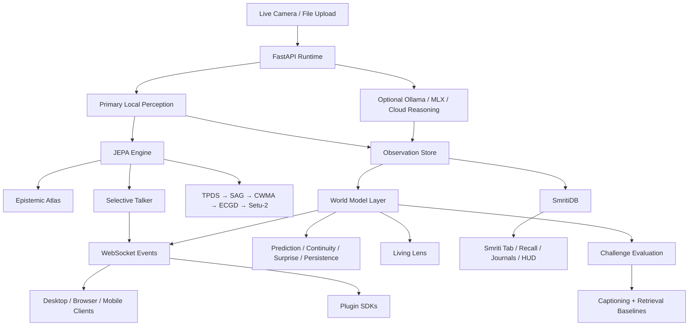

# CLAUDE.md

This repository is now an executable cross-platform project. Use this file as the first-stop implementation guide for future agents.

## Overview

Toori is a JEPA proof surface with three client surfaces:

- Electron desktop shell for the M1 iMac
- SwiftUI iOS client source tree
- Jetpack Compose Android client source tree

The working runtime lives in Python and exposes a loopback-first API on `127.0.0.1:7777`. It stores real observations from camera input, computes local embeddings, maintains world-model state, runs guarded Smriti memory ingestion and recall, and optionally calls reasoning backends.

## Mission And Vision

### Mission

Make JEPA-style world-model behavior inspectable in a real product.

Future work in this repository should keep the proof legible to a human operator. The key question is never only “did the system answer?”, but also:

- what did it expect?
- what stayed stable?
- what changed?
- what persisted through occlusion or movement?
- how did that compare with weaker baselines?

### Vision

Turn Toori into a reusable world-state runtime that can power many applications.

The browser and desktop UI are only the first proof surfaces. The runtime, event model, and SDKs should evolve so Toori can become:

- a desktop scientific demonstration of JEPA-style reasoning
- a plugin/runtime for other products
- a cross-platform perception-and-memory layer with consistent world-model semantics

When deciding between “better captioning” and “better world-state evidence,” bias toward world-state evidence.

## System Diagram



## Primary Entry Points

- [cloud/api/main.py](/Users/macuser/toori/cloud/api/main.py): main runtime app
- [cloud/jepa_service/engine.py](/Users/macuser/toori/cloud/jepa_service/engine.py): JEPA engine and spatial energy maps
- [cloud/runtime/talker.py](/Users/macuser/toori/cloud/runtime/talker.py): selective talker event generator
- [cloud/runtime/atlas.py](/Users/macuser/toori/cloud/runtime/atlas.py): epistemic atlas for entity tracking
- [cloud/runtime/app.py](/Users/macuser/toori/cloud/runtime/app.py): app factory and routes
- [cloud/runtime/service.py](/Users/macuser/toori/cloud/runtime/service.py): core analyze/query/settings logic
- [cloud/runtime/smriti_storage.py](/Users/macuser/toori/cloud/runtime/smriti_storage.py): Smriti schema, recall index, and cluster export
- [cloud/runtime/smriti_ingestion.py](/Users/macuser/toori/cloud/runtime/smriti_ingestion.py): ingestion daemon and folder watch queue
- [cloud/runtime/jepa_worker.py](/Users/macuser/toori/cloud/runtime/jepa_worker.py): isolated JEPA worker pool
- [cloud/runtime/setu2.py](/Users/macuser/toori/cloud/runtime/setu2.py): grounded Setu-2 query bridge
- [cloud/runtime/smriti_migration.py](/Users/macuser/toori/cloud/runtime/smriti_migration.py): copy-first Smriti data migration service
- [cloud/api/tests/test_smriti_production.py](/Users/macuser/toori/cloud/api/tests/test_smriti_production.py): authoritative production gate for Smriti regressions
- [desktop/electron/src/components/smriti/mandala-force-worker.ts](/Users/macuser/toori/desktop/electron/src/components/smriti/mandala-force-worker.ts): Web Worker for Mandala force layout
- [desktop/electron/src/components/smriti/SmritiStorageSettings.tsx](/Users/macuser/toori/desktop/electron/src/components/smriti/SmritiStorageSettings.tsx): Smriti storage configuration surface
- [desktop/electron/src/components/smriti/DeepdiveView.tsx](/Users/macuser/toori/desktop/electron/src/components/smriti/DeepdiveView.tsx): accessible Smriti deepdive modal with patch overlay and neighbors
- [desktop/electron/main.js](/Users/macuser/toori/desktop/electron/main.js): Electron shell entrypoint
- [desktop/electron/src/App.tsx](/Users/macuser/toori/desktop/electron/src/App.tsx): desktop product UI
- [desktop/electron/src/tabs/SmritiTab.tsx](/Users/macuser/toori/desktop/electron/src/tabs/SmritiTab.tsx): Smriti desktop surface
- [mobile/ios/TooriApp/TooriLensApp.swift](/Users/macuser/toori/mobile/ios/TooriApp/TooriLensApp.swift): iOS app root
- [mobile/android/app/src/main/java/com/toori/app/MainActivity.kt](/Users/macuser/toori/mobile/android/app/src/main/java/com/toori/app/MainActivity.kt): Android app root

## Development Commands

- Runtime dev server:
  `TOORI_DATA_DIR=.toori python3 -m uvicorn cloud.api.main:app --host 127.0.0.1 --port 7777`
- Verified Python tests:
  `pytest -q cloud/api/tests cloud/jepa_service/tests cloud/search_service/tests cloud/monitoring/tests tests/test_readme.py`
- Focused backend regression gate while iterating on Smriti:
  `pytest -q cloud/api/tests cloud/jepa_service/tests`
- Desktop typecheck:
  `cd desktop/electron && npm run typecheck`
- Desktop install and build:
  `cd desktop/electron && npm install && npm run build`
- Desktop launch:
  `cd desktop/electron && npm start`

## Architecture

### Runtime

- `RuntimeContainer` coordinates settings, provider health, observation storage, local similarity search, and event publication.
- `JEPAEngine` computes purely numerical latent predictions (`||s - ŝ||²`) and spatial energy maps natively.
- `JEPAWorkerPool` keeps JEPA work off the FastAPI event loop and exposes bounded queue/back-pressure metrics.
- `SelectiveTalker` uses adaptive energy thresholds to gate logic without wasting LLM cycles.
- `EpistemicAtlas` maintains in-memory entity relationship graphs tracking co-occurrence and persistence.
- `ObservationStore` persists observations and settings in SQLite under `.toori/`.
- `SmetiDB` extends observation storage with schema migrations, hybrid recall, cluster export, and person/location linking.
- Smriti storage paths are user-configurable through runtime settings and are resolved via `resolve_smriti_storage(...)`.
- `ProviderRegistry` selects perception and reasoning providers and enforces circuit-breaker fallback.
- The proof-surface layer adds scene state, entity tracks, prediction windows, and challenge runs on top of observations.
- The hybrid proof layer now also supports:
  - grounded tool-state observations through `POST /v1/tool-state/observe`
  - action-conditioned planning rollouts through `POST /v1/planning/rollout`
  - closed-loop recovery benchmarks through `POST /v1/benchmarks/recovery/run`
  - runtime V-JEPA2 config inspection and update through `GET/PUT /v1/world-model/config`
- `WorldModelStatus` must stay truthful: it reports the configured encoder, the last tick encoder actually used, and explicit degradation reason/stage when V-JEPA2 falls back.
- The V-JEPA2 encoder is now dynamically configured. Settings are written to a JSON mirror on disk by `_write_settings_mirror()` and re-read by `_resolve_model_id()` / `_resolve_n_frames()` on each load. Never hard-code encoder parameters in source.
- `_reset_vjepa2_if_config_changed()` triggers a lazy reload of the encoder when model path or `n_frames` differ from the live settings mirror.
- The Smriti pipeline layers are:
  - `TPDS` depth strata from JEPA energy deltas
  - `SAG` topology-aware anchor matching
  - `CWMA` spatial prior alignment
  - `ECGD` epistemic gating and uncertainty output
  - `Setu-2` grounded query scoring and template descriptions
- FastAPI lifecycle must use the lifespan context manager. Do not reintroduce `@app.on_event`.

### Sprint 5 Smriti Additions

- `cloud/runtime/smriti_migration.py` must preserve this order: copy first, verify destination second, update config last.
- Migration is non-destructive. Never delete source data as part of the migration flow.
- `dry_run=True` must not create directories, copy files, or mutate runtime settings.
- `desktop/electron/src/components/smriti/mandala-force-worker.ts` is Worker-only code. It uses `setTimeout(..., 33)` rather than `requestAnimationFrame`, imports no npm packages, and communicates with `postMessage`.
- `cloud/api/tests/test_smriti_production.py` is the hard production gate. It currently contains 12 tests; the original Sprint 5 contract required 11 and the extra coverage is intentional. The telescope regression remains the permanent sentinel.

### Sprint 6 World Model Foundation

This sprint introduced a formal planning layer on top of the existing JEPA observation pipeline. The approach is deliberately **additive and non-breaking**: prior observation/recall/Smriti contracts are untouched; the new models extend `AnalyzeResponse` and sit in their own endpoint namespace.

#### New data models (`cloud/runtime/models.py`)
- `ActionToken` — a candidate action, scored by urgency and confidence.
- `GroundedEntity` — a tracked scene element with a spatial domain label (e.g. `table_surface`, `hand`, `tool`).
- `GroundedAffordance` — an affordance prediction (reachable, graspable, blocked …) linked to a `GroundedEntity`.
- `PredictedAffordanceState` — the post-action predicted affordance state for a single entity.
- `RolloutStep` — a single action step inside a rollout branch.
- `RolloutBranch` — a scored sequence of `RolloutStep`s (plan A or plan B) with outcome confidence and uncertainty.
- `RolloutComparison` — the top-level response for `POST /v1/planning/rollout`; holds two `RolloutBranch`es and a recommended branch.
- `RecoveryScenario` / `RecoveryBenchmarkRun` — a persisted benchmark run that evaluates camera + tool planning across a recovery scenario set.
- `ToolStateObserveRequest` / `ToolStateObserveResponse` — grounding browser/desktop tool state into the world-state pipeline.
- `WorldModelStatus` — live diagnostic: configured encoder, encoder actually used on last tick, degradation reason and stage.
- `WorldModelConfig` / `WorldModelConfigUpdate` — dynamic V-JEPA2 parameters (model path, `n_frames`) that can be read and written at runtime.

#### New world model logic (`cloud/runtime/world_model.py`)
- `_state_domain_from_metadata(metadata)` — infers the spatial domain of an entity from observation metadata.
- `_validate_grounded_entities(raw)` / `_validate_affordances(raw)` — defensive validators for LLM-sourced grounding output.
- `_grounded_entities_from_camera(frame, tick)` — derives grounded entities from a live JEPA tick.
- `_default_affordances_for_domain(domain)` — returns sensible default affordances for a spatial domain when reasoning is unavailable.
- `derive_grounded_entities(request)` — top-level function: returns a list of `GroundedEntity` objects for a `ToolStateObserveRequest`.
- `default_candidate_actions(entities)` — seeds `ActionToken` candidates from grounded entities without requiring a reasoning backend.
- `build_rollout_comparison(request, entities)` — constructs a `RolloutComparison` from grounded entities and a `PlanningRolloutRequest`.
- `build_recovery_benchmark_run(request)` — assembles and persists a `RecoveryBenchmarkRun` from a `RecoveryBenchmarkRunRequest`.

#### New service methods (`cloud/runtime/service.py`)
- `_settings_mirror_path()` — resolves the canonical path for the V-JEPA2 JSON settings mirror.
- `_write_settings_mirror(settings)` — writes the active settings to the JSON mirror on save.
- `_reset_vjepa2_if_config_changed(old, new)` — detects model path / n_frames drift and triggers a lazy encoder reload.
- `get_vjepa2_settings()` → `WorldModelConfig` — reads the current dynamic config.
- `update_vjepa2_settings(model_path, n_frames)` → `WorldModelConfig` — persists new config and reloads the encoder.
- `_effective_vjepa2_model_id(settings)` — resolves the effective model ID from settings, falling back to the JSON mirror.
- `get_world_model_status()` → `WorldModelStatus` — builds the live status diagnostic.
- `observe_tool_state(request)` → `ToolStateObserveResponse` — grounds external tool state into the world pipeline.
- `plan_rollout(request)` → `PlanningRolloutResponse` — runs the rollout comparison engine.
- `run_recovery_benchmark(request)` → `RecoveryBenchmarkRun` — executes and stores a benchmark run.
- `get_recovery_benchmark(benchmark_id)` → `Optional[RecoveryBenchmarkRun]` — fetches a stored benchmark run.

#### New storage methods (`cloud/runtime/storage.py`)
- `save_recovery_benchmark_run(benchmark)` — persists a `RecoveryBenchmarkRun` to SQLite.
- `get_recovery_benchmark_run(benchmark_id)` — retrieves a stored run by ID.
- `recent_recovery_benchmark_runs(limit)` — returns the N most recent benchmark runs.

#### New API routes (`cloud/runtime/app.py`)
- `GET /v1/world-model/status` → `WorldModelStatus`
- `GET /v1/world-model/config` → `WorldModelConfig`
- `PUT /v1/world-model/config` → `WorldModelConfig`
- `POST /v1/tool-state/observe` → `ToolStateObserveResponse`
- `POST /v1/planning/rollout` → `PlanningRolloutResponse`
- `POST /v1/benchmarks/recovery/run` → `RecoveryBenchmarkRun`
- `GET /v1/benchmarks/recovery/{id}` → `RecoveryBenchmarkRun`

#### Desktop UI changes
- `SettingsTab.tsx` — exposes V-JEPA2 model path and `n_frames` controls; reads/writes via the new `GET/PUT /v1/world-model/config` endpoints.
- `LivingLensTab.tsx` — expanded to show `RolloutComparison`, `GroundedEntity` list, and Recovery Lab interactions.
- `useWorldState.ts` — extended to fetch and cache `WorldModelStatus`, grounded entities, and rollout results.
- `DesktopAppContext.tsx` — state providers updated to accommodate `WorldModelConfig` and rollout state.
- `ScientificReadout.tsx` — updated readout panel surfaces new world-state metrics from the Sprint 6 models.
- `SmritiStorageSettings.tsx` — minor schema alignment with updated `WorldModelConfig` payloads.

#### Proof report
- `cloud/runtime/proof_report.py` — refactored PDF generation to stream via `_render_pdf_bytes(html)` instead of writing to a temporary file path. The public `generate_proof_report()` signature is unchanged.

### SETU-2 W-MATRIX FEEDBACK

- Feedback endpoint: `POST /v1/smriti/recall/feedback`
- `confirmed=True` is treated as a positive pair; `confirmed=False` is treated as a negative pair.
- Learning rate for Setu-2 W-matrix updates must never exceed `0.005`.
- The W-matrix is runtime-local in Sprint 5. It is not persisted to disk yet.
- Feedback is best-effort. Missing `media_id` returns `updated=False` rather than raising an HTTP error.

### Provider Policy

- Primary local perception targets:
  - desktop/runtime: DINOv2 + MobileSAM in `cloud/perception/`
  - iOS: CoreML-compatible path in native client
  - Android: TFLite-compatible path in native client
- Guaranteed local fallback in the Python runtime:
  - `basic` classical image descriptor over real pixels
- Optional desktop reasoning:
  - `ollama`
  - MLX via configured shell command
- Default reasoning fallback:
  - OpenAI-compatible cloud provider

### Proof Surface Policy

- `Live Lens` is the operator/debug surface.
- `Living Lens` is the scientific proof surface and should be treated as the primary demo path.
- `Living Lens -> Recovery Lab` is where hybrid camera-plus-tool planning work should surface. Extend that workspace rather than creating a separate planner UI.
- `Smriti` is the semantic memory surface for ingestion, recall, journals, cluster browsing, and pipeline transparency.
- The proof surface must be understandable without reading research papers. Favor plain language, structured evidence, and guided interaction over jargon-heavy dashboards.
- Latest observation sharing is copy-first: any share recap must stay grounded to a real stored observation, real world-state metrics, and the public repo URL.
- The proof surface must expose:
  - prediction consistency
  - temporal continuity
  - surprise
  - persistence
  - baseline comparison
- The differentiator of Toori is not one more multimodal UI. The differentiator is that the runtime turns live scenes into a measurable world state and lets the user compare that behavior against caption-only and retrieval-only baselines.
- In operator wording, `passive mode` means `continuous monitoring mode`: the camera stays live, the scene model keeps updating, and the user does not have to press capture each time.
- Browser mode is the default proof-development surface until the Electron app is packaged as a signed macOS bundle.

### Clients

- Desktop UI is the most complete operator surface today.
- Mobile sources are aligned to the same runtime contract and settings surface, but still need platform dependency installation and project wiring to build in native IDEs.

## Important Invariants

- Never reintroduce placeholder zero-vector behavior in user-facing flows.
- Search results must always refer to actual stored observations.
- Smriti recall and journals must stay backed by real stored media; never fall back to invented results or placeholder memories.
- Storage pruning must never delete original source media outside Smriti-managed storage directories.
- Reasoning providers (Ollama/MLX) are selectively triggered or operate in query-only mode. Live tick paths must not invoke reasoners autonomously.
- The JEPA engine must remain pure numpy-compatible (`float32`) without CUDA or PyTorch to ensure identical paths for M1/MPS users.
- `torch` imports are forbidden in Smriti pipeline modules such as TPDS, SAG, CWMA, ECGD, and Setu-2.
- `ollama` and MLX must remain optional and health-checked.
- `ollama` and MLX are explanatory sidecars only. They must not overwrite or redefine the authoritative world-model metrics, rollout ranking, or recovery benchmark winner.
- DINOv2 is the perception backbone for the desktop/runtime path; ONNX is compatibility-only.
- `torch` imports are allowed only inside `cloud/perception/`.
- Consumer Mode is the default on first launch via `localStorage["toori_mode"]="consumer"`.
- The 3D proof overlay stays at `z-index:10` with `pointer-events:none`.
- The SigReg gauge stays visible in Science Mode.
- Ghost bounding boxes are stored and rendered in pixel coordinates, never patch indices.
- Talker firing is gated by `Ē > μ_E + 2·σ_E`.
- EMA updates happen before predictor forward with no exceptions.
- V-JEPA2 encoder parameters must never be hard-coded. Read from the JSON settings mirror via `_resolve_model_id()` and `_resolve_n_frames()`. Write via `_write_settings_mirror()` on every settings save.
- `WorldModelStatus` must stay truthful: report the configured encoder, the encoder *actually used* on the last tick, and explicit degradation reason/stage if V-JEPA2 falls back to surrogate.
- `GroundedEntity`, `GroundedAffordance`, `ActionToken`, `RolloutBranch`, `RolloutComparison`, and `RecoveryBenchmarkRun` are additive extensions — they must not alter the existing `AnalyzeResponse` contract or break existing observe/recall/Smriti flows.
- Recovery benchmark runs are persisted to SQLite via `save_recovery_benchmark_run()` and are retrievable by ID. Do not hold them only in memory.
- The `_validate_grounded_entities()` and `_validate_affordances()` validators in `world_model.py` are the safety net for any LLM-sourced grounding output. Never skip them.
- Forecast horizons `FE(k)` are expected to increase with `k`; flag non-monotonic behavior.
- The Smriti telescope regression is a hard contract: a cylindrical background object must not be described as a body part.
- Perception stays backbone-agnostic at the engine boundary; see `CONTRIBUTING.md`.
- If a provider is unhealthy, the runtime must degrade gracefully instead of blocking capture/search.
- macOS Camera privacy depends on a real app bundle identity; stock Electron CLI launches should not be treated as proof of permission support.
- `TOORI_PUBLIC_URL` sets the public-facing URL used in share CTAs. Defaults to `https://github.com/NeoOne601/Toori`. Override for forks and enterprise deployments.

### Torch Isolation Grep — Correct Pattern

Always use anchored grep to check for torch imports:
```bash
# CORRECT — only matches actual import statements:
grep -rn "^import torch\|^from torch" cloud/ --include="*.py" \
  | grep -v "cloud/perception/"

# WRONG — matches string literals in tests (false positives):
grep -r "import torch" cloud/ --include="*.py" | grep -v "cloud/perception/"
```
The unanchored pattern matches `assert "torch" not in sys.modules`
in test files, producing misleading "VIOLATION FOUND" output.

### DEEPDIVE FOCUS CONTRACT (WCAG 2.1 AA)

- On open, focus moves to the deepdive modal container.
- While open, focus is trapped inside the modal with Tab and Shift+Tab cycling.
- On close, focus returns to the element that launched the modal.
- Escape closes the modal from anywhere inside it.
- Every interactive control inside the modal must expose an accessible name.

### ALL CANVAS ELEMENTS IN SMRITI

- All Smriti canvases use `getContext("2d")` only. WebGL, THREE.js, and WebGPU are prohibited in Smriti components.
- Every draw loop must call `ctx.clearRect(...)` before painting a new frame.
- Use `ctx.save()` and `ctx.restore()` around transformed drawing code.
- Resize handling must update `canvas.width` and `canvas.height`, then apply `devicePixelRatio` scaling.
- Person journal co-occurrence layout stays circular and static. Do not introduce a force simulation there.

### test_smriti_production.py GOVERNANCE

- `cloud/api/tests/test_smriti_production.py` must pass before merging any Smriti pipeline change.
- All production-gate tests must pass in CI before merge. The current file contains 12 tests.
- Adding tests to that file is encouraged when real regressions are found.
- Removing, weakening, or renaming production-gate tests requires explicit sign-off.
- If `test_telescope_behind_person_not_described_as_body_part` fails, all feature work stops until it passes again.

## Recommended Work Areas

- Improve the Python runtime before adding more UI complexity.
- Keep client models aligned with [cloud/runtime/models.py](/Users/macuser/toori/cloud/runtime/models.py). The Sprint 6 additions (`GroundedEntity`, `ActionToken`, `RolloutComparison`, `RecoveryBenchmarkRun`, `WorldModelStatus`, `WorldModelConfig`) are the current surface to keep in sync.
- Keep desktop types in `desktop/electron/src/types.ts` aligned with the planning and world-model route payloads.
- Extend SDKs in [sdk](/Users/macuser/toori/sdk) when public API changes — the new planning/recovery routes and `WorldModelConfig` endpoints need SDK coverage.
- Update [docs/system-design.md](/Users/macuser/toori/docs/system-design.md), [docs/user-manual.md](/Users/macuser/toori/docs/user-manual.md), and [docs/plugin-guide.md](/Users/macuser/toori/docs/plugin-guide.md) whenever interfaces or workflows move.
- When proof surfaces change, update the README and user manual so the browser-first workflow and packaged-macOS caveat stay explicit.
- The next sprint should focus on: signed macOS bundle, federated Setu-2, and mobile client packaging. Keep the planning/recovery backend stable before widening the client surface.
