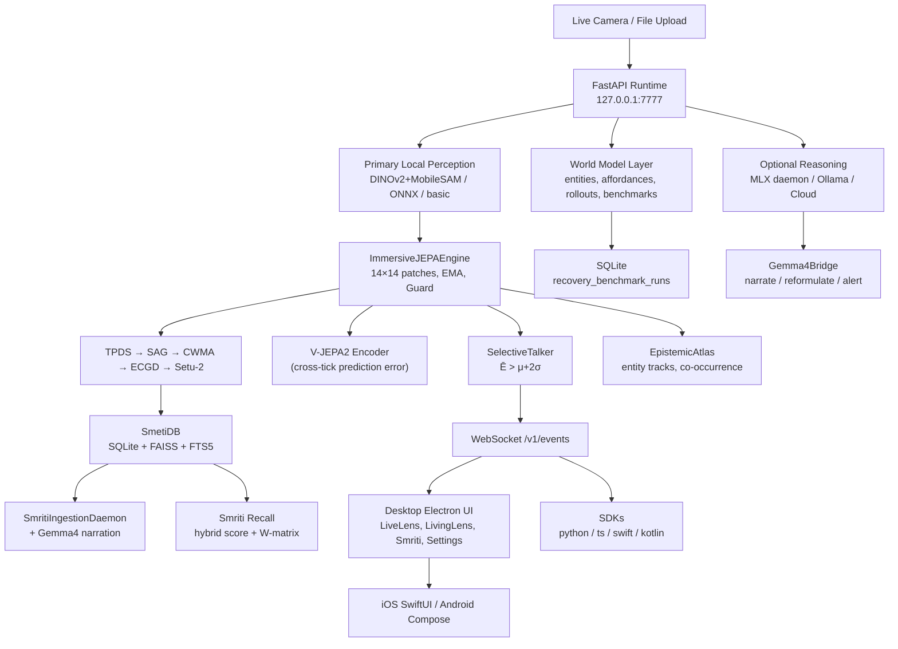

# CLAUDE.md — Toori Implementation Guide

This is the authoritative reference for every agent working in this repository.
Read this entirely before making any change.

---

## Mission & Vision

**Mission:** Make JEPA-style world-model behavior inspectable in a real product.
The key question is never just "did the system answer?" but also:
- What did it expect?
- What stayed stable?
- What changed?
- What persisted through occlusion or movement?
- How does that compare with caption-only and retrieval-only baselines?

**Vision:** A reusable world-state runtime powering many applications — desktop scientific demo, plugin runtime for other products, cross-platform perception-and-memory layer.

**Differentiator:** Toori turns live scenes into a *measurable world state* and compares JEPA behavior against weaker baselines. It is not just another multimodal UI.

---

## Repository Layout

```
toori/
├── cloud/                     Python runtime (FastAPI, JEPA, Smriti)
│   ├── api/                   FastAPI entrypoint + auth + tests
│   │   ├── main.py            → imports create_app() from cloud.runtime.app
│   │   ├── auth.py            API key middleware
│   │   └── tests/             16 test files (272 tests total)
│   ├── jepa_service/          JEPA engines, perceptual pipeline sub-services
│   │   ├── engine.py          JEPAEngine (compat) + ImmersiveJEPAEngine (primary)
│   │   ├── anchor_graph.py    SemanticAnchorGraph (SAG)
│   │   ├── confidence_gate.py EpistemicConfidenceGate (ECGD)
│   │   ├── depth_separator.py TemporalParallaxDepthSeparator (TPDS)
│   │   └── world_model_alignment.py CrossModalWorldModelAligner (CWMA)
│   ├── monitoring/            Prometheus metric tests
│   ├── perception/            DINOv2 + MobileSAM + ONNX + V-JEPA2 encoder
│   ├── runtime/               Core business logic (22 modules)
│   │   ├── app.py             create_app(), all FastAPI routes
│   │   ├── atlas.py           EpistemicAtlas (entity relationship graphs)
│   │   ├── config.py          resolve_data_dir(), resolve_smriti_storage(), default_settings()
│   │   ├── error_types.py     SmritiError hierarchy
│   │   ├── events.py          WebSocket event bus
│   │   ├── gemma4_bridge.py   Gemma4Bridge (anchor narration, query reformulation, alerts)
│   │   ├── jepa_worker.py     JEPAWorkerPool (isolated JEPA off FastAPI event loop)
│   │   ├── models.py          ALL Pydantic data models (single source of truth)
│   │   ├── observability.py   CorrelationContext, PipelineTrace, TokenBucketRateLimiter,
│   │   │                      MemoryCeilingManager, SchemaVersionManager, structlog wrapper
│   │   ├── proof_report.py    PDF proof generation (WeasyPrint streaming)
│   │   ├── providers.py       ProviderRegistry + all provider implementations
│   │   │                      incl. MlxReasoningProvider (daemon architecture)
│   │   ├── resilience.py      SmritiCircuitBreaker, FallbackChain, BackPressureQueue
│   │   ├── service.py         RuntimeContainer — all analyze/query/settings/Smriti logic
│   │   ├── setu2.py           Setu2Bridge (grounded region description)
│   │   ├── smriti_gemma4_enricher.py  SmetiGemma4Enricher (Gemma4 inside ingestion/tick)
│   │   ├── smriti_ingestion.py        SmritiIngestionDaemon + watch folder queue
│   │   ├── smriti_migration.py        Copy-first Smriti data migration
│   │   ├── smriti_storage.py          SmetiDB — SQLite + FAISS, recall, clusters, journals
│   │   ├── storage.py                 ObservationStore + recovery benchmark persistence
│   │   ├── talker.py                  SelectiveTalker (energy-gated events)
│   │   └── world_model.py             Sprint 6 planning layer (entities, affordances, rollouts)
│   └── search_service/        Compatibility search service
├── desktop/electron/          Electron + React/Vite operator UI
│   ├── main.js                Electron shell entrypoint
│   └── src/
│       ├── App.tsx            Root router (tab switcher)
│       ├── types.ts           ALL TypeScript types (keep in sync with models.py)
│       ├── styles.css         Global design tokens and component styles
│       ├── constants.ts       API base URL, polling intervals
│       ├── tabs/              LiveLensTab, LivingLensTab, SmritiTab, SettingsTab,
│       │                      MemorySearchTab, SessionReplayTab, IntegrationsTab
│       ├── components/        BaselineBattle, ConsumerMode, ForecastPanel,
│       │                      Gemma4Panel, OcclusionPanel, SigRegGauge, SpatialCanvas3D
│       │   └── smriti/        DeepdiveView, MandalaView, PerformanceHUD,
│       │                      PersonJournal, RecallSurface, SmritiStorageSettings,
│       │                      mandala-force-worker.ts
│       ├── hooks/             useCameraStream, useLivingLens, useRuntimeBridge,
│       │                      useSmritiState, useWorldState
│       ├── state/             DesktopAppContext
│       ├── panels/            ScientificReadout
│       ├── layouts/           Shell layouts
│       ├── lib/               Shared utilities
│       └── widgets/           Small reusable widgets
├── mobile/
│   ├── ios/TooriApp/          SwiftUI client (TooriLensApp.swift entry)
│   └── android/app/…          Jetpack Compose client (MainActivity.kt entry)
├── sdk/                       python/, typescript/, swift/, kotlin/ SDKs
├── scripts/
│   ├── mlx_reasoner.py        Gemma-4 MLX daemon script (stdin/stdout JSON-lines)
│   ├── setup_backend.py       Backend dependency installer
│   ├── setup_frontend.py      Frontend dependency installer
│   ├── download_desktop_models.py  ONNX model downloader
│   └── e2e_test.py            End-to-end smoke test
├── docs/                      system-design.md, user-manual.md, plugin-guide.md
├── tests/test_readme.py       README contract guard
├── requirements.txt           Core Python deps (fastapi, uvicorn, pydantic, numpy,
│                              pillow, onnxruntime, websockets, weasyprint, structlog,
│                              av>=12, watchdog>=4)
├── conftest.py                Shared pytest fixtures
├── AGENTS.md                  Codex agent guidance
└── CLAUDE.md                  ← this file
```

---

## Development Commands

```bash
# Start runtime (loopback, port 7777)
TOORI_DATA_DIR=.toori python3 -m uvicorn cloud.api.main:app --host 127.0.0.1 --port 7777

# Full verified test suite (272 pass, 11 skip as of Sprint 6 + MLX daemon)
pytest -q cloud/api/tests cloud/jepa_service/tests cloud/search_service/tests cloud/monitoring/tests tests/test_readme.py

# Focused Smriti regression gate
pytest -q cloud/api/tests cloud/jepa_service/tests

# Desktop
cd desktop/electron && npm install
cd desktop/electron && npm run typecheck
cd desktop/electron && npm run build
cd desktop/electron && npm start

# iOS (Xcode)
xcodebuild -project mobile/ios/TooriLens.xcodeproj -scheme TooriLens \
  -configuration Debug -sdk iphonesimulator \
  -derivedDataPath .xcode-derived CODE_SIGNING_ALLOWED=NO build

# Android — open mobile/android in Android Studio
```

---

## Complete API Route Reference

All routes are defined in `cloud/runtime/app.py` via `create_app()`.
Auth: `loopback` mode (default) passes all requests. `api-key` mode requires `X-Api-Key` header.
Rate limiting: 20 req/s burst 60 globally; 5 req/s burst 10 for `/v1/smriti/recall`.

| Method | Path | Description |
|--------|------|-------------|
| GET | `/healthz` | Liveness probe → `{"status":"ok"}` |
| GET | `/metrics` | Prometheus metrics (mounted ASGI app) |
| GET | `/v1/settings` | Get `RuntimeSettings` |
| PUT | `/v1/settings` | Update `RuntimeSettings` |
| GET | `/v1/world-model/status` | `WorldModelStatus` (encoder, degradation) |
| GET | `/v1/world-model/config` | `WorldModelConfig` (V-JEPA2 params) |
| PUT | `/v1/world-model/config` | Update V-JEPA2 model_path + n_frames |
| GET | `/v1/providers/health` | All provider health reports |
| GET | `/v1/observations` | List observations (session_id, limit) |
| GET | `/v1/file` | Serve a file from data_dir (path-restricted) |
| POST | `/v1/analyze` | Analyze image → `AnalyzeResponse` |
| POST | `/v1/living-lens/tick` | Living lens async tick → `LivingLensTickResponse` |
| POST | `/v1/jepa/forecast` | JEPA forecast at horizon k |
| POST | `/v1/query` | Text/image semantic query → `QueryResponse` |
| GET | `/v1/world-state` | Get session world state |
| POST | `/v1/tool-state/observe` | Ground tool state → `ToolStateObserveResponse` |
| POST | `/v1/planning/rollout` | Action-conditioned rollout → `PlanningRolloutResponse` |
| POST | `/v1/benchmarks/recovery/run` | Run recovery benchmark |
| GET | `/v1/benchmarks/recovery/{id}` | Fetch stored benchmark |
| POST | `/v1/challenges/evaluate` | Evaluate challenge run |
| POST | `/v1/proof-report/generate` | Generate PDF proof report |
| GET | `/v1/proof-report/latest` | Download latest PDF |
| POST | `/v1/share/observation` | Build shareable observation payload |
| POST | `/v1/share/observation/event` | Record share event |
| WS | `/v1/events` | WebSocket event stream |
| POST | `/v1/smriti/ingest` | Queue file or folder for ingestion |
| GET | `/v1/smriti/status` | Ingestion daemon stats |
| POST | `/v1/smriti/recall` | Semantic recall → `SmritiRecallResponse` |
| POST | `/v1/smriti/recall/feedback` | W-matrix feedback (pos/neg pair) |
| GET | `/v1/smriti/media/{id}` | Media record detail |
| GET | `/v1/smriti/media/{id}/neighbors` | Nearest neighbors (top_k≤20) |
| POST | `/v1/smriti/tag/person` | Tag person in media |
| GET | `/v1/smriti/person/{name}/journal` | Person journal |
| GET | `/v1/smriti/clusters` | Cluster graph for Mandala |
| GET | `/v1/smriti/metrics` | Worker pool metrics |
| GET | `/v1/smriti/storage` | `SmritiStorageConfig` |
| PUT | `/v1/smriti/storage` | Update storage config |
| GET | `/v1/smriti/storage/usage` | `StorageUsageReport` |
| GET | `/v1/smriti/watch-folders` | List watch folder statuses |
| POST | `/v1/smriti/watch-folders` | Add watch folder |
| DELETE | `/v1/smriti/watch-folders` | Remove watch folder |
| POST | `/v1/smriti/storage/prune` | Prune old/missing/failed media |
| POST | `/v1/smriti/storage/migrate` | Copy-first data migration |

---

## Provider System (`cloud/runtime/providers.py`)

### Perception Providers (return embeddings)
| Name | Class | Notes |
|------|-------|-------|
| `dinov2` | `DINOv2Provider` | Primary. DINOv2-ViT-S/14 + MobileSAM. Requires torch (perception/ only). Device: MPS by default. |
| `onnx` | `OnnxProvider` | MobileNetV2 via ONNX Runtime. Fallback when DINOv2 unavailable. |
| `basic` | `BasicProvider` | Classical pixel descriptor. Always available. Guaranteed fallback. |
| `coreml` | `CoreMLProvider` | iOS/macOS only, disabled by default. |
| `tflite` | `TFLiteProvider` | Android, disabled by default. |

### Reasoning Providers (return text answers)
| Name | Class | Notes |
|------|-------|-------|
| `ollama` | `OllamaReasoningProvider` | Optional. HTTP to local Ollama. Default model: `gemma3:4b`. Disabled by default. |
| `mlx` | `MlxReasoningProvider` | **Daemon architecture** (see below). Gemma-4 on Apple Silicon. Disabled by default. |
| `cloud` | `CloudReasoningProvider` | OpenAI-compatible API. Default model: `gpt-4.1-mini`. Enabled by default. |

### Search Providers
| Name | Class | Notes |
|------|-------|-------|
| `local` | `LocalSearchProvider` | FAISS cosine search over stored observations. |

### MlxReasoningProvider — Daemon Architecture (Sprint 6 fix)
The MLX provider runs `scripts/mlx_reasoner.py` as a **persistent `subprocess.Popen` daemon** (not per-call `subprocess.run`). This prevents the 8GB model-loading spike on every health check.

Key methods:
- `_ensure_daemon(config)` — lazy start, crash restart, thread-safe
- `_send_receive(config, payload, timeout_s)` — JSON-lines over stdin/stdout, `select`-based timeout, `threading.Lock`
- `_daemon_alive()` — checks `self._daemon.poll() is None`
- `shutdown()` — `stdin.close()` → `terminate()` → `wait(5s)` → `kill()`. Registered via `atexit`.
- `health(config)` — tiered: Tier 2 (daemon ping) if alive, Tier 1 (lightweight subprocess) otherwise. **30s TTL cache** prevents redundant probes.
- `_run_healthcheck_subprocess(config)` — runs `mlx_reasoner.py --healthcheck` (no model load, valid JSON output)
- `_format_prompt(prompt, context, has_image=False)` — `has_image` defaults to `False` (prevents TypeError)

`scripts/mlx_reasoner.py` daemon protocol:
- Reads JSON lines from stdin: `{"prompt":…, "image_base64":…, "max_tokens":…}`
- Healthcheck command: `{"type":"healthcheck"}` → responds `{"success":true,"message":"daemon alive (model)"}`
- Responds with JSON: `{"text":…, "tokens_generated":…}` or `{"error":…}`
- `--healthcheck` flag: validates environment without loading weights, exits with JSON

### Provider Fallback Order
`dinov2` → `onnx` → `basic` → `cloud`

### Config Environment Variables
| Variable | Default | Effect |
|----------|---------|--------|
| `TOORI_DATA_DIR` | `.toori/` | Runtime data directory |
| `TOORI_MLX_MODEL_PATH` | `/Volumes/Apple/AI Model/gemma-4-e4b-it-4bit` | MLX model path |
| `TOORI_MLX_COMMAND` | `python3.11 scripts/mlx_reasoner.py` | MLX daemon command |
| `TOORI_MLX_TIMEOUT` | `150` | MLX request timeout (s) |
| `TOORI_OLLAMA_HOST` | `http://127.0.0.1:11434` | Ollama base URL |
| `TOORI_OLLAMA_MODEL` | `gemma3:4b` | Ollama model |
| `TOORI_OPENAI_BASE_URL` | `https://api.openai.com/v1` | Cloud API base URL |
| `TOORI_OPENAI_MODEL` | `gpt-4.1-mini` | Cloud model name |
| `TOORI_OPENAI_API_KEY` | — | Cloud API key |
| `TOORI_DINOV2_DEVICE` | `mps` | DINOv2 device |
| `TOORI_ONNX_MODEL` | `models/vision/mobilenetv2-12.onnx` | ONNX model path |
| `TOORI_SMRITI_DATA_DIR` | — | Override Smriti data dir |
| `TOORI_PUBLIC_URL` | `https://github.com/NeoOne601/Toori` | Share CTA URL |

---

## Data Models Reference (`cloud/runtime/models.py`)

This is the **single source of truth**. Keep `desktop/electron/src/types.ts` in sync.

### Core
- `RuntimeSettings` — all operator settings (providers, perception, reasoning, storage, auth)
- `ProviderConfig` — individual provider config (name, enabled, model, model_path, api_key, timeout_s, metadata)
- `ProviderHealth` — health status (name, role, healthy, message, latency_ms)
- `Observation` — stored observation (id, session_id, image_path, thumbnail_path, width, height, embedding, summary, tags, confidence, novelty)
- `Answer` — reasoning result (text, provider, confidence)
- `ReasoningTraceEntry` — per-provider reasoning attempt log

### World Model (Sprint 6)
- `ActionToken` — candidate action (id, verb, target_kind, parameters)
- `GroundedEntity` — tracked entity with state domain (camera/browser/desktop/memory)
- `GroundedAffordance` — affordance prediction (available/hidden/disabled/missing/error)
- `PredictedAffordanceState` — post-action affordance for a single entity
- `RolloutStep` — one action step in a branch
- `RolloutBranch` — scored rollout sequence (risk_score, confidence, failure_predicates)
- `RolloutComparison` — top-level rollout result with ranked branches + chosen_branch_id
- `RecoveryScenario` / `RecoveryBenchmarkRun` — persisted benchmark (SQLite)
- `SceneState` — full world state snapshot (entities, affordances, metrics, conditioned_rollouts)
- `WorldModelStatus` — live encoder diagnostic (configured vs actual encoder, degradation)
- `WorldModelConfig` — V-JEPA2 runtime config (model_path, n_frames, effective_model)

### JEPA
- `JEPATick` — tick output dataclass (energy_map, entity_tracks, sigreg_loss, forecast_errors, depth_strata, anchor_matches, setu_descriptions, prediction_error, surprise_score, epistemic/aleatoric uncertainty, world_model_version, degraded/degrade_reason/degrade_stage, gemma4_alert)
- `JEPATickPayload` — JSON-serializable form of JEPATick
- `EntityTrack` — tracked entity (id, status: visible/occluded/re-identified/disappeared/violated prediction, cosine_history via metadata)
- `WorldModelMetrics` — prediction_consistency, surprise_score, temporal_continuity_score, persistence_confidence, continuity_signal, persistence_signal

### Smriti
- `SmritiStorageConfig` — data_dir, frames_dir, thumbs_dir, templates_path, watch_folders, max_storage_gb
- `SmritiRecallRequest/Response` — natural language recall with filters
- `SmritiRecallItem` — recall hit with setu_score, hybrid_score, descriptions, anchor_basis
- `SmritiRecallFeedback` — W-matrix feedback (confirmed=True → positive, False → negative)
- `SmritiPruneRequest/Result` — prune by age, missing files, or clear-all
- `SmritiMigrationRequest/Result` — copy-first migration with dry_run support

### API Contracts
- `AnalyzeRequest` — image_base64 or file_path + session_id + query + decode_mode
- `AnalyzeResponse` — observation + hits + answer + provider_health + reasoning_trace
- `LivingLensTickRequest` — extends AnalyzeRequest + proof_mode
- `ToolStateObserveRequest` — current_url, view_id, visible_entities, affordances, screenshot
- `QueryRequest` — query text or image + top_k + filters

---

## JEPA Engine Detail (`cloud/jepa_service/engine.py`)

Two engines coexist:

**`JEPAEngine`** (compatibility): Vector-first API for legacy tests. 4-layer MLP predictor. `tick(frame_embedding) → TickResult`.

**`ImmersiveJEPAEngine`** (primary): DINOv2/SAM-backed session engine.
- 14×14 patch grid (196 patches × 384 dims)
- EMA update before predictor forward; no exceptions
- Guard: when `||θ_tgt - θ_ctx||₂ < 0.01`, tau drops to 0.90 for 10 ticks
- Talker gating: `Ē > μ_E + 2·σ_E`
- Ghost bounding boxes in pixel coordinates (never patch indices)
- V-JEPA2 encoder integrated (Sprint 6): `encode(frame) → (encoder_emb, predictor_emb)`; cross-tick prediction error = `||enc_emb_t - pred_emb_{t-1}||²`; surprise score = z-score normalized over 128-tick window, clamped to [0,1]
- Surrogate fallback when V-JEPA2 fails; `degraded=True` + `degrade_reason/stage` in tick

**Smriti Pipeline** (inside ImmersiveJEPAEngine):
1. **TPDS** — `TemporalParallaxDepthSeparator` assigns foreground/midground/background strata from `energy_map` deltas
2. **SAG** — `SemanticAnchorGraph` matches patch tokens to stored templates; returns anchor_matches with confidence, depth_stratum, patch_indices
3. **CWMA** — `CrossModalWorldModelAligner` refines energy_map with anchor + depth alignment (lambda=0.15)
4. **ECGD** — `EpistemicConfidenceGate` gates regions by consistency score; uncertainty map output
5. **Setu-2** — `Setu2Bridge` generates grounded text descriptions per gated region

**Anchor entity tracking:**
- New track if best cosine < 0.72
- `occluded` after ≥3 misses AND cosine < 0.65
- `disappeared` after ≥5 misses
- `re-identified` when occluded ghost cosine > 0.72 on detection
- `violated prediction` when cosine < 0.5
- Track pruned after ≥4 misses + 8s (disappeared/violated) or ≥10 misses + 20s (occluded)

---

## Smriti Memory System (`cloud/runtime/smriti_storage.py`)

**SmetiDB** extends observation storage:
- SQLite under `.toori/smriti/`
- Schema versioned via `SchemaVersionManager` (no gap-skipping allowed)
- FAISS index for vector similarity
- Full-text search (FTS5) on descriptions
- Hybrid recall: FAISS vector + FTS + Setu-2 scores combined via `W-matrix`
- W-matrix updated from `POST /v1/smriti/recall/feedback`; LR ≤ 0.005; runtime-local (not persisted)
- Cluster export (k-means on embeddings) for Mandala visualization
- Person journal: chronological media for a named person
- Watch folders: `watchdog` monitors directories; deduplicates by SHA-256 hash

**SmritiIngestionDaemon** (`cloud/runtime/smriti_ingestion.py`):
- Async background worker; starts/stops with FastAPI lifespan
- Processes `SmritiMedia` jobs: decode, encode embeddings, run TPDS/SAG/CWMA/ECGD/Setu2, optionally Gemma-4 narration

**Gemma4 integration in Smriti:**
- `SmetiGemma4Enricher` plugs into ingestion (`_process_job`) and living-lens tick
- Call sites: A) after setu_descriptions in ingestion B) before returning in living_lens_tick
- Narration: anchor + depth evidence → 1-sentence description (max 20 words, max 8s timeout)
- Query reformulation: natural language → structured JSON (depth_stratum, person_filter, time_hint)
- Proactive alerts: surprise > 0.55 OR occluded tracks → short alert sentence (max 5s, max 15 words)

---

## Gemma4Bridge (`cloud/runtime/gemma4_bridge.py`)

Evidence-first design: JEPA geometric evidence goes INTO the prompt. Gemma-4 narrates measurements, not imagination. This is why it cannot hallucinate a telescope into a body part.

Four system prompts:
- `_ANCHOR_SYSTEM` — precise spatial narrator; max 20 words; evidence-only
- `_QUERY_SYSTEM` — search query parser; JSON output only
- `_COREF_SYSTEM` — entity co-reference resolver; JSON output only
- `_ALERT_SYSTEM` — safety narrator; max 15 words or "stable"

Methods:
- `narrate_anchor(anchor_matches, depth_strata, setu_descriptions, observation_id, image_base64)`
- `reformulate_query(natural_query)` → `QueryReformulationResult`
- `proactive_alert(scene_state, entity_tracks, jepa_tick)` — only fires when surprise > 0.55 or occluded tracks present

---

## Observability & Resilience

**`cloud/runtime/observability.py`:**
- `CorrelationContext` — async context-var correlation ID (`smriti_{hex12}`)
- `get_logger(component)` — returns structlog or fallback JSON logger bound to correlation_id
- `PipelineTrace` + `trace_stage(trace, stage)` — per-request stage timing
- `with_fallback(fallback_value)` — decorator that logs and returns default on exception
- `TokenBucketRateLimiter(rate_per_second, burst)` — in-process per-key rate limiting
- `MemoryCeilingManager(ceiling_mb)` — RSS monitor; triggers `gc.collect()` at 90% of ceiling
- `SchemaVersionManager(db_path)` — SQLite migration tracker; strict sequential versioning

**`cloud/runtime/resilience.py`:**
- `SmritiCircuitBreaker(name, failure_threshold=3, reset_timeout_s=30)` — closed → open → half-open
- `FallbackChain(*handlers)` — tries handlers in sequence
- `BackPressureQueue(maxsize, policy)` — policies: WAIT, LATEST_DROP, OLDEST_DROP

**HTTP middleware (`app.py`):**
- Every request gets a correlation ID (from header or generated)
- Response includes `X-Correlation-ID` header
- Structured JSON log on request completion
- Rate limit → HTTP 429 with `Retry-After` header

---

## Desktop UI (`desktop/electron/`)

**Tabs:**
| Tab | File | Purpose |
|-----|------|---------|
| Live Lens | `LiveLensTab.tsx` | Operator/debug view; camera + quick capture |
| Living Lens | `LivingLensTab.tsx` | **Primary scientific proof surface**; JEPA metrics, entity tracks, rollouts, Recovery Lab |
| Smriti | `SmritiTab.tsx` | Semantic memory: Mandala, Recall, Deepdive, Journals, HUD |
| Settings | `SettingsTab.tsx` | All RuntimeSettings + V-JEPA2 config + provider toggles |
| Memory Search | `MemorySearchTab.tsx` | Direct recall search |
| Session Replay | `SessionReplayTab.tsx` | Historical observation replay |
| Integrations | `IntegrationsTab.tsx` | Plugin/SDK links |

**Key hooks:**
- `useCameraStream.ts` — camera device enumeration, stream, frame capture, diagnostics
- `useWorldState.ts` — polls `/v1/world-state`, `/v1/world-model/status`, `/v1/providers/health`; manages `WorldModelConfig` and rollout state
- `useSmritiState.ts` — Smriti section state, recall, mandala, journals
- `useLivingLens.ts` — living lens session and proof metrics
- `useRuntimeBridge.ts` — generic fetch/WebSocket helpers to `127.0.0.1:7777`

**Smriti UI components:**
- `MandalaView.tsx` — force-layout cluster graph using `mandala-force-worker.ts`
- `DeepdiveView.tsx` — accessible modal (WCAG 2.1 AA focus trap, Escape to close)
- `RecallSurface.tsx` — natural language recall with filter controls
- `PersonJournal.tsx` — chronological person media gallery
- `SmritiStorageSettings.tsx` — storage config, watch folders, usage, migration, pruning
- `PerformanceHUD.tsx` — worker stats, queue depth, energy EMA

**Canvas rules:**
- All Smriti canvases use `getContext("2d")` only — WebGL/THREE.js/WebGPU prohibited here
- Every draw loop: `ctx.clearRect(...)` first; `ctx.save()`/`ctx.restore()` around transforms
- Resize: update `canvas.width`/`canvas.height`, then apply `devicePixelRatio`
- Person journal co-occurrence: circular static layout only (no force simulation)

**`mandala-force-worker.ts` rules:**
- Worker-only code; uses `setTimeout(…, 33)` not `requestAnimationFrame`
- No npm imports; communicates via `postMessage`

**UI mode:**
- `Consumer Mode` is default on first launch (`localStorage["toori_mode"]="consumer"`)
- `Science Mode` shows SigReg gauge
- 3D proof overlay: `z-index:10`, `pointer-events:none`
- `passive mode` in operator language = continuous monitoring (camera stays live)

---

## V-JEPA2 Encoder (`cloud/perception/vjepa2_encoder.py`)

- Dynamically configured; never hard-code model path or n_frames
- Settings written to JSON mirror on disk by `_write_settings_mirror(settings)`
- Read by `_resolve_model_id()` and `_resolve_n_frames()` on each load
- `_reset_vjepa2_if_config_changed(old, new)` triggers lazy reload on drift
- `WorldModelStatus` must be truthful: `configured_encoder`, `last_tick_encoder_type`, `degraded`, `degrade_reason`, `degrade_stage`
- V-JEPA2 state belongs in `.toori/`; never commit to source control

---

## Test Architecture

### Test Files
| File | Coverage Area |
|------|--------------|
| `test_integration.py` | Full analyze/query request integration |
| `test_smriti_production.py` | **Hard production gate (12 tests)** |
| `test_mlx_daemon.py` | MLX daemon lifecycle, health tiers, protocol (45 tests) |
| `test_atlas.py` | EpistemicAtlas entity tracking |
| `test_talker.py` | SelectiveTalker energy gating |
| `test_setu2_feedback.py` | W-matrix feedback endpoint |
| `test_smriti_storage.py` | SmetiDB schema, FAISS, recall |
| `test_smriti_storage_config.py` | Storage config resolution |
| `test_smriti_ingestion_and_recall.py` | Full ingestion→recall pipeline |
| `test_smriti_data_migration.py` | Copy-first migration |
| `test_smriti_neighbors_and_journal.py` | Neighbor + journal APIs |
| `test_surprise_indexing.py` | Surprise score indexing |
| `test_world_model_routes.py` | Planning/rollout/benchmark routes |
| `test_ws_schema_compat.py` | WebSocket payload schema |
| `test_cross_cutting.py` | Error types, rate limiting, observability |
| `test_auth.py` | Auth mode behavior |
| `tests/test_readme.py` | README contract guard |

### test_smriti_production.py Governance
- Must pass before merging ANY Smriti pipeline change
- 12 tests; the telescope regression is the permanent sentinel
- `test_telescope_behind_person_not_described_as_body_part` failure = all feature work stops
- Adding tests: encouraged when real regressions are found
- Removing/weakening/renaming: requires explicit sign-off

### Torch Isolation (Anchored Grep Pattern)
```bash
# CORRECT — only matches actual import statements:
grep -rn "^import torch\|^from torch" cloud/ --include="*.py" | grep -v "cloud/perception/"

# WRONG — matches string literals in tests (false positives):
grep -r "import torch" cloud/ --include="*.py" | grep -v "cloud/perception/"
```
`torch` is ONLY allowed inside `cloud/perception/`.
`torch` is FORBIDDEN in: TPDS, SAG, CWMA, ECGD, Setu-2, any Smriti pipeline module.

---

## World Model Layer (`cloud/runtime/world_model.py` + `service.py`)

### Functions (`world_model.py`)
- `_state_domain_from_metadata(metadata)` — infers spatial domain from observation metadata
- `_validate_grounded_entities(raw)` / `_validate_affordances(raw)` — safety net for LLM output; never skip
- `_grounded_entities_from_camera(frame, tick)` — derives grounded entities from JEPA tick
- `_default_affordances_for_domain(domain)` — sensible defaults when reasoning unavailable
- `derive_grounded_entities(request)` — top-level; returns `list[GroundedEntity]`
- `default_candidate_actions(entities)` — seeds ActionTokens without reasoning
- `build_rollout_comparison(request, entities)` — constructs `RolloutComparison`
- `build_recovery_benchmark_run(request)` — assembles + persists `RecoveryBenchmarkRun`

### Service Methods (`service.py → RuntimeContainer`)
- `get_vjepa2_settings()` → `WorldModelConfig`
- `update_vjepa2_settings(model_path, n_frames)` → `WorldModelConfig`
- `get_world_model_status()` → `WorldModelStatus`
- `observe_tool_state(request)` → `ToolStateObserveResponse`
- `plan_rollout(request)` → `PlanningRolloutResponse`
- `run_recovery_benchmark(request)` → `RecoveryBenchmarkRun`
- `get_recovery_benchmark(id)` → `Optional[RecoveryBenchmarkRun]`

### Recovery Benchmark Storage (`storage.py`)
- `save_recovery_benchmark_run(benchmark)` — persists to SQLite; do NOT hold in memory only
- `get_recovery_benchmark_run(id)` — retrieve by ID
- `recent_recovery_benchmark_runs(limit)` — N most recent

---

## Smriti Migration Rules (`cloud/runtime/smriti_migration.py`)
1. **Copy first** — source files copied to destination before any config change
2. **Verify second** — destination verified after copy
3. **Update config last** — runtime config updated only after successful verification
4. **Non-destructive** — never delete source data during migration
5. `dry_run=True` → NO directory creation, NO file copy, NO config mutation

---

## FastAPI Lifecycle Rule
Use `@asynccontextmanager` lifespan in `create_app()`.
**Do NOT** reintroduce `@app.on_event("startup")` or `@app.on_event("shutdown")`.

Lifespan sequence:
1. `runtime._load_sag_templates()`
2. `smriti_daemon.start()`
3. `runtime.restore_smriti_watch_folders()`
4. Yield (serve requests)
5. `smriti_daemon.stop()`
6. `runtime._save_sag_templates()`
7. `runtime.shutdown()`

---

## Proof Surface Policy

| Surface | Purpose |
|---------|---------|
| **Live Lens** | Operator debug; raw camera + quick capture |
| **Living Lens** | Primary scientific demo; world-model evidence, rollouts, baselines |
| **Living Lens → Recovery Lab** | Hybrid camera+tool planning; extend here (no separate planner) |
| **Smriti** | Semantic memory: ingestion, recall, journals, cluster browsing |

The proof surface must expose: prediction consistency, temporal continuity, surprise, persistence, baseline comparison. Use plain language, not research jargon.

"Latest observation sharing" must stay grounded to a real stored observation and real metrics. `TOORI_PUBLIC_URL` (default: `https://github.com/NeoOne601/Toori`) drives share CTAs.

---

## Critical Invariants (Never Violate)

1. **No placeholder results** — search, recall, journals must map to real stored observations
2. **No zero-vector embeddings** in user-facing flows
3. **No torch outside `cloud/perception/`**
4. **No hard-coded V-JEPA2 params** — always read from JSON mirror
5. **`WorldModelStatus` must be truthful** — report actual encoder used, not configured
6. **Reasoners are sidecars only** — Ollama/MLX must not overwrite authoritative world-model metrics, rollout ranking, or benchmark winner
7. **DINOv2 is primary perception** for desktop/runtime; ONNX is compatibility-only
8. **Ollama/MLX must remain optional and health-checked**
9. **Reasoning providers must not be invoked autonomously on live tick paths**
10. **Storage pruning must never delete original source media** outside Smriti-managed dirs
11. **Migration is always copy-first, non-destructive**
12. **`_validate_grounded_entities()` and `_validate_affordances()` must never be skipped**
13. **Recovery benchmark runs must be persisted to SQLite** (not memory-only)
14. **Ghost bounding boxes in pixel coordinates** — never patch indices
15. **EMA update before predictor forward** — no exceptions
16. **Forecast horizons `FE(k)` expected to increase with k** — flag non-monotonic
17. **Talker gating: `Ē > μ_E + 2·σ_E`**
18. **W-matrix feedback LR ≤ 0.005**
19. **Telescope regression** = permanent sentinel. Fail = stop all feature work
20. **Consumer Mode default** on first launch
21. **3D proof overlay**: `z-index:10`, `pointer-events:none`
22. **SigReg gauge visible in Science Mode**
23. **FastAPI lifespan only** — no `@app.on_event`
24. **Deepdive modal**: WCAG 2.1 AA — focus trap, Escape closes, focus returns to trigger
25. **MLX daemon health cache: 30s TTL** — never probe on every UI poll

---

## SDK Surfaces (`sdk/`)

Four SDK languages: `python/`, `typescript/`, `swift/`, `kotlin/`.
Update SDK when any of these change:
- Planning/rollout routes (`/v1/planning/rollout`, `/v1/tool-state/observe`)
- Recovery benchmark routes (`/v1/benchmarks/recovery/*`)
- `WorldModelConfig` endpoints (`GET/PUT /v1/world-model/config`)
- Any new top-level API surface

---

## Recommended Work Areas (Current State)

1. **Signed macOS bundle** — Camera privacy requires real app bundle identity; stock Electron CLI launches do not prove permission support
2. **Federated Setu-2** — W-matrix is currently runtime-local and not persisted
3. **Mobile client packaging** — iOS and Android sources are aligned to the runtime contract but need native IDE wiring
4. **SDK coverage** — planning/recovery routes and WorldModelConfig endpoints need SDK clients
5. **Docs sync** — update `docs/system-design.md`, `docs/user-manual.md`, `docs/plugin-guide.md` whenever interfaces or workflows change
6. **Keep planning/recovery backend stable** before widening the client surface

---

## Mermaid System Diagram


