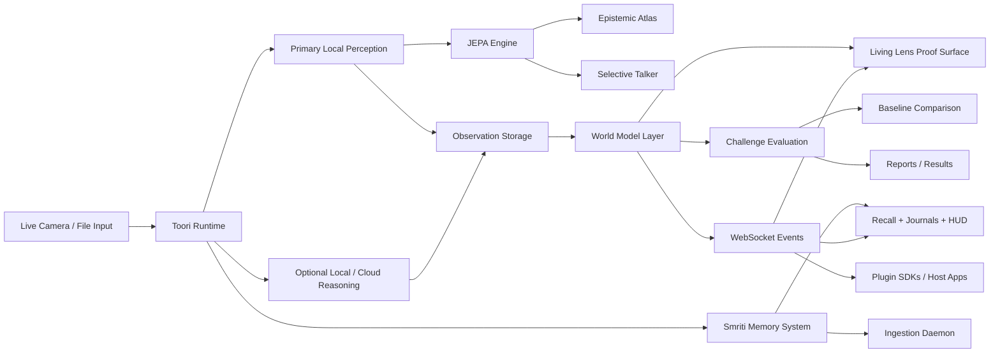

# Toori


Toori is a JEPA proof surface for live camera understanding and grounded memory recall. It demonstrates, in a practical desktop product, how a latent world model can maintain continuity across time, detect surprise, preserve scene identity through occlusion, compare itself against simpler baselines, and index media into a structured semantic memory layer called Smriti.

## Mission

Toori exists to make world-model intelligence inspectable.

The mission is to turn abstract JEPA ideas into a practical, operator-facing system where a person can point a camera at the real world and directly observe:

- what the model expects to stay true
- what actually changed
- whether an entity persisted through occlusion or motion
- whether a temporal world model outperforms caption-only and retrieval-only baselines on the same scene

## Vision

The long-term vision is a camera-native cognition layer that can sit behind many products, not just a single UI:

- a scientific desktop proof surface for demonstrating JEPA-style behavior
- a plugin/runtime boundary that other applications can call as a perception-and-memory layer
- a cross-platform world-model stack for desktop, mobile, robotics-adjacent interfaces, assistive systems, and ambient intelligence workflows

Toori is therefore not only a lens assistant. It is intended to become a reusable world-state runtime.

The main scientific surface is **Living Lens**:

- it watches a live scene continuously
- it tracks temporal continuity and persistence, not just captions
- it highlights prediction consistency and surprise when the scene changes
- it can be compared against two baselines:
  - one-shot frame captioning
  - generic embedding retrieval

The project still includes the practical Toori lens assistant workflow, but the docs now treat that workflow as the delivery vehicle for the proof surface rather than the goal itself.

The new semantic memory surface is **Smriti**:

- it ingests images and videos into a versioned SQLite + vector store
- it runs depth separation, anchor matching, world-model alignment, and confidence gating before recall
- it exposes a desktop tab for clustered browsing, natural-language recall, person journals, and pipeline HUD metrics
- it stays grounded by design: low-confidence regions return uncertainty instead of invented descriptions

## Why Toori Is Different

Most camera products still collapse understanding into one of two weak patterns:

- `frame -> caption`
- `frame -> embedding -> nearest match`

Toori differentiates itself by making temporal world-model behavior first-class:

- it keeps a running scene state instead of treating every frame as a fresh problem
- it measures prediction consistency, continuity, surprise, and persistence explicitly
- it treats captions as secondary explanations rather than the core evidence
- it runs guided challenge sequences that compare JEPA / Hybrid mode against weaker baselines on the exact same live session
- it exposes this through an application and a plugin runtime, so the same world model can power other products

That combination is the differentiator: Toori is not trying to be a prettier captioning app. It is trying to make latent-state reasoning visible, testable, and reusable.

In practice that means Toori can stay useful in scenes that are not ImageNet-shaped. A Kolkata bazaar frame with a thela, a matir handi, or a phuchkawala's moving hands can still be tracked as a live entity thread even when the system has no stable English label for it.

## What It Proves

Toori is intended to make these claims visible and testable:

- a scene can be represented as a changing latent state rather than only a caption
- some objects or structures persist across temporary occlusion
- the model can show where its prediction matched the next observation and where it failed
- memory-backed continuity is stronger than frame-only retrieval for repeated live scenes

This is not a claim that Toori is a full research-grade JEPA implementation. It is a productized proof surface that exposes the right signals and evaluation flows.

## What Is In The Repo

- [cloud/runtime](/Users/macuser/toori/cloud/runtime): runtime contracts, observation storage, provider routing, world-model state, event streaming, and proof-surface APIs
- [cloud/api/main.py](/Users/macuser/toori/cloud/api/main.py): loopback runtime entrypoint on `127.0.0.1:7777`
- [cloud/jepa_service/engine.py](/Users/macuser/toori/cloud/jepa_service/engine.py): JEPA engine and spatial energy maps
- [cloud/runtime/smriti_storage.py](/Users/macuser/toori/cloud/runtime/smriti_storage.py): Smriti storage, migrations, and hybrid recall index
- [cloud/runtime/smriti_ingestion.py](/Users/macuser/toori/cloud/runtime/smriti_ingestion.py): background ingestion daemon and file-watching queue
- [cloud/search_service/main.py](/Users/macuser/toori/cloud/search_service/main.py): compatibility search service
- [desktop/electron](/Users/macuser/toori/desktop/electron): Electron shell plus React/Vite UI
- [mobile/ios/TooriApp](/Users/macuser/toori/mobile/ios/TooriApp): SwiftUI client sources
- [mobile/android/app/src/main/java/com/toori/app](/Users/macuser/toori/mobile/android/app/src/main/java/com/toori/app): Jetpack Compose client sources
- [sdk](/Users/macuser/toori/sdk): Python, TypeScript, Swift, and Kotlin plugin SDKs
- [docs/system-design.md](/Users/macuser/toori/docs/system-design.md): world-model and architecture overview
- [docs/user-manual.md](/Users/macuser/toori/docs/user-manual.md): operator walkthrough

## Feature Matrix

| Feature | Sprint | Status |
| --- | --- | --- |
| JEPA pipeline (TPDS/SAG/CWMA/ECGD/Setu-2) | 1 | ✓ |
| Live Lens camera + tick API | 1 | ✓ |
| Smriti ingestion daemon | 2+3 | ✓ |
| Smriti UI (Mandala/Recall/Deepdive) | 2+3 | ✓ |
| Storage configuration | 4 | ✓ |
| Watch folder management | 4 | ✓ |
| Data migration | 5 | ✓ |
| Setu-2 W-matrix feedback | 5 | ✓ |
| Mandala Web Worker | 5 | ✓ |
| Deepdive interactive patches | 5 | ✓ |
| Person co-occurrence graph | 5 | ✓ |
| WCAG 2.1 AA accessibility | 5 | ✓ |

## Architecture diagram



## System Design

Toori is organized as five cooperating layers:

1. `Capture layer`
   Real camera frames or uploaded images enter through browser, Electron, or mobile clients.
2. `Observation layer`
   The runtime stores observations, thumbnails, embeddings/descriptors, provenance, and session context.
3. `World-model layer`
   Temporal state is built on top of observations through `SceneState`, `EntityTrack`, `PredictionWindow`, continuity signals, persistence signals, and challenge runs.
4. `Proof layer`
   `Living Lens` exposes predicted vs observed state, stability/change, persistence, challenge evaluation, and baseline comparison.
5. `Smriti layer`
   The semantic memory system persists media, builds cluster graphs, performs guarded recall, and surfaces person/location timelines without breaking the main live runtime.
6. `Extension layer`
   The same runtime is available through HTTP, WebSocket events, and generated SDKs so other applications can use Toori as a plugin.

See [docs/system-design.md](/Users/macuser/toori/docs/system-design.md) for the deeper design walkthrough.

## Quickstart

1. Install Python dependencies and start the runtime with Python 3.11:

```bash
cd /Users/macuser/toori
python3.11 -m pip install -r requirements.txt
TOORI_DATA_DIR=.toori python3 -m uvicorn cloud.api.main:app --host 127.0.0.1 --port 7777
```

2. Verify the runtime:

```bash
curl http://127.0.0.1:7777/healthz
curl http://127.0.0.1:7777/v1/providers/health
```

3. Launch the proof surface in a browser first:

```bash
cd /Users/macuser/toori/desktop/electron
npm install
npm run web
```

Open [http://127.0.0.1:4173](http://127.0.0.1:4173).

Browser mode is the recommended proof path during development because it uses the browser camera permission flow and avoids the macOS app identity problems that affect stock Electron launches.

4. If you need the Electron shell, use it as a packaged-app development target, not as the proof default:

```bash
cd /Users/macuser/toori/desktop/electron
npm start
```

For a realistic macOS packaging path, the app must be built and signed as a real `Toori Lens Assistant.app` bundle with a stable bundle identifier. The stock Electron CLI alone is not enough for reliable Camera privacy registration on macOS.

## Desktop Settings To Configure

Open **Settings** and set the providers you want to use:

- `providers.dinov2` metadata for the desktop/runtime DINOv2 + MobileSAM path
- `providers.onnx.model_path` for legacy ONNX compatibility when you explicitly switch back
- `providers.ollama.base_url` and `providers.ollama.model` for local Ollama reasoning
- `providers.mlx.model_path` and `providers.mlx.metadata.command` for MLX reasoning
- `providers.cloud.base_url`, `providers.cloud.model`, and `providers.cloud.api_key` for cloud fallback reasoning

The local M1 defaults prefer DINOv2 perception, keep ONNX as a compatibility path, and support optional `ollama` and MLX reasoning on macOS.

The same Settings surface now includes **Smriti Storage**, where operators can:

- choose the storage location for Smriti indexes, frames, and thumbnails
- set a storage budget with warning thresholds
- add or remove watched folders
- inspect disk usage by category
- prune missing, failed, or all Smriti-managed data
- run a verified copy-first migration to a new storage location without deleting the source data

## Smriti Quick Start

1. Start the runtime:

```bash
TOORI_DATA_DIR=.toori uvicorn cloud.api.main:app --port 7777
```

2. Start the frontend:

```bash
cd /Users/macuser/toori/desktop/electron
npm run web
```

3. Open [http://127.0.0.1:4173](http://127.0.0.1:4173)
4. Open `Settings -> Smriti Storage` and configure the data directory.
   On an M1 iMac with a 256 GB SSD, point Smriti at an external drive before indexing a large photo/video corpus.
5. In `Settings -> Smriti Storage`, use `+ Add Folder` to watch your media folders.
6. Wait for ingestion. `Smriti -> HUD` shows queue depth, workers, and pending media.
7. Open `Smriti -> Recall` and run a natural-language query such as `red jacket`, `beach sunset`, or `my cat`.
8. Click a result to open Deepdive, then press `E` for the JEPA patch overlay, `F` for fullscreen, and `Esc` to close.
9. Use the `✓` and `✗` buttons on recall cards to feed Setu-2 relevance feedback back into the current runtime session.
10. Open `Smriti -> Journals` after tagging a person to inspect their timeline and co-occurrence graph.

## Smriti Pipeline

The semantic memory stack is intentionally gated and layered:

1. `TPDS`
   Temporal Parallax Depth Separator computes foreground, midground, and background strata directly from JEPA energy deltas.
2. `SAG`
   Semantic Anchor Graph matches patch topology against object templates so cylindrical background objects do not collapse into nearby body-part tracks.
3. `CWMA`
   Cross-Modal World Model Alignment applies spatial co-occurrence priors to penalize physically inconsistent configurations.
4. `ECGD`
   Epistemic Confidence Gate blocks low-consistency descriptions and emits uncertainty maps instead of hallucinated answers.
5. `Setu-2`
   A JEPA-to-language energy bridge provides grounded recall scoring and template-based descriptions.
6. `SmritiDB`
   Versioned schema migrations, full-text search, and a FAISS-lite vector index back ingestion, recall, journals, and the Mandala cluster graph.

The runtime runs JEPA work in isolated worker processes and uses a FastAPI lifespan handler to start and drain Smriti background services cleanly.

## Proof Surface Terms

- **Live Lens**: manual capture and debugging surface
- **Living Lens**: the continuous proof surface showing world-model behavior in real time
- **Smriti**: the semantic memory tab for cluster browsing, guarded recall, ingestion, journals, and worker metrics
- **JEPA Residual / Energy**: purely numerical target for surprise detection; low energy indicates prediction consistency
- **Epistemic Atlas**: spatial tracking of entities and their relationship threads across time
- **Selective Talker**: adaptive event narration that only triggers on significant JEPA surprises or track shifts
- **Responsive Grid**: the modular Living Lens dashboard layout that adaptively separates understanding, scene pulse, and memory relinking
- **Saliency Filtering**: dynamic entity identification that rejects weak or irrelevant proposals (threshold 0.15)
- **Passive mode**: the continuous monitoring mode that keeps updating the scene model without waiting for manual capture

## Proof Workflow

The practical workflow is:

1. Open the browser UI first.
2. Use **Live Lens** for manual capture and debugging.
3. Use **Living Lens** for continuous monitoring and proof evidence.
4. Open **Smriti** after you have captured or ingested media to inspect semantic clusters and run guarded recall queries.
5. Run an occlusion/change challenge in the live camera feed.
6. Compare the same sequence against the baselines.

The proof is strongest when the runtime shows prediction consistency, continuity, surprise, and persistence on the same real sequence.

## What Operators See

The live world-model outputs are written for humans, not for a paper:

- `Predicted state` means what the model expected to remain true in the next moment.
- `Observed state` means what the camera actually saw.
- `What stayed stable` means the scene elements that persisted across time.
- `What changed` means the elements that appeared, disappeared, or shifted enough to matter.
- `Persistence graph` means the tracked scene threads the model is trying to keep alive across occlusion and reappearance.
- `Challenge evaluation` means a guided sequence that compares the JEPA-style mode against captioning and retrieval baselines on the same real session.
- `Consumer Mode` means the plain-language proof surface with the immersive overlay still visible but without the dense science metrics.

## Core API

- `POST /v1/analyze`
- `POST /v1/query`
- `POST /v1/living-lens/tick`
- `POST /v1/challenges/evaluate`
- `GET /v1/world-state`
- `GET /v1/settings`
- `PUT /v1/settings`
- `GET /v1/providers/health`
- `GET /v1/observations`
- `WS /v1/events`

### Smriti Routes

| Method | Route | Description |
| --- | --- | --- |
| POST | `/v1/smriti/ingest` | Ingest a media file or watch a folder |
| POST | `/v1/smriti/recall` | Semantic query recall |
| GET | `/v1/smriti/status` | Ingestion status |
| GET | `/v1/smriti/clusters` | Cluster list for Mandala |
| GET | `/v1/smriti/metrics` | Performance metrics |
| POST | `/v1/smriti/tag/person` | Tag a person in media |
| GET | `/v1/smriti/person/{name}/journal` | Person journal |
| GET | `/v1/smriti/storage` | Storage configuration |
| PUT | `/v1/smriti/storage` | Update storage config |
| GET | `/v1/smriti/storage/usage` | Disk usage report |
| GET | `/v1/smriti/watch-folders` | List watched folders |
| POST | `/v1/smriti/watch-folders` | Add watch folder |
| DELETE | `/v1/smriti/watch-folders` | Remove watch folder |
| POST | `/v1/smriti/storage/prune` | Prune storage |
| POST | `/v1/smriti/storage/migrate` | Migrate to a new storage location |
| POST | `/v1/smriti/recall/feedback` | Setu-2 W-matrix feedback |
| GET | `/v1/smriti/media/{id}/neighbors` | Semantic neighbors |

## Tests

Run the verified backend suite:

```bash
pytest -q cloud/api/tests cloud/jepa_service/tests cloud/search_service/tests cloud/monitoring/tests tests/test_readme.py
```

Run the desktop compile gates:

```bash
cd /Users/macuser/toori/desktop/electron
npm run typecheck
npm run build
```

## Contributing

See [CONTRIBUTING.md](/Users/macuser/toori/CONTRIBUTING.md) for the current contribution surfaces: perception backbones, predictor architectures, Consumer Mode translations, and SDK extensions.

## License

- Engine and SDK code: Apache 2.0
- UI proof surface and translation-facing presentation assets: CC-BY-SA 4.0 where noted

## Notes

- Observation data is stored in `.toori/` by default in the repository root.
- Smriti stores schema-managed memory data and learned anchor templates alongside the runtime data directory.
- Smriti storage migration is copy-first and non-destructive: it verifies the destination and updates config last, while preserving the original source data.
- Video ingestion uses PyAV when available; folder watching uses `watchdog` when available and degrades gracefully when those packages are absent.
- `ollama` and MLX are optional desktop-only reasoning backends and are health-checked before use.
- The runtime will still function in local observation-memory mode if cloud reasoning is unavailable.
- Mobile source trees are present, but native project wiring remains a separate platform packaging step.
- Browser mode is the default proof-development path until the Electron app is packaged as a real signed macOS bundle.
