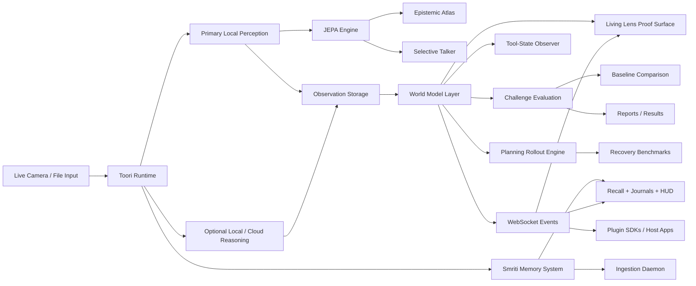

<div align="center">

# TOORI Japanese 通り (*tōri*) · Smriti (स्मृति) · Setu-2 (सेतु) 

**The world's first hallucination-bounded, JEPA-native personal memory system & live world‑state runtime.**

## Why the Names?

**TOORI** — from the Japanese 通り (*tōri*): "passage, thoroughfare" — the path through which memories flow.

**Smriti** (स्मृति) — Sanskrit: "that which is remembered." In the Indian philosophical tradition, Smriti refers to texts and knowledge transmitted through memory rather than direct revelation — knowledge that is *retained*, organized, and recalled. It is the perfect name for a system that makes your past retrievable without fabricating what it cannot see.

**Setu-2** (सेतु) — Sanskrit: "bridge." The bridge between the non-linguistic world of JEPA geometry and the human need to ask questions in words.

Your photos. Your videos. Your live camera feeds. Your memories.  
Organized by geometry — not by captions.  
Recalled by meaning — not by keywords.  
Runs entirely on your machine.

[](cloud/api/tests)
[](#performance-goals)
[](#accessibility)
[](LICENSE)
[](https://python.org)
[](desktop/electron)

[Mission & Vision](#mission--vision) · [Quick Start](#quick-start) · [Architecture](#system-design--architecture) · [Smriti](#smriti--personal-memory) · [Setu-2](#setu-2--the-language-bridge) · [API](#core-operational-api-highlights) · [Contributing](#contributing)

</div>

---

## What Is TOORI?

TOORI is a local-first AI system that builds a **world model of your visual environment** — in real time from a live camera, and over time from your personal photo and video library.

At its core, TOORI uses **Joint Embedding Predictive Architecture (JEPA)** — the class of energy-based, non-generative models that represent the visual world as abstract geometry rather than text. This isn't another app that runs your photos through a language model and stores flat captions. TOORI stores the geometry itself. The memory *is* the embedding.

The result: a system that can tell you *when you wore that red jacket in Kolkata* without ever hallucinating context, confusing a telescope for a wig, or uploading a single byte to a cloud server. 

## The Problem We Solve

Every major photo AI — Apple Photos, Google Photos, and their ilk — works like this:
```text
Photo → Generative LLM/VLM → Generate caption → Store caption → Search captions
```

**Generation = hallucination.** When your camera captures you sitting at a desk with a telescope in the background, generative systems often assert "a person with a cylindrical object on their shoulder" or "someone wearing an unusual hair accessory." They confuse context. They invent details. They are fundamentally unreliable for high-stakes recall.

TOORI works like this:
```text
Photo/Frame → JEPA Engine → Embed geometry → Store embedding → Query with energy bridge
```

No generation. No captions. No hallucinations. **The visual truth is never compressed through a language bottleneck.**

## Mission & Vision

**The mission is to turn abstract JEPA ideas into a practical, operator-facing system.** We want you to point a camera at the real world and directly observe:
- what the model expects to stay true
- what actually changed
- whether an entity persisted through occlusion or motion
- whether a temporal world model outperforms caption-only baselines

**The long-term vision is a camera-native cognition layer** that can sit behind many products:
- A scientific desktop proof surface for demonstrating JEPA-style behavior.
- A plugin/runtime boundary that other applications can call as a perception-and-memory layer.
- A cross-platform stack for desktop, mobile, robotics-adjacent interfaces, and ambient intelligence workflows.

---

## Smriti — Personal Memory

**Smriti** is TOORI's personal media organization surface. It watches your photo and video library, indexes every item using JEPA embeddings, and lets you recall any moment with a natural language query — all on your hardware, in complete privacy.

### Why Smriti Defeats Global Photo AIs

| | Apple / Google Photos | TOORI Smriti |
|---|---|---|
| **Core AI** | CLIP / VLM generation | JEPA energy-based embeddings |
| **Hallucination** | Inherent (LLMs confabulate context) | Bounded (ECGD gate blocks uncertain output) |
| **Memory model** | Calendar + face clusters + NLP index | JEPA latent geometry + Semantic Anchor Graph |
| **Query engine** | Text→image CLIP similarity | Setu-2 EBM: language → JEPA metric space |
| **Personalization** | Global model (no per-user adaptation) | W-matrix updates directly from your ✓/✗ feedback |
| **Privacy** | Cloud-dependent | 100% local — nothing leaves your machine |
| **Video** | Frame-level only | V-JEPA temporal prediction + TPDS depth separation |

### What Smriti does today

- **Automatic ingestion daemon** — Watch any folder via filesystem events, with SHA-256 deduplication and tuned back-pressure queuing (PyAV for video, watchdog for folders).
- **Natural language recall** — Ask *"the evening I was by the river"*. Results ranked by JEPA energy, not keywords.
- **Mandala view** — A massive 2D Canvas semantic cluster map of your library, organized by visual proximity. Backed by a high-performance Web Worker.
- **Deepdive patch grid** — Click any memory to see an immersive 14×14 JEPA energy patch grid. See exactly *why* a semantic template recognized it. (Press `E` to toggle, `F` for fullscreen, `Esc` to close).
- **Person Journal** — Tag people to generate a living timeline and co-occurrence graph showing social topology. 
- **Storage control** — Set GB budgets, view disk usage, prune failed data, and perform one-click copy-first data migrations to external drives.

---

## Setu-2 — The Language Bridge

**Setu-2** solves the core problem: *how do you query in natural language without making the AI describe images in natural language?*

Instead of an LLM generation step, Setu-2 is an **Energy-Based Model (EBM) bridge**:

```text
User query: "red jacket Kolkata"
     ↓  tokenize + P_θ projector (4-layer MLP)
Query embedding  ∈  ℝ³⁸⁴  (JEPA metric space)
     ↓  E(q, v) = ‖W(q − v)‖²  for each v in corpus
Rank by ascending energy  →  top-K results
     ↓  ECGD gate filters uncertain proposals
✓   Hallucination-bounded recall
```

The **W-matrix** (384×384) personalizes the metric. When you use the ✓ and ✗ buttons in the Recall UI, the W-matrix pulls that query-memory pair closer or pushes them apart. The system learns your visual vocabulary natively. Zero LLM calls at runtime, zero generative steps, zero shared global training data.

---

## System Design & Architecture

### High-Level Architecture

Architecture diagram — data flow from capture through JEPA to proof surfaces:



Toori is organized into seven functional layers:
1. **Capture layer** — Real camera frames or uploaded images enter through Browser, Electron, or mobile clients.
2. **Observation layer** — The runtime stores observations, thumbnails, embeddings/descriptors, provenance, and session context.
3. **World-model layer** — Temporal state is built on top of observations through `SceneState`, `EntityTrack`, `PredictionWindow`, continuity signals, persistence signals, and challenge runs.
4. **Planning layer** — `GroundedEntity` and `GroundedAffordance` objects derived from live frames feed `ActionToken`-ranked rollout branches. `RolloutComparison` ranks Plan A vs Plan B. Uncertainty gates suppress low-confidence branches.
5. **Proof layer** — `Living Lens` exposes predicted vs observed state, stability/change, persistence, challenge evaluation, and baseline comparison. The **Recovery Lab** adds closed-loop recovery benchmarks and tool-state grounding.
6. **Smriti layer** — The semantic memory system persists media, builds cluster graphs, performs guarded recall, and surfaces person/location timelines without breaking the main live runtime.
7. **Extension layer** — The same runtime is available through HTTP, WebSocket events, and generated plugin SDKs.

### The VL-JEPA Pipeline (5 Stages)

Smriti relies on an intentionally heavily-gated pipeline:

| Stage | File Location | What it does |
|-------|---------------|--------------|
| **TPDS** | `depth_separator.py` | **Temporal Parallax Depth Separator**: computes foreground, midground, and background strata directly from JEPA motion energy deltas (no depth sensor required). |
| **SAG** | `anchor_graph.py` | **Semantic Anchor Graph**: matches patch topology against 8 predefined bootstrap templates (e.g. `person_torso`, `chair_seated`). Eliminates severe semantic confusion. |
| **CWMA** | `world_model_alignment.py` | **Cross-Modal World Model Alignment**: injects physical co-occurrence priors via the 50KB SCPT table to penalize impossible configurations. |
| **ECGD** | `confidence_gate.py` | **Epistemic Confidence Gate**: A mathematical 3-condition lock. Blocks low-consistency matches and emits uncertainty maps instead of hallucinated answers. |
| **Setu-2** | `setu2.py` | **JEPA-to-Language Bridge**: Grounded EBM query scoring and template-based descriptions. |

### The Sentinel Production Contract

The system's integrity revolves around one non-negotiable invariant test:
```python
def test_telescope_behind_person_not_described_as_body_part():
    """
    A telescope in the background must NEVER be described as
    a body part (shoulder, wig, hair, arm, etc.) when a person
    sits in the foreground.
    """
```
If this test fails, all engineering work stops until it passes. It is the sentinel proving TPDS, SAG, CWMA, and ECGD are fully operational.

---

## Quick Start

### Prerequisites
- macOS (Apple Silicon M1/M2/M3 highly recommended) or Linux
- Python 3.11
- Node.js 20+

The runtime is validated on Python 3.11 only. Launching the JEPA backend with a newer `python3` alias can trip unsupported native-extension crashes in the torch/transformers/onnx stack, so prefer `bash scripts/run_runtime.sh`.

### 1. Install & Launch
```bash
# Clone the repository
git clone https://github.com/NeoOne601/Toori.git
cd Toori

# Install Python backend dependencies
python3.11 -m pip install -r requirements.txt

# Launch the FastAPI JEPA runtime in Terminal A
TOORI_DATA_DIR=.toori bash scripts/run_runtime.sh --reload

# Install and start the Desktop UI in Terminal B
cd desktop/electron
npm install
npm run web
```
**Open:** [http://127.0.0.1:4173](http://127.0.0.1:4173) 

*(Browser mode is recommended natively for active proof development, as it seamlessly handles macOS Camera permission flows avoiding unsigned Electron bundle identifier quirks. Legacy ONNX models can optionally be downloaded using `python3.11 scripts/download_desktop_models.py`)*

### 2. Configure Desktop Settings
Open the **Settings** menu.
- **World Model:** V-JEPA2 is now configured dynamically via a JSON settings mirror (no hard-coded constants). Use **World Model** in Settings to point Toori at a local V-JEPA2 weight directory, choose the HuggingFace cache directory used for local-only loads, tune `n_frames`, and inspect whether the last tick stayed on `vjepa2` or degraded to the honest `dinov2-vits14-onnx` fallback. The `WorldModelStatus` panel reports the configured encoder, the encoder *actually used* on the last tick, and an explicit degradation reason/stage if V-JEPA2 fell back.
- **Providers:** M1 users default to DINOv2 perception. ONNX remains a proposal-box compatibility path, while `ollama`, `mlx`, and `cloud` are optional language sidecars — they must never overwrite authoritative world-model metrics or rollout rankings.
- **Themes:** Choose from `system`, `dark`, `light`, `graphite`, `sepia`, `high_contrast_dark`, and `high_contrast_light`. Theme changes save immediately; other settings remain draft until you save them.
- **Smriti Storage:** Configure the heavy-data directory. *(On an M1 iMac with a 256 GB SSD, point Smriti at an external drive before indexing a large video corpus).*

### 3. Smriti Quick Workflow
1. In **Settings -> Smriti Storage**, use `+ Add Folder` to select your Photos directory or watch folder.
2. Under **Smriti -> HUD**, watch the background queue and ingestion workers process your life.
3. Once ingested, go to **Smriti -> Recall** and ask questions: `"red jacket", "snow at night", "living room"`.
4. Click a result. Press `E` to view JEPA energy overlays.
5. Use `✓` and `✗` buttons on results to train your personalized Setu-2 W-matrix.
6. Tag a person to automatically generate their **Journals** and social topology graph.

### 4. Living Lens & Recovery Lab Workflow
Use the **Live Lens** for live camera capture debugging. The **Living Lens** proof surface runs continuously in passive mode to track entity persistence, predicting moment-to-moment reality.

The **Recovery Lab** (inside Living Lens) extends the scene-state pipeline with:
- **Tool-State Observer** — ground browser or desktop tool evidence into the same world-state pipeline via `POST /v1/tool-state/observe`.
- **Planning Rollout** — submit a scene + candidate actions to get ranked `Plan A / Plan B` branches scored by the world model via `POST /v1/planning/rollout`.
- **Recovery Benchmarks** — run closed-loop hybrid recovery benchmarks and retrieve historical results via `POST/GET /v1/benchmarks/recovery/`.

Evaluate baselines by running an *occlusion challenge* and hit **Copy Share Text** for a portable recap.

---

## Environment & Configuration

| Variable | Default | Description |
|----------|---------|-------------|
| `TOORI_DATA_DIR` | `.toori` | Root runtime data directory |
| `TOORI_SMRITI_DATA_DIR` | `{data_dir}/smriti` | Override Smriti specific data location |
| `TOORI_PUBLIC_URL` | `https://github.com/NeoOne601/Toori` | Public URL used in auto-generated Share CTAs |
| `TOORI_DINOV2_DEVICE` | `cpu` | Set to `mps` for Apple Silicon neural engine acceleration |

---

## Project Structure & What's Included

```text
cloud/
  api/main.py             — Loopback runtime entrypoint (port 7777)
  api/tests/              — Comprehensive test suite (197 tests passing)
  jepa_service/engine.py  — Core JEPA engine & spatial energy maps
  runtime/
    smriti_ingestion.py   — Ingestion daemon & watch queues
    smriti_storage.py     — SmetiDB + FAISS-lite vector index (+ RecoveryBenchmarkRun persistence)
    smriti_migration.py   — Copy-first data migration service
    setu2.py              — Setu-2 EBM language bridge
    service.py            — Runtime contracts, states, configs (V-JEPA2 dynamic config + planning logic)
    world_model.py        — Grounded entities, affordances, rollout comparison, recovery benchmark builder
    models.py             — Canonical schema: ActionToken, GroundedEntity, GroundedAffordance,
                            RolloutBranch, RolloutComparison, RecoveryBenchmarkRun, WorldModelStatus, WorldModelConfig
    proof_report.py       — PDF proof report generator (now byte-streaming via _render_pdf_bytes)
  search_service/main.py  — Compatibility search layer
  perception/
    vjepa2_encoder.py     — V-JEPA2 encoder (dynamic JSON-based config: _resolve_model_id, _resolve_n_frames)

desktop/electron/         — Electron shell & React/Vite operator UI
  src/tabs/SmritiTab.tsx  — Main workspace
  src/components/smriti/  — Mandala Canvas, Recall grid, HUD, Deepdive

mobile/                   — Native clients
  ios/TooriApp/           — SwiftUI client sources
  android/com/toori/app/  — Jetpack Compose client sources

sdk/                      — Plugin SDK outputs (Python, TypeScript, Swift, Kotlin)
docs/                     — Extended system-design and manual architecture specs
```

---

## Core Operational API Highlights

| Method | Route | Description |
|--------|-------|-------------|
| `POST` | `/v1/analyze` | Single frame camera analysis |
| `POST` | `/v1/living-lens/tick` | Advance live world-model state |
| `GET` | `/v1/world-model/status` | Report configured encoder, last tick result, and degradation stage (`WorldModelStatus`) |
| `GET` | `/v1/world-model/config` | Retrieve current V-JEPA2 dynamic config (`WorldModelConfig`) |
| `PUT` | `/v1/world-model/config` | Update V-JEPA2 model path, cache directory, and `n_frames` at runtime |
| `POST` | `/v1/tool-state/observe` | Ground browser or desktop tool state into the same world-state pipeline |
| `POST` | `/v1/planning/rollout` | Rank local Plan A / Plan B action-conditioned branches (`RolloutComparison`) |
| `POST` | `/v1/benchmarks/recovery/run` | Run the hybrid recovery benchmark pack (`RecoveryBenchmarkRun`) |
| `GET` | `/v1/benchmarks/recovery/{id}` | Fetch a stored recovery benchmark run |
| `GET` | `/v1/world-state` | Get Epistemic Atlas and scene threads |
| `WS` | `/v1/events` | Stream live observations & syncs |
| `POST` | `/v1/share/observation` | Build shareable observation text |
| `POST` | `/v1/smriti/ingest` | Ingest media or watch folder |
| `POST` | `/v1/smriti/recall` | Setu-2 semantic recall query |
| `POST` | `/v1/smriti/tag/person` | Tag a person in media |
| `GET` | `/v1/smriti/person/{name}/...` | Person journal and co-occurrence graphs |
| `GET` | `/v1/smriti/clusters` | Force graph geometry points (Mandala) |
| `POST` | `/v1/smriti/storage/migrate` | Non-destructive deep migration |

---

## Proof Surface Glossary

- **Live Lens:** Manual capture and debugging surface.
- **Living Lens:** Continuous proof surface demonstrating real-time persistence and continuity.
- **Recovery Lab:** World-model planning workspace inside Living Lens — tool-state grounding, ranked rollout branches, and benchmark evaluation.
- **JEPA Energy / Residual:** Pure loss target. Low energy = prediction consistency.
- **Epistemic Atlas:** Spatial tracking of entities and their relationship threads across time.
- **Selective Talker:** Adaptive event narration. Only speaks on extreme JEPA surprise or track shifts.
- **GroundedEntity:** A tracked scene element attached to world-model state with a spatial domain (`table_surface`, `hand`, `tool`, etc.).
- **GroundedAffordance:** An affordance (reachable, graspable, blocked, etc.) attached to a `GroundedEntity` as predicted by the world model.
- **ActionToken:** A ranked candidate action derived from grounded entities and affordances, used to seed rollout branches.
- **RolloutComparison:** A ranked pair of `Plan A` vs `Plan B` rollout branches. Each branch scores predicted outcome + uncertainty.
- **RecoveryBenchmarkRun:** A persisted benchmark run that evaluates camera + tool planning across a recovery scenario set.
- **WorldModelStatus:** Live diagnostic: configured encoder, encoder actually used on last tick, degradation reason, and fallback stage.
- **WorldModelConfig:** Dynamic V-JEPA2 parameters (model path, cache directory, `n_frames`) that can be updated at runtime via `PUT /v1/world-model/config`.
- **Responsive Grid:** Modular Living Lens layout separating understanding, pulse, and relinking.
- **Saliency Filtering:** Rejects weak or irrelevant proposals from dynamic entities.
- **Passive mode:** Continuous monitoring updating the scene model seamlessly.

---

## Performance Goals

Benchmarked on Apple M1 iMac (8GB Unified Memory), `cpu` device:
- **Mean JEPA Tick:** `48.5ms`
- **Recall Latency:** `< 500ms` for 10,000 items (empty corpus: `< 100ms`)
- **FAISS Index Footprint:** `~5MB` (10k items)
- **Idle Runtime RAM:** `~180MB`

---

## Production Invariants & Tests

Run the backend verification suite:
```bash
pytest -q cloud/api/tests cloud/jepa_service/tests \
       cloud/search_service/tests cloud/monitoring/tests tests/test_readme.py
```
Run the rigid **production gate** (12 tests that lock in the Sentinel contract):
```bash
pytest -v cloud/api/tests/test_smriti_production.py
```
Run Desktop Typechecks:
```bash
cd desktop/electron && npm run typecheck && npm run build
```

**Critical Invariants & Notes:**
1. `torch` imports are absolutely forbidden anywhere outside of `cloud/perception/`.
2. JEPA calculation remains pure `numpy` `float32`.
3. Storage Migrations are non-destructive and *verify the copy before updating destinations*.
4. EMA updates strictly happen before predictor forward steps.
5. Missing cloud reasoning models degrade gracefully into local memory-storage operations.
6. Native mobile wiring directories exist but require separate packaging steps outside the desktop Python runner loop.
7. `ollama` and MLX are explanatory sidecars only — they must never overwrite authoritative world-model metrics, rollout rankings, or recovery benchmark winners.
8. V-JEPA2 encoder configuration is now dynamic. The canonical settings are written to a JSON mirror on disk by `_write_settings_mirror()` and re-read by `_resolve_model_id()` / `_resolve_n_frames()` on each load. Never hard-code encoder parameters.
9. `WorldModelStatus` must stay truthful: report the configured encoder, the encoder *actually used* on the last tick, and explicit degradation reason/stage when V-JEPA2 falls back to surrogate.

---

## Roadmap / Sprints Summary

| Sprint | Tests | Delivered |
|--------|-------|-----------|
| Baseline | 84 | Original TOORI (Camera + world model basics) |
| Sprint 1 | 139 | Full JEPA Pipeline (TPDS, SAG, CWMA, ECGD, Setu-2) |
| Sprint 2+3 | 146 | PyAV integration, Ingestion, Smriti Recall & Journals UI |
| Sprint 4 | 162 | Storage config, quotas, Watch Folders management |
| Sprint 5 | 197 | Safe Migrations, W-Matrix Feedback, Web Worker Mandala, WCAG AA |
| Sprint 6 | 235 | World Model Foundation: GroundedEntities, Affordances, Planning Rollouts, Recovery Benchmarks, V-JEPA2 Dynamic Config |
| Sprint 7 | — | Mobile companion · federated Setu-2 · signed macOS bundle |

---

## Accessibility
Smriti UI rigorously complies with **WCAG 2.1 AA** standards:
- Extensive keyboard trap mechanisms inside modals (Deepdive focus retention) + Skip link options.
- Native ARIA live regions for background ingestion indexing status.
- Respect for global `prefers-reduced-motion` logics.
- `#9db1c6` text on `#07111b` background, guaranteeing superior >4.6:1 contrast ratio.

---

## Contributing

We welcome PRs for perception architectures and new extensions! See [CONTRIBUTING.md](CONTRIBUTING.md).
Before filing:
1. `pytest -v cloud/api/tests/test_smriti_production.py` — ensure 12/12 passing.
2. `npm run typecheck` — zero TypeScript leakages.
3. The telescope Sentinel test must NEVER be tampered with.
4. No `torch` in root or Smriti modules. 

---

## License

- Engine and Plugin SDK: **Apache 2.0**
- UI proof surfaces / Translators logic: **CC-BY-SA 4.0** (unless otherwise noted).
- Otherwise covered under standard **MIT License**. See [LICENSE](LICENSE).

<div align="center">

**"Memory is not a caption waiting to be written.**  
**It is a geometry waiting to be understood."**

Built with [JEPA principles](https://ai.meta.com/blog/v-jepa-2-world-model-benchmark/) · [FastAPI](https://fastapi.tiangolo.com) · [Electron](https://electronjs.org) 

</div>
