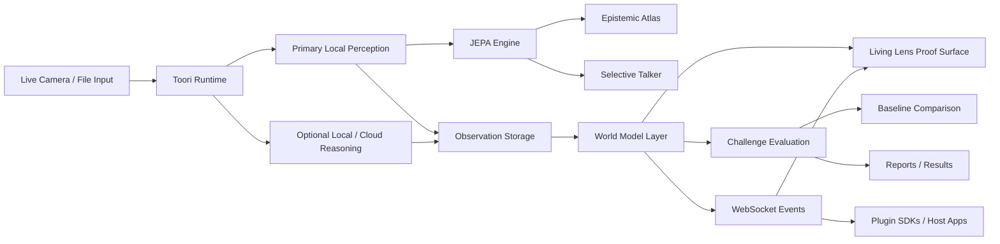

# Toori

Toori is a JEPA proof surface for live camera understanding. It is designed to demonstrate, in a practical desktop product, how a latent world model can maintain continuity across time, detect surprise, preserve scene identity through occlusion, and compare itself against simpler baselines.

## Mission

Toori exists to make world-model intelligence inspectable.

The mission is to turn abstract JEPA ideas into a practical, operator-facing system where a person can point a camera at the real world and directly observe:

- what the model expects to stay true
- what actually changed
- whether an entity persisted through occlusion or motion
- whether a temporal world model outperforms caption-only and retrieval-only baselines on the same scene

## Vision

The long-term vision is a camera-native cognition layer that can sit behind many products, not just a single UI:

- a scientific desktop proof surface for demonstrating JEPA-style behavior
- a plugin/runtime boundary that other applications can call as a perception-and-memory layer
- a cross-platform world-model stack for desktop, mobile, robotics-adjacent interfaces, assistive systems, and ambient intelligence workflows

Toori is therefore not only a lens assistant. It is intended to become a reusable world-state runtime.

The main scientific surface is **Living Lens**:

- it watches a live scene continuously
- it tracks temporal continuity and persistence, not just captions
- it highlights prediction consistency and surprise when the scene changes
- it can be compared against two baselines:
  - one-shot frame captioning
  - generic embedding retrieval

The project still includes the practical Toori lens assistant workflow, but the docs now treat that workflow as the delivery vehicle for the proof surface rather than the goal itself.

## Why Toori Is Different

Most camera products still collapse understanding into one of two weak patterns:

- `frame -> caption`
- `frame -> embedding -> nearest match`

Toori differentiates itself by making temporal world-model behavior first-class:

- it keeps a running scene state instead of treating every frame as a fresh problem
- it measures prediction consistency, continuity, surprise, and persistence explicitly
- it treats captions as secondary explanations rather than the core evidence
- it runs guided challenge sequences that compare JEPA / Hybrid mode against weaker baselines on the exact same live session
- it exposes this through an application and a plugin runtime, so the same world model can power other products

That combination is the differentiator: Toori is not trying to be a prettier captioning app. It is trying to make latent-state reasoning visible, testable, and reusable.

In practice that means Toori can stay useful in scenes that are not ImageNet-shaped. A Kolkata bazaar frame with a thela, a matir handi, or a phuchkawala's moving hands can still be tracked as a live entity thread even when the system has no stable English label for it.

## What It Proves

Toori is intended to make these claims visible and testable:

- a scene can be represented as a changing latent state rather than only a caption
- some objects or structures persist across temporary occlusion
- the model can show where its prediction matched the next observation and where it failed
- memory-backed continuity is stronger than frame-only retrieval for repeated live scenes

This is not a claim that Toori is a full research-grade JEPA implementation. It is a productized proof surface that exposes the right signals and evaluation flows.

## What Is In The Repo

- [cloud/runtime](/Users/macuser/toori/cloud/runtime): runtime contracts, observation storage, provider routing, world-model state, event streaming, and proof-surface APIs
- [cloud/api/main.py](/Users/macuser/toori/cloud/api/main.py): loopback runtime entrypoint on `127.0.0.1:7777`
- [cloud/jepa_service/engine.py](/Users/macuser/toori/cloud/jepa_service/engine.py): JEPA engine and spatial energy maps
- [cloud/search_service/main.py](/Users/macuser/toori/cloud/search_service/main.py): compatibility search service
- [desktop/electron](/Users/macuser/toori/desktop/electron): Electron shell plus React/Vite UI
- [mobile/ios/TooriApp](/Users/macuser/toori/mobile/ios/TooriApp): SwiftUI client sources
- [mobile/android/app/src/main/java/com/toori/app](/Users/macuser/toori/mobile/android/app/src/main/java/com/toori/app): Jetpack Compose client sources
- [sdk](/Users/macuser/toori/sdk): Python, TypeScript, Swift, and Kotlin plugin SDKs
- [docs/system-design.md](/Users/macuser/toori/docs/system-design.md): world-model and architecture overview
- [docs/user-manual.md](/Users/macuser/toori/docs/user-manual.md): operator walkthrough

## Architecture diagram



## System Design

Toori is organized as five cooperating layers:

1. `Capture layer`
   Real camera frames or uploaded images enter through browser, Electron, or mobile clients.
2. `Observation layer`
   The runtime stores observations, thumbnails, embeddings/descriptors, provenance, and session context.
3. `World-model layer`
   Temporal state is built on top of observations through `SceneState`, `EntityTrack`, `PredictionWindow`, continuity signals, persistence signals, and challenge runs.
4. `Proof layer`
   `Living Lens` exposes predicted vs observed state, stability/change, persistence, challenge evaluation, and baseline comparison.
5. `Extension layer`
   The same runtime is available through HTTP, WebSocket events, and generated SDKs so other applications can use Toori as a plugin.

See [docs/system-design.md](/Users/macuser/toori/docs/system-design.md) for the deeper design walkthrough.

## Quickstart

1. Start the runtime with Python 3.11:

```bash
cd /Users/macuser/toori
python3.11 scripts/setup_backend.py
```

2. Verify the runtime:

```bash
curl http://127.0.0.1:7777/healthz
curl http://127.0.0.1:7777/v1/providers/health
```

3. Launch the proof surface in a browser first:

```bash
cd /Users/macuser/toori/desktop/electron
npm install
npm run web
```

Open [http://127.0.0.1:4173](http://127.0.0.1:4173).

Browser mode is the recommended proof path during development because it uses the browser camera permission flow and avoids the macOS app identity problems that affect stock Electron launches.

4. If you need the Electron shell, use it as a packaged-app development target, not as the proof default:

```bash
cd /Users/macuser/toori/desktop/electron
npm start
```

For a realistic macOS packaging path, the app must be built and signed as a real `Toori Lens Assistant.app` bundle with a stable bundle identifier. The stock Electron CLI alone is not enough for reliable Camera privacy registration on macOS.

## Desktop Settings To Configure

Open **Settings** and set the providers you want to use:

- `providers.dinov2` metadata for the desktop/runtime DINOv2 + MobileSAM path
- `providers.onnx.model_path` for legacy ONNX compatibility when you explicitly switch back
- `providers.ollama.base_url` and `providers.ollama.model` for local Ollama reasoning
- `providers.mlx.model_path` and `providers.mlx.metadata.command` for MLX reasoning
- `providers.cloud.base_url`, `providers.cloud.model`, and `providers.cloud.api_key` for cloud fallback reasoning

The local M1 defaults prefer DINOv2 perception, keep ONNX as a compatibility path, and support optional `ollama` and MLX reasoning on macOS.

## Proof Surface Terms

- **Live Lens**: manual capture and debugging surface
- **Living Lens**: the continuous proof surface showing world-model behavior in real time
- **JEPA Residual / Energy**: purely numerical target for surprise detection; low energy indicates prediction consistency
- **Epistemic Atlas**: spatial tracking of entities and their relationship threads across time
- **Selective Talker**: adaptive event narration that only triggers on significant JEPA surprises or track shifts
- **Responsive Grid**: the modular Living Lens dashboard layout that adaptively separates understanding, scene pulse, and memory relinking
- **Saliency Filtering**: dynamic entity identification that rejects weak or irrelevant proposals (threshold 0.15)
- **Passive mode**: the continuous monitoring mode that keeps updating the scene model without waiting for manual capture

## Proof Workflow

The practical workflow is:

1. Open the browser UI first.
2. Use **Live Lens** for manual capture and debugging.
3. Use **Living Lens** for continuous monitoring and proof evidence.
4. Run an occlusion/change challenge in the live camera feed.
5. Compare the same sequence against the baselines.

The proof is strongest when the runtime shows prediction consistency, continuity, surprise, and persistence on the same real sequence.

## What Operators See

The live world-model outputs are written for humans, not for a paper:

- `Predicted state` means what the model expected to remain true in the next moment.
- `Observed state` means what the camera actually saw.
- `What stayed stable` means the scene elements that persisted across time.
- `What changed` means the elements that appeared, disappeared, or shifted enough to matter.
- `Persistence graph` means the tracked scene threads the model is trying to keep alive across occlusion and reappearance.
- `Challenge evaluation` means a guided sequence that compares the JEPA-style mode against captioning and retrieval baselines on the same real session.
- `Consumer Mode` means the plain-language proof surface with the immersive overlay still visible but without the dense science metrics.

## Core API

- `POST /v1/analyze`
- `POST /v1/query`
- `POST /v1/living-lens/tick`
- `POST /v1/challenges/evaluate`
- `GET /v1/world-state`
- `GET /v1/settings`
- `PUT /v1/settings`
- `GET /v1/providers/health`
- `GET /v1/observations`
- `WS /v1/events`

## Tests

Run the verified backend suite:

```bash
pytest -q cloud/api/tests cloud/jepa_service/tests cloud/search_service/tests cloud/monitoring/tests tests/test_readme.py
```

## Contributing

See [CONTRIBUTING.md](/Users/macuser/toori/CONTRIBUTING.md) for the current contribution surfaces: perception backbones, predictor architectures, Consumer Mode translations, and SDK extensions.

## License

- Engine and SDK code: Apache 2.0
- UI proof surface and translation-facing presentation assets: CC-BY-SA 4.0 where noted

## Notes

- Observation data is stored in `.toori/` by default in the repository root.
- `ollama` and MLX are optional desktop-only reasoning backends and are health-checked before use.
- The runtime will still function in local observation-memory mode if cloud reasoning is unavailable.
- Mobile source trees are present, but native project wiring remains a separate platform packaging step.
- Browser mode is the default proof-development path until the Electron app is packaged as a real signed macOS bundle.
