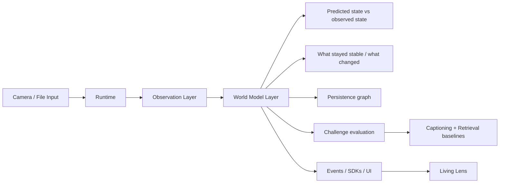

# Toori System Design

## Intent

Toori is a camera-native JEPA proof surface. Its job is to make latent world-model behavior visible through a practical product:

- continuous observation of a live scene
- temporal prediction over recent frames
- memory-backed persistence across occlusion and reappearance
- explicit comparison against weaker baselines

The proof is centered on **Living Lens**, while **Live Lens** remains the manual capture and debugging surface.

## Design Principle

The system is arranged around a simple scientific claim:

> a useful scene model should do more than caption a frame; it should maintain state, predict the near future, and show when reality diverges from expectation.

That leads to four visible signals:

- `prediction_consistency`
- `temporal_continuity`
- `surprise`
- `persistence`

These signals are not optional cosmetic metrics. They are the main evidence that the product is doing something JEPA-like.

## Runtime Layers

### 1. Frame layer

The runtime ingests real images or camera frames and stores them as observations.

Each observation includes:

- image or frame payload
- thumbnail
- embedding or descriptor
- timestamp
- session id
- reasoning provenance
- nearest-memory neighbors

### 2. World-model layer

Above observations, Toori maintains temporal state:

- `SceneState`
- `EntityTrack`
- `PredictionWindow`
- `WorldModelMetrics`
- `ChallengeRun`
- `BaselineComparison`
- `world_state_id` linked from each `Observation`

This layer is responsible for:

- tracking a scene across time
- linking observations to a world-state id
- remembering entities through temporary occlusion
- storing the current prediction window
- recording whether the next frame matched expectation

### 3. Proof layer

The proof layer turns the world model into something a user can inspect:

- predicted state vs observed state
- what stayed stable
- what changed
- persistence graph
- challenge runs
- baseline comparison results

## System Diagram

This is the layer the user should trust when judging whether Toori is actually demonstrating JEPA-like behavior.

## Data Flow

1. A client captures a frame.
2. The runtime stores the observation and updates the current world state.
3. The temporal predictor scores the transition from the previous latent window to the new observation.
4. Entity tracks are updated or re-identified.
5. Metrics are computed:
   - continuity
   - surprise
   - persistence
   - prediction consistency
   - occlusion recovery
6. The runtime optionally produces a caption or answer, but the proof does not depend on language output.
7. Events are streamed to the UI and plugin clients.

## Baselines

Toori compares the JEPA proof surface against two weaker references:

- **Frame captioning**
  - one image in, one caption out
  - no temporal memory
  - no explicit continuity or persistence
- **Generic embedding retrieval**
  - finds similar observations
  - does not predict the next state
  - does not model occlusion recovery

The proof surface is strongest when the same live sequence is evaluated by all three modes.

## Client Roles

### Browser mode

- default proof-development surface
- fastest way to validate camera access and demo flow
- avoids the macOS camera registration problems that stock Electron launches can hit

### Electron desktop

- packaged desktop target
- useful for a real macOS app identity and Camera privacy registration
- should be built as a signed `Toori Lens Assistant.app` bundle

### iOS / Android

- native client sources
- same runtime contract
- same proof vocabulary
- same world-model semantics

## Provider System

### Perception

Primary local perception is platform-native:

- `onnx` on desktop
- `coreml` on iOS
- `tflite` on Android

A real fallback descriptor still exists so the app can keep working when the primary backend is missing.

### Reasoning

Reasoning is separate from proof:

- `ollama`: desktop-only local reasoning
- `mlx`: desktop-only local reasoning
- `cloud`: optional OpenAI-compatible fallback

These providers can explain a scene, but the JEPA proof should still be readable without them.

## Living Lens Evaluation

`Living Lens` is designed around a live challenge loop:

- show an object
- partially occlude it
- fully occlude it
- reveal it again
- move away from the scene
- return to the scene
- introduce a distracting change

The runtime should then show:

- whether the entity thread survived
- whether surprise spiked on the unexpected change
- whether continuity stayed high when the scene truly persisted
- whether the reappearance restored the same world-state thread

For operators, the live panels mean:

- `Predicted state` is the model’s short-term expectation.
- `Observed state` is what the camera actually captured.
- `What stayed stable` is the part of the scene that kept matching the expectation.
- `What changed` is the part of the scene that diverged from expectation.
- `Persistence graph` is the visible list of tracked scene threads.
- `Challenge evaluation` is the guided comparison against the two baselines.

## Runtime API

The proof surface adds explicit world-model endpoints on top of the existing analyze/query/settings routes:

- `POST /v1/living-lens/tick`
  - accepts a live frame, session id, and optional prompt
  - returns the latest observation plus world-model signals and nearest-memory state
- `GET /v1/world-state`
  - returns the current `SceneState`, entity tracks, persistence graph, and rolling metric history
- `POST /v1/challenges/evaluate`
  - evaluates a live or stored sequence against JEPA mode and both baselines
- `WS /v1/events`
  - emits `world_state.updated`, `entity_track.updated`, and `challenge.updated` in addition to observation events

Conceptual runtime types:

- `SceneState`
- `EntityTrack`
- `PredictionWindow`
- `WorldModelMetrics`
- `ChallengeRun`
- `BaselineComparison`

## Storage

- SQLite stores settings, observation metadata, and world-state metadata
- `frames/` stores full images when retention allows it
- `thumbs/` stores thumbnails for replay and memory views
- `.toori/` is the default local development state directory

## Extension Surface

The runtime is the plugin boundary. Other apps should integrate through:

- HTTP endpoints
- WebSocket events
- generated SDKs in `sdk/`

The important API idea is that clients consume a world model, not just a caption service.

## Current Scientific Limits

Toori is a practical proof surface, not a finalized JEPA benchmark suite.

Current limitations to keep in mind:

- the world-model layer is engineered on top of real observations, but it is still a product implementation
- cloud reasoning is optional and should not be required for the proof signals
- challenge evaluation is the right way to demonstrate value, not isolated captions
- packaged macOS identity is still required for a reliable Electron camera privacy story
- browser-first development is the most reliable proof path until the packaged macOS app is available
